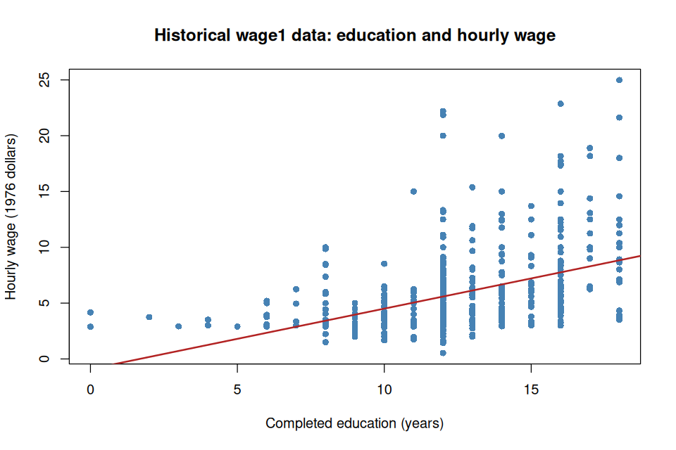

# Class 1: Course Introduction, AI-Assisted Learning, and Modern Data Workflows

**Date:** Wednesday, September 2, 2026  
**Status:** Complete first version  
**Last updated:** August 30, 2026

[Ungraded Practice 1](practice/) · [Course syllabus](../../ECO202-Fall2026-Syllabus.pdf) · [R demonstration](class-01-reproducible-analysis.R) · [Historical wage data](data/wage1.csv) · [Generated figure](figures/education-wage-scatter.png)

**Class-folder workflow:** Use this guide for preparation, class, and review; run adjacent files when directed; then complete [ungraded practice](practice/) before studying the [worked solutions](practice/solutions/).

<!-- Source lineage: current ECO 202 syllabus and course-design decisions; the opening/navigation structure follows the current ORF 524 Week 1 visual grammar without importing its graduate-level content. The empirical example uses the documented wage1 CSV distributed with the course. -->

## Central question

How can we use AI and computation to learn from economic data without outsourcing the statistical judgment that makes an analysis credible?

This question organizes both today's class and the semester. AI can explain, calculate, write code, suggest graphs, and critique an interpretation. It cannot decide whether the question is clear, the data are relevant, the method is appropriate, the calculation is correct, or the conclusion is justified.

## Learning goals

By the end of class, you should be able to:

1. explain the purpose of ECO 202 and how its class guides, references, four closed-book exams, and individual empirical project work together;
2. distinguish the common statistical foundation expected of everyone from optional paths into theory, applications, programming, data work, and other extensions;
3. distinguish an AI model from a product, interface, access tier, and complete workflow;
4. navigate the course repository and locate a guide, script, dataset, figure, and syllabus;
5. turn a vague request into an auditable AI dialogue by specifying the context, task, constraints, and verification plan;
6. follow a reproducible analysis from question and data to code, output, graph, verification, interpretation, and limitation; and
7. explain why an accurate calculation or plausible AI-generated statement may still fail to support a causal conclusion.

<a id="lecture-map"></a>

## In-class route

The route is the live navigation surface. The linked sections contain the fuller lecture and discussion notes, numerical work, demonstrations, and review material.

| Stop | Live focus | Mode |
|---|---|---|
| **C1.1** | [What is ECO 202?](#c1-stop-1) | Discuss + Checkpoint 1 |
| **C1.2** | [How the course works](#c1-stop-2) | Syllabus and course-map discussion |
| **C1.3** | [The AI landscape](#c1-stop-3) | Discuss + classification check |
| **C1.4** | [One reference workflow](#c1-stop-4) | Workflow demonstration + discussion |
| **C1.5** | [GitHub and the course repository](#c1-stop-5) | Repository demonstration + Checkpoint 2 |
| **C1.6** | [Prompting as specification and dialogue](#c1-stop-6) | AI interaction 1 + audit |
| **C1.7** | [A first reproducible analysis](#c1-stop-7) | Data demonstration + Board work 1 + AI interaction 2 |
| **C1.8** | [Association is not causation](#c1-stop-8) | Checkpoint 3 + AI interaction 3 |
| **C1.9** | [Independent foundations and next steps](#c1-stop-9) | Assessment boundary + exit check |

Sections 10 and 11 and the appendices support practice, review, and setup rather than defining additional live stops.

## How to use this guide

**Prepare:** No particular AI system, editor, or statistical package is required before the first meeting. If possible, skim the [course syllabus](../../ECO202-Fall2026-Syllabus.pdf), open the course repository in a browser, identify one AI system you can access without purchasing anything for this activity, and bring one example of an AI output that would require careful checking.

**In class:** Follow the route above while using the fuller notes below for definitions, comparisons, prompts, and verified conclusions. AI interactions 1–3 are separate activities to audit; Board work 1 is the independent numerical check. The tested R script and generated figure provide a fallback if a live system fails.

**Review:** Revisit the classification and navigation checks, run or follow the R demonstration, complete the brief checks in Section 10, and use the common-core summary to test what you can explain without assistance.

**Practice:** Use the brief questions in Section 10 for immediate retrieval, then continue with [Ungraded Practice 1](practice/) for the fuller workflow, numerical verification, AI audit, and unaided transfer. Reproducing the analysis in R or another suitable environment is optional; software syntax is not the learning target.

**Prerequisites:** Basic arithmetic and the ability to read a small table and scatterplot are enough. Setup and troubleshooting help appears in the appendices.

## Full guide map

1. [What is ECO 202?](#1-what-is-eco-202)
2. [How the course works](#2-how-the-course-works)
3. [The AI landscape](#3-the-ai-landscape)
4. [One reference workflow](#4-one-reference-workflow)
5. [GitHub and the course repository](#5-github-and-the-course-repository)
6. [Prompting as specification and dialogue](#6-prompting-as-specification-and-dialogue)
7. [A first reproducible analysis](#7-a-first-reproducible-analysis)
8. [Association is not causation](#8-association-is-not-causation)
9. [Independent foundations and next steps](#9-independent-foundations-and-next-steps)
10. [Practice and answer checks](#10-practice-and-answer-checks)
11. [Common core, optional paths, and recap](#11-common-core-optional-paths-and-recap)

<a id="c1-stop-1"></a>

## 1. What is ECO 202?

ECO 202 is an introduction to probability and statistical reasoning for the analysis of economic data. The goal is to move from an economic question to evidence and then to a conclusion whose meaning, assumptions, and limitations can be defended.

| From | Toward |
|---|---|
| Variables, observations, tables, and graphs | Clear descriptions of economic data |
| Association in a sample | Careful interpretation and the distinction between association and causation |
| Probability and random variables | A mathematical language for uncertainty |
| Samples and research designs | Claims about populations and causal effects |
| Sampling distributions | Standard errors and repeated-sampling reasoning |
| Estimation and testing | Quantified uncertainty and evidence |
| Conditional relationships and regression | Empirical models for economic questions |
| Separate techniques | A reproducible individual empirical project |

A calculation is only one link in this chain. The observational unit, variable definitions, data source, target, assumptions, and interpretation determine what the number can mean.

### Checkpoint 1

Complete the sentence in a way that refers to both evidence and judgment: “Statistical analysis is more than calculation because …” Then identify one question that should be answered before treating a table of numbers as evidence about an economic claim.

<a id="c1-stop-2"></a>

## 2. How the course works

This section is an orientation, not a substitute for the [current syllabus](../../ECO202-Fall2026-Syllabus.pdf). The syllabus and official instructor announcements govern administrative and assessment matters.

### Logistics and materials

- **Meetings:** Monday and Wednesday, 1:20–2:40 p.m., Robertson 100.
- **Canvas:** announcements, submissions, grades, restricted materials, and administrative communication.
- **GitHub:** class guides, ungraded practice, public worked solutions, redistributable data, figures, code, and the student-facing syllabus.
- **Course staff:** current names and contact information appear in the syllabus.

The officially listed textbook is David S. Moore, George P. McCabe, and Bruce A. Craig, *Introduction to the Practice of Statistics*, 10th edition. It is an important reference, while the class-by-class guides organize the course and identify complementary explanations when another treatment or greater depth may help.

### Assessments

| Assessment | Date | Weight | Main purpose |
|---|---:|---:|---|
| In-Class Exam 1 | Wed, Sep 23 | 20% | Independent mastery of the first common-core block |
| In-Class Exam 2 | Mon, Oct 12 | 20% | Independent mastery of the second common-core block |
| In-Class Exam 3 | Mon, Nov 9 | 20% | Independent mastery of the third common-core block |
| In-Class Exam 4 | Mon, Dec 7 | 20% | Independent mastery of the final common-core block |
| Individual empirical project | Sun, Dec 20, 7:00 p.m. | 20% | Execution with data, computation, communication, and documented AI assistance |

The four exams are in class and closed book; AI assistance is not permitted. They assess the common statistical foundation every student must command independently. AI is permitted and encouraged for the empirical project, subject to requirements for verification, reproducibility, disclosure, privacy, interpretation, and individual responsibility.

### A common core with several paths

| Path | Questions you might pursue |
|---|---|
| **Statistical foundations** | Why does the method work? Which assumptions are essential? |
| **Data** | Where did the observations come from? How were variables measured and cleaned? |
| **Computation** | How can code automate, reproduce, visualize, or stress-test the analysis? |
| **Empirical economics** | What economic question does the evidence address? What remains unresolved? |
| **Causal reasoning** | What comparison would identify a causal effect? What threatens it? |
| **AI practice** | How can a tool explain, generate, critique, translate, or debug the work? |

Students may choose different routes through the extensions, but the common statistical foundation identified in each guide is not optional. The closed-book exams and AI-assisted project therefore measure complementary forms of mastery rather than contradictory ones.

<a id="c1-stop-3"></a>

## 3. The AI landscape

AI can serve as a tutor, coding assistant, critic, simulator, editor, or brainstorming partner. It is not a scholarly source or statistical authority, and no fluent response becomes course content merely because it appears on the screen.

### Model, product, interface, access, and workflow

- An **AI model** is the underlying system that produces an output.
- An **AI product** packages one or more models with features, policies, and tools.
- An **interface** is how a person interacts with the product.
- An **access tier** determines which models, features, usage limits, or prices apply.
- A **workflow** combines an AI system with files, software, habits, permissions, and verification methods.

| Interface | Typical interaction | Useful when | Important limitation or risk |
|---|---|---|---|
| Web, desktop, or mobile GUI | Type, speak, or attach files | Low-friction explanation, drafting, or file analysis | The system may lack the full project context |
| Editor or IDE integration | Work beside Markdown, code, data, and project files | Explanation and execution should stay together | The assistant may edit or run files; permissions matter |
| Command-line interface | Issue requests from a terminal | A fast, scriptable, file-oriented workflow is useful | Broad authority can produce consequential changes |
| API or programmatic interface | A program sends structured requests | Automation or a repeatable application is needed | Credentials, programming, and cost monitoring are required |
| Embedded or domain-specific AI | Use AI inside statistical, spreadsheet, writing, or business software | The task already lives in another application | Capabilities and data policies vary |
| Cloud or agentic workspace | Delegate longer work with files and tools | Work can run and be reviewed later | The user must understand where data go and what was authorized |

The course does not prescribe a vendor, model, interface, or paid subscription. Responsible practice should transfer across products.

### A durable interaction cycle

1. **Question:** State what you want to learn or decide.
2. **Attempt:** Predict, calculate, sketch, or propose an approach when useful.
3. **Ask:** Provide the setting, available information, requested output, and constraints.
4. **Inspect:** Look for errors, ambiguity, hidden assumptions, and unsupported conclusions.
5. **Verify:** Check with mathematics, code, data, documentation, or a reliable source.
6. **Revise:** Improve the prompt, analysis, or conclusion.
7. **Own:** Explain and take responsibility for the result you retain.

### Classification check

For an AI system you have used, identify the model if known, the product, the interface, the access tier, and the surrounding workflow. Which of those features would change if the same model were accessed from an editor rather than a browser?

<a id="c1-stop-4"></a>

## 4. One reference workflow

The instructor's reference implementation uses VS Code as the workspace, the current Markdown guide as the stable course spine, Codex integrated beside it as an AI collaborator, R for statistical computing and graphics, and a terminal, plots, data, and supporting files within the class folder.

```text
┌────────────────────────────────────┬───────────────────────────────┐
│ Markdown guide or rendered preview │ AI interaction                │
│                                    │                               │
│ • stable course narrative          │ • explanation or comparison   │
│ • definitions and notation         │ • proposed R code              │
│ • checkpoints and prompts          │ • critique or debugging        │
│ • verified conclusions             │ • provisional output           │
├────────────────────────────────────┴───────────────────────────────┤
│ R terminal, script output, data viewer, or generated plot          │
└────────────────────────────────────────────────────────────────────┘
```

| Artifact | Status and responsibility |
|---|---|
| Class guide | Instructor-curated course material and the stable learning spine |
| AI response | Provisional output to inspect rather than an authoritative answer |
| R script | Executable instructions whose inputs and operations must be understood |
| Console output or figure | A result of executing particular instructions on particular data |
| Retained interpretation | A claim the analyst must verify, qualify, and defend |

Integration reduces friction but does not remove the need to manage permissions, execute code, verify results, or exercise statistical judgment. Students may reproduce this setup, modify it, or use another AI, editor, interface, and statistical package. Required learning never depends on adopting the instructor's personal configuration.

<a id="c1-stop-5"></a>

## 5. GitHub and the course repository

The public repository distributes the stable course materials. GitHub renders each class `README.md` when its folder opens; Git is the underlying version-control system, but prior Git knowledge is not required to read or download the materials.

```text
ECO-202/
  README.md                         Course entry point
  ECO202-Fall2026-Syllabus.pdf      Student-facing syllabus
  classes/                          One folder per instructional class
    PRACTICE.md                     Course-wide ungraded-practice index
    01-course-introduction-ai-and-data-workflows/
      README.md                     The guide you are reading
      class-01-reproducible-analysis.R
                                    Reproducible R demonstration
      data/                         Verified local data and provenance
      figures/                      Reproducible figures for this class
      practice/                     Ungraded self-study for this class
        README.md                   Practice problems and compact checks
        solutions/README.md         Public worked solutions after an attempt
  precepts/                         Weekly notes from the teaching assistants
  exams/                            Exams and solutions after administration
  project/                          Approved final-project information
  assets/                           Canonical files reused across classes
```

### Three ways to use the repository

1. **Read in a browser:** GitHub renders the guide without requiring an installation.
2. **Download a snapshot:** Obtain the current files without version-control history.
3. **Clone with Git:** Keep a local copy with history and later retrieve updates with `git pull`.

A complete class folder contains its guide, script, local data, provenance note, and generated figure so that the demonstration can be run from that folder without constructing a repository-wide path. Canvas remains the location for submissions, grades, restricted materials, and administrative communication unless official activity instructions explicitly say otherwise.

Do not place personal information, private student work, restricted data, credentials, or course submissions in a public repository.

### Checkpoint 2

Locate the CSV used in today's demonstration, its provenance note, the complete R script, the generated figure, and the syllabus's assessment rules. Which file is authoritative for the code, which file records the data source, and which output must be regenerated if the script changes?

<a id="c1-stop-6"></a>

## 6. Prompting as specification and dialogue

“Analyze this wage dataset and tell me what it means” omits the economic question, observational unit, variable definitions, data source, requested output, substantive constraints, and verification plan. A more useful prompt makes those choices visible without pretending that good wording guarantees a correct answer.

```text
Context: [setting, observations, variables, and data source]
Goal: [the question to answer]
Task: [the explanation, calculation, graph, code, or critique requested]
Constraints: [method, language, level, length, and anything not to assume]
Verification: [what should be checked and how limitations should be reported]
```

> [!TIP]
> **AI interaction 1 — Inspect before calculating**
>
> First identify the observational unit, variable types, and missing source information yourself. Then copy the prompt below and audit whether the response respects the supplied historical setting without inventing facts.

```text
We have wage1.csv, a historical dataset containing 526 workers from a 1976
Current Population Survey extract. The variables include hourly wage, completed
education, labor-market experience, and tenure.

Before calculating anything:
1. identify the observational unit;
2. classify these four variables and state their units;
3. propose two descriptive questions and one causal question; and
4. explain why the causal question cannot be answered from these variables
   alone.

State what source, sampling, measurement, or population information you would
still need. Do not invent facts that are not supplied.
```

**Audit question:** Does the response keep descriptive and causal questions separate, identify the historical period, and state what remains unknown rather than filling the gaps with plausible prose?

<a id="c1-stop-7"></a>

## 7. A first reproducible analysis

The local file [`data/wage1.csv`](data/wage1.csv) contains 526 workers from a 1976 Current Population Survey extract distributed with Jeffrey Wooldridge's textbook data. One row represents one worker. The file is real, historical, and observational; it does not describe current wages and does not by itself identify returns to education. [Local provenance notes](data/README.md) accompany the file.

| Variable | Meaning | Type | Units |
|---|---|---|---|
| `wage` | Hourly earnings | Quantitative | 1976 dollars per hour |
| `educ` | Completed education | Quantitative | Years |
| `exper` | Potential labor-market experience | Quantitative | Years |
| `tenure` | Time with the current employer | Quantitative | Years |

Before calculating, identify the observational unit, inspect the first rows and column names, count missing values, and predict the direction of the education–wage association. A reproducible workflow then connects the question, data, code, output, graph, numerical check, interpretation, and limitation.

> [!TIP]
> **AI interaction 2 — Propose auditable R code**
>
> State the desired calculations and interpretation boundary before requesting code. Compare the generated proposal with the tested course script rather than accepting either from appearance alone.

```text
Write simple base R code that reads data/wage1.csv, displays the relevant
columns and missing-value count, reports the number of workers, calculates the
mean and median hourly wage, and makes a scatterplot of hourly wage against
completed education with a fitted linear line.

Comment every step. Do not interpret the relationship causally. Check the mean
by dividing the sum of wages by the number of workers, and save the plot under
figures/. Before giving the code, state what each row represents and explain
why a historical observational extract does not describe current wages or by
itself identify a causal return to education.
```

The tested script is [`class-01-reproducible-analysis.R`](class-01-reproducible-analysis.R). Open this class folder as the working folder, then run:

```sh
Rscript class-01-reproducible-analysis.R
```

| Quantity | Verified result |
|---|---:|
| Workers | 526 |
| Missing values in the CSV | 0 |
| Sum of hourly wages | 3,101.35 |
| Mean hourly wage | 5.8961 |
| Median hourly wage | 4.65 |
| Education–wage correlation | 0.4059 |
| Descriptive fitted line | $\widehat{\mathrm{wage}}=-0.9049+0.5414\mkern3mu\mathrm{educ}$ |

The fitted line is a descriptive preview; scatterplots, correlation, fitted values, and residuals receive their systematic treatment in Class 4.

> [!IMPORTANT]
> **Board work 1 — Verify before interpreting**
>
> Use the reported sum and sample size to reconstruct the mean:
>
> $$
> \bar w=\frac{3{,}101.35}{526}\approx5.896.
> $$
>
> State the units, explain why the answer is not a current-wage estimate, and identify which parts of the calculation can be checked without trusting AI. Then compare the result with the script's `mean()` output and with a second software environment or spreadsheet if available.



The graph shows a positive association within these 526 records and substantial wage variation at the same education level. It does not explain why the association occurs, establish that the extract represents every population of interest, or turn 1976 wages into current dollars.

<a id="c1-stop-8"></a>

## 8. Association is not causation

Suppose an AI system reports:

> The upward-sloping line proves that an additional year of education causes a worker's hourly wage to increase.

The calculation and graph can be accurate while this interpretation is unsupported. A causal claim compares outcomes under different interventions, not merely workers with different observed education levels.

Three scopes should remain separate throughout the course. The **target population** is the set of units the question ultimately aims to describe. **Population inference** asks what a sample can reveal about that defined population. **External validity** asks whether a finding should travel to other people, places, treatments, or times. **Causal inference** asks what would change under a specified intervention. Classes 5--7 develop these distinctions systematically; here they organize the first audit.

### Checkpoint 3

Identify the first unsupported word or step in the statement above. Were workers randomly assigned years of education? Could experience, occupation, ability, family resources, location, or selection affect the relationship? Does a historical 1976 extract describe current workers or isolate a causal effect? What does the fitted line establish directly?

> [!TIP]
> **AI interaction 3 — Audit the causal claim**
>
> Write the strongest descriptive statement you think the graph supports before copying the prompt. Audit whether the response separates sample description, population inference, external validity, and causal inference.

```text
Audit this claim: “The upward-sloping fitted line proves that an additional year
of education causes a worker's hourly wage to increase.”

Separate:
1. what is directly visible among the 526 workers in the historical extract;
2. what would require a sampling or external-validity argument;
3. what would require a causal research design; and
4. a rewritten conclusion that the graph actually supports.

Do not describe the 1976 wages as current and do not introduce a numerical
causal estimate.
```

A defensible conclusion is narrower: among the 526 workers in this historical 1976 extract, workers with more completed education tend to have higher hourly wages. The graph describes a sample association and does not establish that additional education caused the wage differences.

<a id="c1-stop-9"></a>

## 9. Independent foundations and next steps

AI and computation change how students can learn and execute empirical work, but they do not change the standard of mastery. Closed-book exams assess statistical reasoning students must command independently; the empirical project assesses responsible execution with modern tools.

### What is outside the common closed-book target?

- Installation steps and editor commands
- Memorized R, Python, or Stata syntax
- Features of a particular AI product
- Reproduction of the instructor's personal workflow

### What may be assessed independently?

- Identifying observations, variables, samples, populations, and targets
- Selecting and carrying out essential statistical calculations
- Interpreting a table, graph, estimate, or measure of uncertainty
- Stating assumptions used by a method
- Distinguishing description, prediction, and causal inference
- Detecting and repairing a flawed calculation or AI-generated interpretation

### Choose an initial setup

- **Minimal path:** Read on GitHub, use an accessible web or app-based AI, and follow the projected R demonstrations while checking important results.
- **Reference path:** Install R and VS Code, open or clone the repository, add the R extension, and optionally reproduce the Codex integration.
- **Alternative path:** Use RStudio, Python, Stata, a notebook, spreadsheet, or another suitable environment with a preferred AI interface.

### Exit check

Complete these sentences in your own words:

1. One statistical responsibility I cannot delegate to AI is …
2. One result from today's R demonstration that I can verify independently is …
3. One workflow I will try first—and one reason it fits me—is …

## 10. Practice and answer checks

These brief questions support immediate retrieval from the guide. The separate [Ungraded Practice 1](practice/) provides the fuller 40–55 minute practice route, staged answer checks, and worked solutions for deliberate study after an attempt.

### Practice A — Classify the artifacts

For the Class 1 analysis, distinguish the economic question, raw data, data documentation, R instructions, executed output, graph, numerical check, and retained interpretation. Which artifacts are inputs, which are generated, and which require human judgment?

### Practice B — Reproduce and verify

Run [`class-01-reproducible-analysis.R`](class-01-reproducible-analysis.R) from the Class 1 folder or translate it into another environment. Verify the number of rows, missing-value count, mean, median, and direction of the education–wage association. Explain any difference before changing the code.

**Answer check:** The file has 526 rows and no missing values; the mean wage is approximately 5.896, the median is 4.65, and the sample association between education and wage is positive.

### Practice C — Repair the claim

Rewrite each statement as the strongest conclusion supported by the Class 1 data alone:

1. The average American currently earns \$5.90 per hour.
2. Education raises hourly wage by approximately \$0.54 for every worker.
3. The fitted line proves that more education causes higher wages.

**Answer check:** Every repair should identify the historical sample, use descriptive rather than current-population or causal language, and avoid claiming that the fitted relationship applies uniformly to every worker.

## 11. Common core, optional paths, and recap

**Common core:** The relationship among question, data, statistical object, computation, verification, interpretation, and limitation; observational units and variable meanings; data provenance; the distinction among a model, product, interface, access tier, and workflow; auditable prompting; the provisional status of generated output; reproducibility; and the distinction among description, population inference, external validity, and causal inference.

**Explore further:** Alternative editors and statistical languages; Git and version control; APIs and automated workflows; data cleaning and provenance systems; translation of the R demonstration; causal research designs; and deeper theory behind correlation and regression.

The durable workflow is:

> Question → inspect data → attempt or predict → request assistance when useful → execute → verify → interpret → state limitations → take responsibility

The class guides provide the stable learning spine. AI is a flexible collaborator rather than an authority. Code may be generated, but the user remains responsible for the data, execution, verification, interpretation, privacy, and disclosure. The exams measure independent foundations; the empirical project measures responsible empirical work with modern tools.

## Appendix A — Official setup links for the reference path

Software changes. Follow official documentation rather than an unverified installation script.

1. **R:** Download R from [The R Project for Statistical Computing](https://www.r-project.org/). After installation, open R and evaluate `1 + 1`.
2. **VS Code:** Use the [official VS Code getting-started guide](https://code.visualstudio.com/docs/getstarted/overview). Open a folder rather than a loose collection of files.
3. **Markdown:** VS Code includes Markdown editing and preview support. See [Markdown and Visual Studio Code](https://code.visualstudio.com/docs/languages/markdown).
4. **R in VS Code:** Install the [R extension for Visual Studio Code](https://marketplace.visualstudio.com/items?itemName=REditorSupport.r) and follow its current prerequisites. Its documentation presently recommends the R package `languageserver`:

   ```r
   install.packages("languageserver")
   ```

5. **Codex in VS Code:** Follow the [official Codex IDE extension documentation](https://learn.chatgpt.com/docs/codex/ide). Availability, authentication, models, and usage limits may depend on the account or institution and may change.
6. **Course repository:** Students may read in the browser, download a snapshot, or—after release—follow GitHub's [official cloning guide](https://docs.github.com/en/repositories/creating-and-managing-repositories/cloning-a-repository).

### Verify the reference path

You should be able to:

- open the Class 1 folder in VS Code;
- preview this `README.md`;
- open `class-01-reproducible-analysis.R`;
- run `Rscript class-01-reproducible-analysis.R` from the class folder; and
- find the generated plot under `figures/`.

Do not enter a password, token, API key, or confidential data into a prompt or tracked course file.

## Appendix B — Alternative statistical environments

- **RStudio:** A dedicated environment for R. See the [official RStudio Desktop download](https://posit.co/download/rstudio-desktop/).
- **Python:** See the [official Python downloads](https://www.python.org/downloads/). Notebook and editor choices can be added after Python works.
- **Stata:** Installation requires an appropriate license and activation information. See the [official Stata installation guide](https://www.stata.com/install-guide/). Any verified Princeton-supported access route or course-specific instruction will be announced through official course channels.
- **Other environments:** A spreadsheet, notebook service, or another statistical language may be suitable when it produces reproducible and verifiable work.

## Appendix C — Troubleshooting questions

Before asking AI to fix a setup problem, collect evidence:

1. Which operating system and version are you using?
2. Which exact application or command did you run?
3. What was the complete error message?
4. Which folder is open, and what is the current working directory?
5. Does the expected file exist at the path used by the code?
6. Can the smallest test—such as `1 + 1` in R—run successfully?
7. Did you obtain the installer or extension from an official source?

Share only what is needed to diagnose the issue. Remove usernames, tokens, personal paths, and private data from screenshots or pasted logs.

## Verified references

- [ECO 202 Fall 2026 syllabus](../../ECO202-Fall2026-Syllabus.pdf)
- [Class 1 `wage1` data and provenance](data/README.md)
- [The R Project for Statistical Computing](https://www.r-project.org/)
- [VS Code getting started](https://code.visualstudio.com/docs/getstarted/overview)
- [VS Code Markdown documentation](https://code.visualstudio.com/docs/languages/markdown)
- [R extension for Visual Studio Code](https://marketplace.visualstudio.com/items?itemName=REditorSupport.r)
- [Official Codex IDE extension documentation](https://learn.chatgpt.com/docs/codex/ide)
- [GitHub documentation: cloning a repository](https://docs.github.com/en/repositories/creating-and-managing-repositories/cloning-a-repository)
- [Python downloads](https://www.python.org/downloads/)
- [Stata installation guide](https://www.stata.com/install-guide/)
