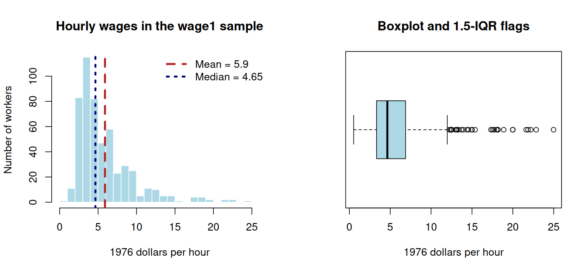

# Class 2: Descriptive Statistics and Data Visualization

**Date:** Wednesday, September 9, 2026  
**Status:** Complete first version  
**Last updated:** August 30, 2026

[← Class 1](../01-course-introduction-ai-and-data-workflows/) · [Ungraded Practice 2](practice/) · [Course syllabus](../../ECO202-Fall2026-Syllabus.pdf) · [Class 3 →](../03-density-curves-normal-distributions-and-standardization/)

**Class-folder workflow:** Use this guide for preparation, class, and review; run adjacent files when directed; then complete [ungraded practice](practice/) before studying the [worked solutions](practice/solutions/).

<!-- Source lineage: Econ202-UlrichMueller/LectureNotes.tex, Descriptive Statistics; Spring 2026 PS1; Spring 2025 Midterm Exam 1; Moore, McCabe, and Craig, Chapter 1. The empirical example uses the documented wage1 CSV distributed with the course. -->

## Central question

How can we turn a table of economic data into a faithful description without allowing a graph or a single number to hide what matters?

## Learning goals

By the end of class, you should be able to:

1. identify the observational units, variables, variable types, units of measurement, and population represented by a dataset;
2. describe a distribution using appropriate graphs and the language of shape, center, spread, and unusual observations;
3. calculate and interpret the mean, median, quartiles, interquartile range, variance, and standard deviation;
4. explain which summaries are resistant to extreme observations and use the $1.5\mathrm{IQR}$ rule as a diagnostic rather than a deletion rule; and
5. produce and audit a concise descriptive report using the data, a reproducible calculation, and appropriate limitations.

<a id="lecture-map"></a>

## In-class route

The route is the live navigation surface. The sections contain the fuller exposition, numerical work, practice, and review material.

| Stop | Live focus | Mode |
|---|---|---|
| **C2.1** | [From an economic question to a data table](#c2-stop-1) | Discuss + Checkpoint 1 |
| **C2.2** | [From a variable to its distribution](#c2-stop-2) | Visual diagnosis + data demonstration |
| **C2.3** | [Center, position, and spread](#c2-stop-3) | Board work + Checkpoint 2 |
| **C2.4** | [Robustness, outliers, and what summaries conceal](#c2-stop-4) | Board work + perturbation |
| **C2.5** | [A reproducible wage-distribution walkthrough](#c2-stop-5) | Data demonstration + Checkpoint 3 |
| **C2.6** | [From output to a defensible description](#c2-stop-6) | AI interaction + audit |

## How to use this guide

**Prepare:** Recall the difference between a row and a column in a data table. Bring one example of a categorical variable and one quantitative variable from an economic setting.

**In class:** Begin with the economic question and the observational unit, then move between the data table, graphs, and numerical summaries. The board-work blocks isolate calculations worth reconstructing by hand; the data demonstration shows how the same reasoning scales to a real dataset.

**Review:** Rework the seven-wage example without looking at the calculations, then explain which features of the distribution no single summary can preserve.

**Practice:** Use the questions near the end of the guide for immediate retrieval, then continue with [Ungraded Practice 2](practice/) for sustained calculation, interpretation, and transfer. The accompanying R script is a reproducible reference implementation, not a required programming language or syntax exercise.

**Prerequisites:** Arithmetic with fractions, averages, and squared numbers; familiarity with rows and columns in a table.

## Full guide map

1. [From an economic question to a data table](#1-from-an-economic-question-to-a-data-table)
2. [From a variable to its distribution](#2-from-a-variable-to-its-distribution)
3. [Center, position, and spread](#3-center-position-and-spread)
4. [Robustness, outliers, and what summaries conceal](#4-robustness-outliers-and-what-summaries-conceal)
5. [A reproducible wage-distribution walkthrough](#5-a-reproducible-wage-distribution-walkthrough)
6. [From output to a defensible description](#6-from-output-to-a-defensible-description)
7. [Practice and answer checks](#7-practice-and-answer-checks)
8. [Common core, optional paths, and recap](#8-common-core-optional-paths-and-recap)

<a id="c2-stop-1"></a>

## 1. From an economic question to a data table

A useful analysis begins with a question, not a command to make every possible graph. In this class our recurring question is: **What does hourly pay look like among the workers recorded in a historical wage dataset, and which features of that distribution should a responsible summary preserve?**

The local file [`data/wage1.csv`](data/wage1.csv) contains 526 workers from a 1976 Current Population Survey extract distributed with Jeffrey Wooldridge's textbook data. One row represents one worker. The file is historical and observational; it does not describe current wages and cannot by itself establish why workers earn different amounts. [Local provenance notes](data/README.md) accompany the file.

| Variable | Meaning | Type | Units or coding |
|---|---|---|---|
| `wage` | Hourly earnings | Quantitative | 1976 dollars per hour |
| `educ` | Completed education | Quantitative | Years |
| `female` | Recorded sex indicator | Categorical | 1 if female, 0 otherwise |
| `nonwhite` | Recorded race indicator | Categorical | 1 if nonwhite, 0 otherwise |
| `profocc` | Professional-occupation indicator | Categorical | 1 if yes, 0 otherwise |

A **variable** is a recorded characteristic. A **categorical variable** places units into groups; a **quantitative variable** records numerical amounts for which arithmetic has substantive meaning. A numerical code such as 0 or 1 may still represent categories. The **distribution** of a variable describes the values it takes and how often they occur.

### Checkpoint 1

1. If a table records unemployment rates for every county in every month, what does one row represent?
2. Is a five-digit ZIP code quantitative merely because it is written with numbers?
3. What population, period, and units would need to be stated before interpreting a reported mean wage?

<a id="c2-stop-2"></a>

## 2. From a variable to its distribution

For one categorical variable, a bar chart displays counts or proportions. For one quantitative variable, a histogram displays how values occupy intervals, while a boxplot compresses the distribution into its median, quartiles, and tails. Side-by-side boxplots or aligned histograms help compare groups, but group sizes and common axis scales must remain visible.

| Question | Useful display | Essential audit |
|---|---|---|
| How common is each category? | Bar chart | Counts or proportions? Missing category? |
| What is the shape of one quantitative variable? | Histogram | Bin width, origin, scale, and units |
| How do quantitative distributions differ across groups? | Side-by-side boxplots or aligned histograms | Comparable axes and group sizes |

Describe a quantitative distribution using **shape**, **center**, **spread**, **modes**, and **unusual observations**. A right-skewed distribution has a longer right tail; a left-skewed distribution has a longer left tail. A mode is a major peak, not necessarily one uniquely most frequent recorded value. An outlier is an observation separated from the broader pattern and is a prompt to investigate, not an automatic instruction to delete.



The hourly-wage distribution is right-skewed: most observations lie below the mean, while a smaller number of relatively high wages extend the right tail. The histogram shows the overall shape; the boxplot makes the upper-tail observations especially visible. Neither graph explains why the pattern occurs.

<a id="c2-stop-3"></a>

## 3. Center, position, and spread

A **descriptive statistic** is a numerical summary calculated from observed data. In this class, the term covers summaries such as a sample mean, median, quartile, variance, or standard deviation. Class 6 later distinguishes a sample statistic from a population quantity, and Class 13 develops estimators formally.

For observations $x_1,\ldots,x_n$, the sample mean is

$$
\bar x=\frac{1}{n}\sum_{i=1}^n x_i.
$$

The **median** divides the ordered observations in half. Quartiles $Q_1$ and $Q_3$ mark the lower and upper quarters, and the interquartile range is $\mathrm{IQR}=Q_3-Q_1$. Software packages use more than one interpolation convention for sample quartiles, so very small datasets can produce slightly different numerical quartiles; the convention should be stated when it matters.

The sample variance and standard deviation are

$$
s^2=\frac{1}{n-1}\sum_{i=1}^n(x_i-\bar x)^2,
\qquad
s=\sqrt{s^2}.
$$

Variance has squared units; standard deviation has the original units. The reason for the denominator $n-1$ will be developed when variance is treated as an estimator. At this stage, it is important to use the definition consistently and interpret $s$ as a typical scale of variation around the mean, not as an average absolute distance.

> [!IMPORTANT]
> **Board work 1 — A complete numerical description**
>
> Consider the seven hourly wages, in dollars,
>
> $$
> 8,\ 9,\ 10,\ 10,\ 11,\ 12,\ 24.
> $$
>
> Using the median-of-halves convention for quartiles:
>
> 1. calculate the mean, median, $Q_1$, $Q_3$, $\mathrm{IQR}$, range, sample variance, and sample standard deviation;
> 2. state the units of every answer;
> 3. predict the relationship between the mean and median from the shape before calculating; and
> 4. identify which information in the original seven values is lost when only these summaries are reported.

The calculations give

$$
\bar x=12,
\qquad
M=10,
\qquad
Q_1=9,
\qquad
Q_3=12,
\qquad
\mathrm{IQR}=3,
$$

and

$$
s^2=\frac{178}{6}\approx29.67,
\qquad
s\approx5.45.
$$

The mean exceeds the median because the wage of 24 pulls the mean toward the right tail. The mean and median measure different features; neither is automatically the uniquely correct description of a typical worker.

### Checkpoint 2

Two datasets have the same mean and standard deviation. Must they have the same shape, median, or number of modes? Construct or sketch a counterexample.

<a id="c2-stop-4"></a>

## 4. Robustness, outliers, and what summaries conceal

A statistic is **resistant** when changing a small fraction of the observations by a large amount does not change it much. The median and $\mathrm{IQR}$ are resistant; the mean and standard deviation are not. Resistance is not a contest with one universal winner: mean and standard deviation are central to later probability and inference, while median and $\mathrm{IQR}$ are often more faithful summaries of skewed or contaminated data.

The common boxplot rule flags observations below $Q_1-1.5\mathrm{IQR}$ or above $Q_3+1.5\mathrm{IQR}$. For the seven-wage example, the fences are $4.5$ and $16.5$, so 24 is flagged. The flag says “investigate.” It does not establish that 24 is an error or that it should be removed.

> [!IMPORTANT]
> **Board work 2 — Perturb one observation**
>
> Replace the wage 24 by 80 while leaving the other six observations unchanged. Before calculating, rank the likely changes in the mean, median, $\mathrm{IQR}$, and standard deviation. Then verify that
>
> $$
> \bar x_{\mathrm{new}}=20,
> \qquad
> M_{\mathrm{new}}=10,
> \qquad
> \mathrm{IQR}_{\mathrm{new}}=3,
> \qquad
> s_{\mathrm{new}}\approx26.49.
> $$
>
> Explain why the unchanged median and $\mathrm{IQR}$ do not mean that the modified distribution is unchanged.

The mean also has a least-squares property:

$$
\bar x=\arg\min_a\sum_{i=1}^n(x_i-a)^2.
$$

This property helps explain why the mean and variance form a natural pair and foreshadows least-squares regression in Class 4. The derivation by differentiation is an optional theory path; the interpretation of the criterion is common core.

<a id="c2-stop-5"></a>

## 5. A reproducible wage-distribution walkthrough

The script [`class-02-wage-distributions.R`](class-02-wage-distributions.R) reads the CSV from this class's `data/` folder, reports its dimensions and missingness, reproduces the figure, and computes the numerical summary below. The script is intentionally linear and commented line by line.

Open this class folder as the working folder, then run:

```sh
Rscript class-02-wage-distributions.R
```

| Quantity | Hourly wage in the 1976 sample (dollars per hour) |
|---|---:|
| Number of workers | 526 |
| Minimum | 0.53 |
| First quartile | 3.33 |
| Median | 4.65 |
| Mean | 5.90 |
| Third quartile | 6.88 |
| Maximum | 24.98 |
| Sample standard deviation | 3.69 |
| $\mathrm{IQR}$ | 3.55 |

The $1.5\mathrm{IQR}$ upper fence is $12.205$, and 36 wages exceed it. Calling those 36 observations “outliers” under the boxplot rule does not call them mistakes. A defensible report would note the right skew, report both mean and median, keep the historical dollar units visible, and avoid generalizing from this extract to current workers.

### Checkpoint 3

1. Why is “the average worker earned 5.90 dollars per hour” less precise than “the mean hourly wage among the 526 workers in this 1976 extract was 5.90 dollars per hour”?
2. Which number in the table best reveals right skew when compared with the median?
3. What would you inspect before deciding whether the maximum wage is a data error, a valid high wage, or a value recorded in different units?

<a id="c2-stop-6"></a>

## 6. From output to a defensible description

A minimal descriptive report identifies the source and observational unit, reports sample size and missingness, combines an appropriate graph with numerical summaries, describes important shape and unusual observations, and limits its conclusion to the data and population actually represented.

> [!TIP]
> **AI interaction 1 — Audit a descriptive report**
>
> First identify at least three problems in the proposed report yourself. Then copy the prompt into an AI interface and audit whether its response catches the same problems without inventing new facts.

```text
The historical wage1 dataset contains 526 workers from a 1976 Current
Population Survey extract. Hourly wage has mean $5.90, median $4.65,
standard deviation $3.69, first quartile $3.33, third quartile $6.88,
and maximum $24.98. A boxplot flags 36 observations above the upper
1.5-IQR fence.

Audit this proposed report: "The typical American currently earns $5.90
per hour. Wages are approximately Normal, and the 36 outliers should be
deleted because they make the mean exceed the median."

Identify every claim that is unsupported or imprecise. Separate arithmetic
checks from interpretation, explain what the outlier rule does and does not
establish, and rewrite the report in at most four sentences. Do not infer
causes of wage differences.
```

**Audit question:** Does the response distinguish the historical sample from a current population, a boxplot flag from an error diagnosis, and right skew from a Normal model?

## 7. Practice and answer checks

These brief questions support immediate retrieval from the guide. The separate [Ungraded Practice 2](practice/) provides the fuller 37–50 minute practice route, staged answer checks, and worked solutions for deliberate study after an attempt.

### Practice A — Build the data description

A dataset contains one row per household and columns for annual income, household size, county, survey weight, and whether the household rents its home. Classify each variable, state the observational unit, and list two questions that must be answered before treating the rows as representative of a population.

### Practice B — Calculate and interpret

For the values $5,7,8,10,10$, use the median-of-halves convention to compute the mean, median, quartiles, $\mathrm{IQR}$, sample variance, and sample standard deviation. Describe the distribution without claiming more than five observations can show.

**Answer check:** The mean and median are both 8; $Q_1=6$, $Q_3=10$, $\mathrm{IQR}=4$, $s^2=4.5$, and $s\approx2.12$.

### Practice C — Choose the summary

For each setting, choose an initial pair of center and spread measures and defend the choice: household income in a city, adult height in a large population, and waiting time in an emergency department. Then state what graph you would inspect before finalizing the choice.

## 8. Common core, optional paths, and recap

**Common core:** Observational units; categorical and quantitative variables; distributions; bar charts, histograms, and boxplots; shape, center, and spread; mean, median, quartiles, $\mathrm{IQR}$, sample variance, and standard deviation; resistance; the $1.5\mathrm{IQR}$ rule; units; and limitations of a descriptive claim.

**Explore further:** Data dictionaries and provenance records; weighted summaries; alternative quantile conventions; logarithmic transformation; derivation of the mean's least-squares property; and reproducible graphics in a statistical language.

The durable workflow is:

> Question → observational unit and variables → data audit → graph → numerical summaries → unusual observations → interpretation and limitations

## References

- Moore, McCabe, and Craig, *Introduction to the Practice of Statistics*, 10th ed., Chapter 1.
- Diez, Çetinkaya-Rundel, and Barr, *OpenIntro Statistics*, 4th ed., chapters on data and numerical summaries.
- Çetinkaya-Rundel and Hardin, *Introduction to Modern Statistics*, 2nd ed., early data-exploration chapters.
- Wooldridge, *Introductory Econometrics: A Modern Approach*, 7th ed.; [`wage1` data and provenance notes](data/README.md).
