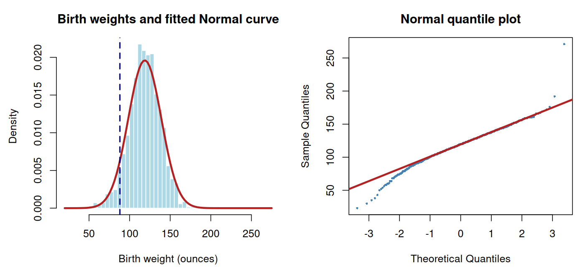

# Class 3: Density Curves, Normal Distributions, and Standardization

**Date:** Monday, September 14, 2026  
**Status:** Complete first version  
**Last updated:** August 30, 2026

[← Class 2](../02-descriptive-statistics-and-data-visualization/) · [Practice 3](practice/) · [Course syllabus](../../ECO202-Fall2026-Syllabus.pdf) · [Class 4 →](../04-scatterplots-correlation-and-descriptive-regression/)

**Class-folder workflow:** Use this guide for preparation, class, and review; run adjacent files when directed; then complete [ungraded practice](practice/) before studying the [worked solutions](practice/solutions/).

<!-- Source lineage: Econ202-UlrichMueller/LectureNotes.tex, Density Curves, Normal Distribution and Standardization; Spring 2026 PS1--PS2; Spring 2025 Midterm Exam 1; Moore, McCabe, and Craig, Chapter 1. The empirical example uses the documented bwght CSV distributed with the course. -->

## Central question

How can a common scale and a probability model help us compare values across economic distributions—and when does that model become misleading?

## Learning goals

By the end of class, you should be able to:

1. track how a linear transformation changes the center, spread, units, and shape of a distribution;
2. calculate and interpret standardized values without confusing a z-score with a percentile;
3. translate intervals into areas under a density curve;
4. use a Normal model to calculate probabilities and quantiles; and
5. distinguish a correct Normal calculation from a credible Normal approximation.

<a id="lecture-map"></a>

## In-class route

| Stop | Live focus | Mode |
|---|---|---|
| **C3.1** | [Linear transformations and units](#c3-stop-1) | Board work + unit audit |
| **C3.2** | [Standardization and comparable position](#c3-stop-2) | Calculation + Checkpoint 1 |
| **C3.3** | [Density curves as probability models](#c3-stop-3) | Visual reasoning + numerical example |
| **C3.4** | [The Normal family](#c3-stop-4) | Discuss + benchmark areas |
| **C3.5** | [Normal probabilities and quantiles](#c3-stop-5) | Board work + Checkpoint 2 |
| **C3.6** | [Does the model fit the question?](#c3-stop-6) | Data demonstration + AI interaction |

## How to use this guide

**Prepare:** Review mean, median, interquartile range, variance, and standard deviation. Be ready to distinguish the observed distribution in a dataset from a probability model used to approximate it.

**In class:** Predict the direction and rough size of every transformation or probability before calculating. The board work develops the reusable reasoning; the R demonstration checks it on historical birth-weight data.

**Review:** Reconstruct one standardization, one Normal probability, and one Normal quantile from a sketch before checking with software.

**Practice:** Complete the brief numerical questions near the end, then use [Practice 3](practice/) for the 40–55 minute sustained module. Software syntax is not a learning objective; the statistical statement, calculation, verification, and interpretation are.

**Prerequisites:** Class 2 summaries, linear equations, fractions, square roots, and areas of simple geometric shapes.

## Full guide map

1. [Linear transformations and units](#1-linear-transformations-and-units)
2. [Standardization and comparable position](#2-standardization-and-comparable-position)
3. [Density curves as probability models](#3-density-curves-as-probability-models)
4. [The Normal family](#4-the-normal-family)
5. [Normal probabilities and quantiles](#5-normal-probabilities-and-quantiles)
6. [Does the model fit the question?](#6-does-the-model-fit-the-question)
7. [Practice and answer checks](#7-practice-and-answer-checks)
8. [Common core, optional paths, and recap](#8-common-core-optional-paths-and-recap)

<a id="c3-stop-1"></a>

## 1. Linear transformations and units

Suppose every observation is transformed according to

$$
y=a+bx.
$$

Then

$$
\bar y=a+b\bar x,
\qquad
s_y=|b|s_x,
\qquad
\mathrm{IQR}_y=|b|\mathrm{IQR}_x.
$$

Adding $a$ changes location but not spread. Multiplying by $b$ changes both location and spread; a negative $b$ also reflects the distribution. These rules do not extend automatically to nonlinear transformations: in general, $\overline{g(x)}\neq g(\bar x)$.

The historical local file [`data/bwght.csv`](data/bwght.csv) records 1,388 births from a 1988 National Health Interview Survey extract. Birth weight has sample mean $118.70$ ounces and sample standard deviation $20.35$ ounces. [Local provenance notes](data/README.md) accompany the file.

> [!IMPORTANT]
> **Board work 1 — Change units without changing standardized position**
>
> Let $X$ be birth weight in ounces and $Y=X/16$ be birth weight in pounds.
>
> 1. calculate the sample mean and standard deviation of $Y$;
> 2. calculate the standardized position of an 88-ounce birth using the ounce summaries;
> 3. convert 88 ounces to pounds and repeat the standardization using the pound summaries; and
> 4. explain why the two z-scores agree even though the numerical means and standard deviations do not.

The transformed sample has mean $118.70/16\approx7.42$ pounds and standard deviation $20.35/16\approx1.27$ pounds. An 88-ounce birth weighs 5.5 pounds, and both calculations produce a z-score of approximately $-1.51$.

<a id="c3-stop-2"></a>

## 2. Standardization and comparable position

For the probability-model notation in this guide, a **random variable** is a numerical outcome whose value is uncertain under a stated random mechanism or model. Uppercase $X$ names that modeled quantity and lowercase $x$ can name one possible or observed value. Class 10 develops random variables and their distributions formally; this class uses only the minimum notation needed for density and Normal models.

For an observed dataset with mean $\bar x$ and positive standard deviation $s$, the standardized value is

$$
z=\frac{x-\bar x}{s}.
$$

For a probability model with mean $\mu$ and standard deviation $\sigma$, use

$$
Z=\frac{X-\mu}{\sigma}.
$$

A z-score of $1.4$ means the value lies 1.4 standard deviations above its reference mean. It is unitless. A z-score is not itself a percentile: converting it into a percentile requires a distributional model or an empirical distribution.

Standardization allows comparisons across distributions. A wage can be larger in dollars but less unusual relative to its occupation if that occupation has a much larger mean or spread.

### Checkpoint 1

Occupation A has mean hourly wage 20 dollars and standard deviation 4 dollars; occupation B has mean 30 dollars and standard deviation 10 dollars. Compare a wage of 26 dollars in A with a wage of 40 dollars in B. Which is higher? Which has the larger standardized position? What additional information would be needed to compare their percentiles exactly?

<a id="c3-stop-3"></a>

## 3. Density curves as probability models

A **density curve** is nonnegative and has total area one. For a continuous random variable, the probability of an interval is the area under the density over that interval. The probability of one exact point is zero even though intervals around that point can have positive probability.

The median divides the area in half; a mode is a peak; the mean is a balance point. These locations coincide for a symmetric unimodal density but need not coincide in a skewed model.

As a numerical example, consider the triangular density

$$
f(x)=
\begin{cases}
x/2, & 0\leq x\leq2,\\
0, & \text{otherwise}.
\end{cases}
$$

Its graph is a triangle with base 2 and height 1, so its total area is one. The area below 1 is a triangle with base 1 and height $1/2$, hence

$$
\mathbb P(X\leq1)=\frac14,
\qquad
\mathbb P(X>1)=\frac34.
$$

This calculation depends on area, not on counting observed data points. A density is a model for a distribution, not a smoothed dataset that automatically becomes true.

<a id="c3-stop-4"></a>

## 4. The Normal family

We write

$$
X\sim\mathsf N(\mu,\sigma^2)
$$

when $X$ has a Normal distribution with mean $\mu$, variance $\sigma^2$, and standard deviation $\sigma>0$. The standardized variable

$$
Z=\frac{X-\mu}{\sigma}
$$

then follows the standard Normal distribution $\mathsf N(0,1)$. This guide uses the second argument of $\mathsf N$ for the variance; software documentation must be checked because conventions differ.

The fixed numbers $\mu$ and $\sigma^2$ are the model's **parameters**: together they determine which member of the Normal family is being used. Class 6 later distinguishes a population parameter from a statistic calculated from a sample.

For a Normal model, approximately 68% of the distribution lies within one standard deviation of the mean, approximately 95% lies within 1.96 standard deviations, and approximately 99.7% lies within three standard deviations. These are properties of the Normal family, not universal rules for every distribution.

The standard Normal cumulative distribution function is

$$
\Phi(z)=\mathbb P(Z\leq z).
$$

Symmetry gives $\Phi(-z)=1-\Phi(z)$. A sketch should determine the relevant tail or interval before a table, calculator, R, Python, Stata, or AI system supplies decimals.

<a id="c3-stop-5"></a>

## 5. Normal probabilities and quantiles

If $X\sim\mathsf N(\mu,\sigma^2)$, then

$$
\mathbb P(X\leq c)
=\mathbb P\left(Z\leq\frac{c-\mu}{\sigma}\right)
=\Phi\left(\frac{c-\mu}{\sigma}\right).
$$

For an interval, subtract cumulative areas. For an upper tail, use the complement. To find the cutoff $c_q$ with cumulative probability $q$, reverse the calculation:

$$
c_q=\mu+z_q\sigma,
\qquad
\Phi(z_q)=q.
$$

> [!IMPORTANT]
> **Board work 2 — Areas and cutoffs in a Normal model**
>
> For a deliberately simplified model, suppose birth weight satisfies
>
> $$
> X\sim\mathsf N(120,20^2)
> $$
>
> in ounces.
>
> 1. sketch and calculate $\mathbb P(X<88)$;
> 2. calculate $\mathbb P(100<X<140)$;
> 3. find the 10th percentile $c_{0.10}$; and
> 4. check each answer using its sign, symmetry, and a 68--95--99.7 benchmark before using software.

For the lower tail, $z=(88-120)/20=-1.6$, so $\mathbb P(X<88)=\Phi(-1.6)\approx0.0548$. The interval from 100 to 140 is exactly one standard deviation on either side of the mean, so its probability is approximately $0.6827$. Because $z_{0.10}\approx-1.2816$, the 10th percentile is approximately $120-1.2816(20)=94.37$ ounces.

### Checkpoint 2

Without calculating a decimal, decide whether each probability is below, equal to, or above one half: $\mathbb P(X<120)$, $\mathbb P(X>130)$, and $\mathbb P(100<X<140)$ under the model above. Which answer follows from symmetry alone?

<a id="c3-stop-6"></a>

## 6. Does the model fit the question?

A correct Normal calculation is conditional on a Normal model. Whether the result is useful requires a separate diagnostic. Compare the empirical histogram with a Normal curve having the same center and spread, inspect a Normal quantile plot, and look for skewness, multiple modes, bounds, heaping, and extreme tails. A model can approximate the center well and the tails poorly.



The linear, line-by-line commented script [`class-03-normal-models.R`](class-03-normal-models.R) reads the CSV from this class's `data/` folder, produces the diagnostics, and checks two versions of the calculation. Using the sample mean $118.70$ and sample standard deviation $20.35$, the fitted Normal model assigns probability $0.0657$ below 88 ounces; the empirical fraction is $0.0598$. Their proximity for this cutoff does not prove that the entire distribution is Normal, and a visible extreme upper-tail observation remains a reason to inspect the data source.

Open this class folder as the working folder, then run:

```sh
Rscript class-03-normal-models.R
```

> [!TIP]
> **AI interaction 1 — Separate calculation from model criticism**
>
> First decide which parts of the task are arithmetic and which require judgment about the data. Then copy the prompt and inspect whether the response keeps those tasks separate.

```text
A historical dataset contains 1,388 birth weights from a 1988 survey
extract. The sample mean is 118.70 ounces, the sample standard deviation
is 20.35 ounces, and 5.98% of the observations are below 88 ounces. A
Normal model fitted with that mean and standard deviation gives 6.57%
below 88 ounces. The data range from 23 to 271 ounces.

Audit the statement: "Because 5.98% and 6.57% are close, birth weight is
Normal and the model can be trusted for every cutoff." Verify the z-score
and fitted probability, identify what the numerical agreement does and does
not establish, and propose two graphical diagnostics. Distinguish a possible
data-quality question from proof that an observation is erroneous.
```

**Audit question:** Does the response verify the probability while refusing to turn agreement at one cutoff into global model validation?

## 7. Practice and answer checks

The short checks below support immediate review. The separate [Practice 3 module](practice/) provides a staged 40–55 minute route, compact answer checks, and complete worked solutions for study after an attempt.

### Practice A — Standardize and reverse

Suppose test scores are modeled as $X\sim\mathsf N(70,8^2)$. Calculate the z-score for 86, find $\mathbb P(X>86)$, and find the 10th percentile. Sketch before calculating.

**Answer check:** The z-score is 2, the upper-tail probability is approximately $0.0228$, and the 10th percentile is approximately $59.75$.

### Practice B — Use area rather than a Normal table

For the triangular density in Section 3, calculate $\mathbb P(0.5<X<1.5)$ using geometric areas. Explain why asking for $\mathbb P(X=1)$ has a different answer from asking for the density height $f(1)$.

**Answer check:** The probability is $0.5$; $\mathbb P(X=1)=0$ while $f(1)=0.5$.

### Practice C — Diagnose an approximation

An AI system reports a negative 1st-percentile cutoff for a variable that cannot be negative. Explain how the arithmetic could be correct under a Normal model while the model is unhelpful for that tail. State one alternative way to report the empirical lower tail.

## 8. Common core, optional paths, and recap

**Common core:** Linear transformations; effects on center, spread, units, and shape; sample and model z-scores; density curves and areas; Normal notation; standardization; Normal probabilities, intervals, complements, and quantiles; and diagnostics for a Normal approximation.

**Explore further:** Nonlinear transformations; robust standardization; derivation of moments for simple densities; simulation; comparison of table, software, and empirical probabilities; and more formal quantile-plot diagnostics.

The durable workflow is:

> Model and units → sketch the event → standardize → calculate → check sign and magnitude → diagnose the approximation → interpret conditionally

## References

- Moore, McCabe, and Craig, *Introduction to the Practice of Statistics*, 10th ed., Chapter 1.
- Diez, Çetinkaya-Rundel, and Barr, *OpenIntro Statistics*, 4th ed., sections on numerical data and the Normal distribution.
- Spiegelhalter, *The Art of Statistics*, chapters on distributions, models, and communicating uncertainty.
- Wooldridge, *Introductory Econometrics: A Modern Approach*, 7th ed.; [`bwght` data and provenance notes](data/README.md).
