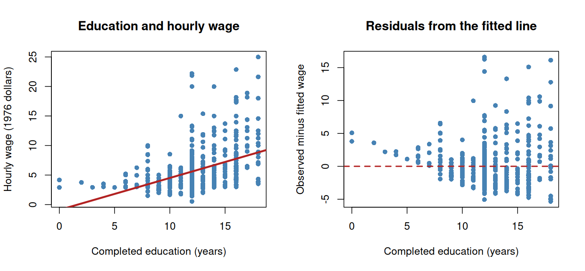

# Class 4: Scatterplots, Correlation, and Descriptive Regression

**Date:** Wednesday, September 16, 2026  
**Status:** Complete first version  
**Last updated:** August 30, 2026

[← Class 3](../03-density-curves-normal-distributions-and-standardization/) · [Practice 4](practice/) · [Course syllabus](../../ECO202-Fall2026-Syllabus.pdf) · [Class 5 →](../05-association-causation-and-confounding/)

**Class-folder workflow:** Use this guide for preparation, class, and review; run adjacent files when directed; then complete [ungraded practice](practice/) before studying the [worked solutions](practice/solutions/).

<!-- Source lineage: Econ202-UlrichMueller/LectureNotes.tex, Correlation and Regression; Spring 2026 PS1--PS2; Spring 2025 Midterm Exam 1; Moore, McCabe, and Craig, Chapter 2. The empirical example uses the documented wage1 CSV distributed with the course. -->

## Central question

What can a straight-line summary reveal—and conceal—about the relationship between two economic variables?

## Learning goals

By the end of class, you should be able to:

1. read a scatterplot in terms of observational units, variables, direction, form, strength, clusters, and unusual observations;
2. calculate and interpret correlation as a standardized measure of linear association;
3. construct and interpret a least-squares line with an intercept;
4. calculate fitted values and residuals and use them to diagnose nonlinearity, influence, and extrapolation;
5. interpret $r^2$ as a descriptive variance decomposition; and
6. distinguish description and prediction from a causal claim.

<a id="lecture-map"></a>

## In-class route

| Stop | Live focus | Mode |
|---|---|---|
| **C4.1** | [Relationships begin with a graph](#c4-stop-1) | Visual diagnosis + Checkpoint 1 |
| **C4.2** | [Correlation as standardized association](#c4-stop-2) | Board work + property audit |
| **C4.3** | [Least-squares prediction](#c4-stop-3) | Board work + numerical walkthrough |
| **C4.4** | [Fitted values, residuals, and diagnostics](#c4-stop-4) | Calculation + Checkpoint 2 |
| **C4.5** | [A historical education–wage relationship](#c4-stop-5) | Data demonstration + interpretation |
| **C4.6** | [From regression output to a defensible claim](#c4-stop-6) | AI interaction + audit |

## How to use this guide

**Prepare:** Review standardized values, sample variance, and the distinction between an observational unit and a variable. Sketch a strong nonlinear relationship that could nevertheless have correlation near zero.

**In class:** Read every graph before calculating. The two board-work blocks develop the formulas from one small dataset; the reproducible demonstration then applies the same reasoning to 526 historical worker records.

**Review:** Reconstruct the fitted line and residuals in the five-worker example, then explain why a large $r^2$ would still not establish causality.

**Practice:** Work through the brief questions near the end, then use [Practice 4](practice/) for the 55–70 minute sustained module. The R script is available for reproduction and variation, but memorized code is not part of the common core.

**Prerequisites:** Classes 2–3; algebra; sample mean, standard deviation, and standardization; sums of squared deviations.

## Full guide map

1. [Relationships begin with a graph](#1-relationships-begin-with-a-graph)
2. [Correlation as standardized association](#2-correlation-as-standardized-association)
3. [Least-squares prediction](#3-least-squares-prediction)
4. [Fitted values, residuals, and diagnostics](#4-fitted-values-residuals-and-diagnostics)
5. [A historical education–wage relationship](#5-a-historical-educationwage-relationship)
6. [From regression output to a defensible claim](#6-from-regression-output-to-a-defensible-claim)
7. [Practice and answer checks](#7-practice-and-answer-checks)
8. [Common core, optional paths, and recap](#8-common-core-optional-paths-and-recap)

<a id="c4-stop-1"></a>

## 1. Relationships begin with a graph

When each observational unit has measurements $(x_i,y_i)$, a scatterplot places an explanatory variable $x$ on the horizontal axis and a response variable $y$ on the vertical axis. The labels are useful for organizing a prediction or an empirical question; labeling $x$ “explanatory” does not establish that changing $x$ would cause $y$ to change.

Describe a scatterplot using:

- **direction:** positive, negative, or neither;
- **form:** linear, curved, clustered, or another visible pattern;
- **strength:** how tightly the points follow the form;
- **unusual observations:** vertical outliers, unusual $x$ values, or influential points; and
- **context:** observational unit, variables, units, period, and population represented.

A graph can reveal structure that a coefficient cannot: two subgroups can have different relationships, a curve can have correlation near zero, and one high-leverage observation can substantially change a fitted line.

### Checkpoint 1

1. Sketch a U-shaped relationship and predict the sign and approximate size of its correlation.
2. If every point lies exactly on a decreasing curve that is not a straight line, must the correlation equal $-1$?
3. What feature of a scatterplot would make a prediction at $x=30$ questionable even if the fitted line has a large $r^2$?

<a id="c4-stop-2"></a>

## 2. Correlation as standardized association

For paired observations, the sample correlation is

$$
r=\frac{1}{n-1}\sum_{i=1}^n
\left(\frac{x_i-\bar x}{s_x}\right)
\left(\frac{y_i-\bar y}{s_y}\right).
$$

The **sample covariance** used in this calculation is

$$
s_{xy}=\frac{1}{n-1}\sum_{i=1}^n(x_i-\bar x)(y_i-\bar y).
$$

It records whether paired observations tend to lie above or below their respective sample means together. Its units are the product of the two variables' units. Class 10 develops covariance for random variables and probability distributions; $s_{xy}$ here is a descriptive sample summary.

Equivalently, $r=s_{xy}/(s_xs_y)$. Correlation is unitless, symmetric in $x$ and $y$, bounded between $-1$ and $1$, and measures linear association. It is unchanged by positive changes of units but changes sign if exactly one variable is reflected by multiplying by a negative number.

Correlation is not resistant. A value near zero does not rule out a nonlinear relationship, subgroup patterns, or a causal relationship whose effects differ across units. A value near one does not establish that one variable causes the other.

> [!IMPORTANT]
> **Board work 1 — Build correlation from paired deviations**
>
> Consider this deliberately small teaching dataset:
>
> | Worker | Education ($x$, years) | Wage ($y$, dollars per hour) |
> |---|---:|---:|
> | A | 10 | 4 |
> | B | 12 | 5 |
> | C | 14 | 7 |
> | D | 16 | 8 |
> | E | 18 | 11 |
>
> 1. calculate $\bar x=14$, $\bar y=7$, $s_x=\sqrt{10}$, and $s_y=\sqrt{7.5}$;
> 2. calculate the sample covariance $s_{xy}=8.5$;
> 3. verify that $r=s_{xy}/(s_xs_y)\approx0.9815$; and
> 4. explain why the number is large and positive without using causal language.

The calculation is an average of paired standardized deviations. Workers with education above the sample mean also tend to have wages above the sample mean, and the five points are close to a rising straight line.

<a id="c4-stop-3"></a>

## 3. Least-squares prediction

A linear prediction rule with an intercept has the form

$$
\widehat y_i=b_0+b_1x_i.
$$

The residual is the observed minus fitted value, $e_i=y_i-\widehat y_i$. Least squares chooses $b_0$ and $b_1$ to minimize

$$
\sum_{i=1}^n(y_i-b_0-b_1x_i)^2.
$$

The solution is

$$
b_1=r\frac{s_y}{s_x}=\frac{s_{xy}}{s_x^2},
\qquad
b_0=\bar y-b_1\bar x.
$$

The slope has units of $y$ per unit of $x$. The intercept is the fitted value at $x=0$ and may not have a useful interpretation if zero is outside, or sparsely represented in, the observed range. The line passes through $(\bar x,\bar y)$. Regressing $y$ on $x$ is not the reverse of regressing $x$ on $y$ because the two procedures minimize different vertical residuals.

> [!IMPORTANT]
> **Board work 2 — Fit, predict, and audit the line**
>
> Continue with the five-worker dataset from Board work 1.
>
> 1. use $b_1=s_{xy}/s_x^2$ and $b_0=\bar y-b_1\bar x$ to obtain
>
> $$
> \widehat y=-4.9+0.85x;
> $$
>
> 2. calculate every fitted value and residual;
> 3. verify that the residuals sum to zero and the line passes through $(14,7)$;
> 4. interpret the slope without the words *effect*, *impact*, or *causes*; and
> 5. explain why the intercept should not be read as a credible wage for a worker with zero years of education.

The fitted values are $3.6,5.3,7.0,8.7,10.4$, and the residuals are $0.4,-0.3,0,-0.7,0.6$. The slope says that within this five-worker fitted line, one additional year of education is associated with $0.85$ more dollars per hour in fitted wage.

<a id="c4-stop-4"></a>

## 4. Fitted values, residuals, and diagnostics

A residual plot places $e_i$ against $x_i$ or against $\widehat y_i$. Systematic curvature means a straight line misses part of the relationship. Changing spread can make one typical residual size misleading. Clusters can indicate omitted group structure. A point with an extreme $x$ value has high leverage and can rotate the fitted line; a point is influential when removing it materially changes the fit.

**Extrapolation** uses the line far outside the observed range of $x$. It is fragile because the observed data contain no direct evidence that the same form continues there.

With an intercept, define the descriptive residual variance using denominator $n-1$:

$$
s_e^2=\frac{1}{n-1}\sum_{i=1}^n e_i^2.
$$

For simple least-squares regression,

$$
s_y^2=s_{\widehat y}^2+s_e^2,
\qquad
s_{\widehat y}^2=r^2s_y^2,
\qquad
s_e^2=(1-r^2)s_y^2.
$$

Thus $r^2$ is the fraction of the sample variation in $y$ represented by the fitted linear values. It is not the fraction of outcomes caused by $x$, a probability that the model is true, or a guarantee of out-of-sample predictive performance. Later regression inference uses a different degrees-of-freedom adjustment when estimating error variance; the expression here is only the descriptive variance decomposition.

### Checkpoint 2

For the five-worker example, $r^2\approx0.9633$. Verify that the residual sum of squares is $1.10$, so $s_e^2=1.10/4=0.275$, and check that $(1-r^2)s_y^2=0.275$. What information about the five points is still absent from $r^2$?

<a id="c4-stop-5"></a>

## 5. A historical education–wage relationship

The linear, line-by-line commented script [`class-04-wage-regression.R`](class-04-wage-regression.R) reads the local [`data/wage1.csv`](data/wage1.csv) file, analyzes hourly wage and completed education for its 526 workers, and produces the scatterplot and residual plot below. [Local provenance notes](data/README.md) accompany the file.

Open this class folder as the working folder, then run:

```sh
Rscript class-04-wage-regression.R
```



The reproducible calculation gives

$$
r=0.4059,
\qquad
\widehat{\mathrm{wage}}=-0.9049+0.5414\mkern3mu\mathrm{educ},
\qquad
r^2=0.1648.
$$

Within this sample, an additional year of education is associated with approximately $0.54$ more dollars per hour in fitted 1976 wage. At 12 years of education, the fitted wage is approximately $5.59$ per hour. The intercept is not a credible wage prediction merely because a few very low education values appear in the file, and the visible dispersion shows that education alone leaves substantial worker-to-worker wage variation unexplained.

The slope identity can be checked independently:

$$
0.4059\frac{3.6931}{2.7690}\approx0.5414.
$$

This is a descriptive relationship in an observational dataset. Class 5 asks what additional design and assumptions would be required for a causal interpretation.

<a id="c4-stop-6"></a>

## 6. From regression output to a defensible claim

A defensible regression description identifies the sample and variables, reads the graph, interprets the slope and fitted values with units, examines residual structure and influential observations, avoids extrapolation, and labels the claim as descriptive or predictive unless a causal design is established.

> [!TIP]
> **AI interaction 1 — Audit a regression interpretation**
>
> Before using AI, mark every phrase in the proposed interpretation that goes beyond the calculation. Then copy the prompt and compare the response with your own audit.

```text
A historical observational dataset contains 526 workers from a 1976
Current Population Survey extract. Regressing hourly wage on completed
years of education gives

  fitted wage = -0.9049 + 0.5414 education,
  correlation = 0.4059, and r-squared = 0.1648.

Audit this statement: "Each additional year of education causes wages to
rise by exactly $0.54, and education explains 16.48% of why any worker earns
what they do. The negative intercept proves that the model is wrong."

Verify the slope using b1 = r sy/sx with sy = 3.6931 and sx = 2.7690.
Separate descriptive association, prediction, and causality; interpret
r-squared precisely; discuss the intercept and observed range; and provide
one defensible two-sentence description. Do not add variables or results
that were not supplied.
```

**Audit question:** Does the response preserve the historical sample and units, reject causal language, and interpret $r^2$ as a sample linear-variation decomposition rather than an explanation of individual outcomes?

## 7. Practice and answer checks

The short checks below support immediate review. The separate [Practice 4 module](practice/) provides a staged 55–70 minute route, compact answer checks, and complete worked solutions for study after an attempt.

### Practice A — Reconstruct the five-worker fit

Without looking back, use the five-worker table to calculate $r$, $b_1$, $b_0$, the fitted wage at 16 years of education, its residual, and $r^2$. State the units of the slope and residual.

**Answer check:** $r\approx0.9815$, $b_1=0.85$, $b_0=-4.9$, the fitted wage is $8.70$, the residual is $-0.70$, and $r^2\approx0.9633$.

### Practice B — Work from summary statistics

Across a set of counties, let $x$ be median household income in tens of thousands of dollars and let $y$ be the percentage of households reporting food insecurity. Suppose $\bar x=6$, $s_x=1.5$, $\bar y=12$, $s_y=4$, and $r=-0.60$. Find the regression of $y$ on $x$, predict $y$ at $x=7$, and interpret the slope without making a causal claim.

**Answer check:** $b_1=-1.6$ percentage points per ten-thousand dollars, $b_0=21.6$ percentage points, and the fitted value at $x=7$ is $10.4$ percent.

### Practice C — Diagnose before summarizing

Sketch three datasets: one with a strong curve and correlation near zero, one in which a single point creates a large positive correlation, and one with two subgroups whose within-group slopes differ from the aggregate slope. For each, state what a correlation coefficient alone would conceal.

## 8. Common core, optional paths, and recap

**Common core:** Scatterplots; direction, form, strength, clusters, and unusual observations; correlation and its properties; least-squares objective; slope, intercept, fitted values, and residuals; residual diagnostics; influence; extrapolation; $r^2$; and the boundary between description, prediction, and causality.

**Explore further:** Derivation of the normal equations; alternative losses; transformations such as log wage; out-of-sample validation; influence measures; subgroup and nonlinear fits; and reproducible regression graphics.

The durable workflow is:

> Paired data → scatterplot → linear summary → fitted values and residuals → diagnostics → descriptive or predictive interpretation → causal boundary

## References

- Moore, McCabe, and Craig, *Introduction to the Practice of Statistics*, 10th ed., Chapter 2.
- Diez, Çetinkaya-Rundel, and Barr, *OpenIntro Statistics*, 4th ed., sections on bivariate data and linear regression.
- Çetinkaya-Rundel and Hardin, *Introduction to Modern Statistics*, 2nd ed., regression chapters.
- Wooldridge, *Introductory Econometrics: A Modern Approach*, 7th ed.; [`wage1` data and provenance notes](data/README.md).
- Stock and Watson, *Introduction to Econometrics*, 4th ed., introductory regression chapters.
