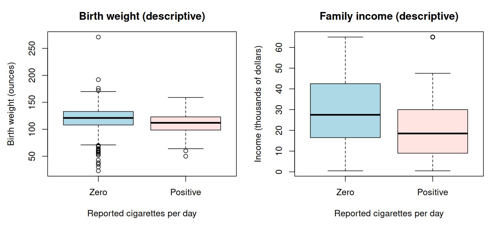

# Class 5: Association, Causation, and Confounding

**Date:** Monday, September 21, 2026  
**Status:** Complete first version  
**Last updated:** August 30, 2026

[← Class 4](../04-scatterplots-correlation-and-descriptive-regression/) · [Practice 5](practice/) · [Course syllabus](../../ECO202-Fall2026-Syllabus.pdf) · **Next meeting:** In-Class Exam 1

**Class-folder workflow:** Use this guide for preparation, class, and review; run adjacent files when directed; then complete [ungraded practice](practice/) before studying the [worked solutions](practice/solutions/).

<!-- Source lineage: Econ202-UlrichMueller/LectureNotes.tex, Correlation vs. Causation; Spring 2026 PS2; Moore, McCabe, and Craig, Chapters 2--3. The empirical example uses the documented bwght CSV distributed with the course. -->

## Central question

What additional comparison, design, and assumptions are needed to turn an observed association into a credible statement about an intervention?

## Learning goals

By the end of class, you should be able to:

1. distinguish descriptive, predictive, and causal claims;
2. construct competing causal stories that can generate the same observed association;
3. define potential outcomes, an individual treatment effect, and an average treatment effect;
4. explain the missing-counterfactual problem and decompose an observed group difference into treatment and selection components;
5. distinguish an observational study from a randomized experiment; and
6. audit a causal claim by identifying the intervention, target population, comparison, design, assumptions, and defensible conclusion.

<a id="lecture-map"></a>

## In-class route

| Stop | Live focus | Mode |
|---|---|---|
| **C5.1** | [Description, prediction, or causation?](#c5-stop-1) | Classification + Checkpoint 1 |
| **C5.2** | [Why the same association can have different causes](#c5-stop-2) | Board work + data demonstration |
| **C5.3** | [Potential outcomes and treatment effects](#c5-stop-3) | Board work + numerical walkthrough |
| **C5.4** | [The missing counterfactual and selection](#c5-stop-4) | Discuss + Checkpoint 2 |
| **C5.5** | [What random assignment changes](#c5-stop-5) | Design comparison + transfer |
| **C5.6** | [Auditing a causal claim](#c5-stop-6) | AI interaction + Exam 1 synthesis |

## How to use this guide

**Prepare:** Bring one causal claim from news, policy, business, or ordinary conversation. Identify the proposed intervention, outcome, and units to which the claim refers.

**In class:** Classify the claim before discussing evidence. The board work makes both the causal stories and the missing counterfactual explicit; the data demonstration remains descriptive so that the causal boundary is visible rather than merely stated.

**Review:** For three observed associations, propose at least two competing explanations, define the relevant potential outcomes, and describe a design that would make the causal comparison more credible.

**Practice:** Complete the brief numerical and causal-reasoning questions near the end, then use [Practice 5](practice/) for the 42–54 minute Class 5 core and separate 25–35 minute Exam 1 checkpoint. The notation and reasoning are common core; advanced identification methods are optional previews.

**Prerequisites:** Class 4 scatterplots, correlation, least-squares regression, and careful interpretation of descriptive comparisons.

## Full guide map

1. [Description, prediction, or causation?](#1-description-prediction-or-causation)
2. [Why the same association can have different causes](#2-why-the-same-association-can-have-different-causes)
3. [Potential outcomes and treatment effects](#3-potential-outcomes-and-treatment-effects)
4. [The missing counterfactual and selection](#4-the-missing-counterfactual-and-selection)
5. [What random assignment changes](#5-what-random-assignment-changes)
6. [Auditing a causal claim](#6-auditing-a-causal-claim)
7. [Practice and answer checks](#7-practice-and-answer-checks)
8. [Common core, optional paths, and recap](#8-common-core-optional-paths-and-recap)

<a id="c5-stop-1"></a>

## 1. Description, prediction, or causation?

A **descriptive claim** summarizes units or relationships actually observed. A **predictive claim** uses observed information to forecast an outcome for new or future units and must be judged using predictive performance beyond the data used to fit it. A **causal claim** compares what would happen under different interventions.

The same numerical slope can enter all three conversations, but the supporting evidence is different. The sentence “workers with more education have higher fitted wages in this sample” is descriptive. “Education helps predict wages for comparable future workers” is predictive and requires validation. “An additional year of education raises a worker's wage” is causal and requires a defensible intervention and counterfactual comparison.

Words such as *effect*, *impact*, *leads to*, *raises*, *reduces*, and *because* usually signal a causal claim. Replacing those words with *associated with* can repair the wording of a descriptive statement, but wording alone cannot repair the research design.

### Checkpoint 1

Classify each statement and identify the evidence it would require:

1. Among the workers in the `wage1` sample, education and hourly wage are positively correlated.
2. Education improves wage predictions for workers outside the fitted sample.
3. Requiring one additional year of schooling would increase average wages.
4. Counties with higher unemployment benefits have higher unemployment rates.

<a id="c5-stop-2"></a>

## 2. Why the same association can have different causes

An association between $X$ and $Y$ can arise because $X$ affects $Y$, $Y$ affects $X$, a pre-existing variable $L$ affects both, selection determines which units enter the data, variables are measured with error, or chance creates a sample pattern. A **confounder** is a pre-treatment common cause of treatment and outcome that makes the observed treatment groups systematically incomparable. A variable is not automatically a confounder merely because it predicts the outcome or changes a regression coefficient.

> [!IMPORTANT]
> **Board work 1 — One pattern, several causal stories**
>
> Start with the observed positive education–wage association from Class 4. Draw and interpret at least three distinct diagrams:
>
> 1. education $\to$ wage;
> 2. prior ability or family resources $\to$ education and prior ability or family resources $\to$ wage; and
> 3. expected wage opportunities $\to$ education decisions, together with other determinants of observed wages.
>
> For each diagram, identify what is observed, what remains unobserved, and whether the fitted slope from Class 4 has a causal interpretation. Add one selection mechanism that could change which workers appear in the sample.

The point is not that every proposed story is equally plausible. The point is that the observed education–wage pairs alone do not tell us which story generated their pattern.

The historical local file [`data/bwght.csv`](data/bwght.csv) provides a second example. In this 1988 survey extract, the mean birth weight is $120.06$ ounces among 1,176 records with zero reported cigarettes per day and $111.15$ ounces among 212 records with positive reported cigarette consumption, an observed difference of $-8.91$ ounces. Mean family income is also different between the two groups: $30.49$ versus $20.92$ in the dataset's thousands-of-dollars units. [Local provenance notes](data/README.md) accompany the file.



The linear, line-by-line commented script [`class-05-causal-comparisons.R`](class-05-causal-comparisons.R) reads the local data and works through each group and calculation in sequence. The negative birth-weight difference is an association. The income difference reveals pre-existing group differences but does not prove that income is the only confounder, that controlling for it would identify a causal effect, or that the entire association is noncausal.

Open this class folder as the working folder, then run:

```sh
Rscript class-05-causal-comparisons.R
```

<a id="c5-stop-3"></a>

## 3. Potential outcomes and treatment effects

Let $D_i\in\lbrace0,1\rbrace$ indicate whether unit $i$ receives a clearly defined binary treatment. Let $Y_i(1)$ be the outcome that would occur for unit $i$ under treatment and $Y_i(0)$ the outcome that would occur for the same unit without treatment. The individual treatment effect is

$$
Y_i(1)-Y_i(0).
$$

For a finite group of $n$ units, the average treatment effect is

$$
\mathrm{ATE}=\frac{1}{n}\sum_{i=1}^n\bigl[Y_i(1)-Y_i(0)\bigr].
$$

The observed outcome is

$$
Y_i=D_iY_i(1)+(1-D_i)Y_i(0).
$$

Potential-outcomes notation forces four decisions into view: the units, the treatment, the outcome, and the target average. “Education,” “smoking,” or “job training” is not sufficiently precise until the intervention, timing, version, and comparison state are defined.

> [!IMPORTANT]
> **Board work 2 — Treatment effects versus an observed difference**
>
> The following complete table is fictional and visible only for teaching. In real data, one potential outcome per unit would be missing.
>
> | Unit | $Y_i(0)$ | $Y_i(1)$ | $D_i$ | Observed outcome ($Y_i$) |
> |---|---:|---:|---:|---:|
> | A | 4 | 7 | 1 | 7 |
> | B | 6 | 7 | 1 | 7 |
> | C | 2 | 4 | 0 | 2 |
> | D | 5 | 6 | 0 | 5 |
>
> 1. calculate each individual treatment effect and verify that $\mathrm{ATE}=1.75$;
> 2. calculate the average effect for the treated units, which is 2;
> 3. calculate the observed treated-minus-untreated difference, which is $7-3.5=3.5$; and
> 4. explain why the observed difference exceeds both the ATE and the average effect for the treated.

The treated units would have had a mean outcome of 5 even without treatment, while the untreated units have a mean untreated potential outcome of 3.5. The observed difference therefore combines an average treatment effect of 2 among the treated with a pre-treatment selection difference of 1.5.

<a id="c5-stop-4"></a>

## 4. The missing counterfactual and selection

For each real unit, we observe at most one of $Y_i(1)$ and $Y_i(0)$. The unobserved value is the **counterfactual**. This is the fundamental problem of causal inference: no larger regression output can reveal both potential outcomes for the same unit.

For a finite group, write $\overline{Y^{\mathrm{obs}}}_{D=1}$ and $\overline{Y^{\mathrm{obs}}}_{D=0}$ for the observed means in the two groups. Use the same subscript to indicate which group's potential outcomes are being averaged. Then the treated-minus-untreated mean difference has the decomposition

$$
\overline{Y^{\mathrm{obs}}}_{D=1}-\overline{Y^{\mathrm{obs}}}_{D=0}
=\overline{Y(1)-Y(0)}_{D=1}
+\left\lbrack\overline{Y(0)}_{D=1}-\overline{Y(0)}_{D=0}\right\rbrack.
$$

The first term is the average treatment effect for treated units. The bracketed term is the difference between the two groups' average untreated potential outcomes—the selection term. Observational data reveal the left side, but the two components require assumptions or design because $Y(0)$ is unobserved for treated units. Class 17 will translate this finite-group statement into conditional-expectation notation after that notation has been developed.

Time ordering is necessary for many causal claims but not sufficient. A common cause can precede both treatment and outcome, and expectations about future outcomes can change present decisions.

### Checkpoint 2

1. In Board work 2, what assignment of treatment created the selection difference?
2. If treated and untreated observed means were equal, could individual treatment effects still be nonzero?
3. Why does adding a pre-treatment variable to a regression not automatically eliminate the selection term?

<a id="c5-stop-5"></a>

## 5. What random assignment changes

An **observational study** records treatments or exposures as they occur. A **randomized experiment** assigns treatment using a known chance mechanism that does not use the units' potential outcomes to choose their assignments. Averaging across the possible assignments makes the treated and control groups comparable before treatment, although one realized assignment need not be exactly balanced.

Random assignment does not guarantee that assigned treatment is received (**noncompliance**), that every assigned unit supplies an outcome (**attrition**), that all units receive the same version of a treatment, that measurement is correct, or that the result applies to every population. Class 7 develops these design and implementation limits in detail.

The core experimental principles are comparison, randomization, and replication. Class 7 develops experimental units, treatments, blocks, matched pairs, implementation failures, and external validity in detail.

Observational causal analysis requires an identification argument beyond association. Measured pre-treatment controls, natural experiments, instrumental variables, regression discontinuity, or other strategies can help only through assumptions tied to the setting. “Control for everything available” is not a design, and controlling for a consequence of treatment or a selection variable can introduce bias.

A causal conclusion should therefore answer:

1. What intervention and comparison state define the potential outcomes?
2. Which units and target population define the average effect?
3. Why are the observed comparison groups informative about the missing counterfactual?
4. Which assumptions connect the design to that claim?
5. What threats remain after the analysis?

<a id="c5-stop-6"></a>

## 6. Auditing a causal claim

> [!TIP]
> **AI interaction 1 — Expose the missing causal argument**
>
> First write the strongest descriptive statement supported by the numbers and list two competing causal stories. Then copy the prompt and audit whether the response respects that boundary.

```text
In a historical observational dataset, mean birth weight is 120.06 ounces
among 1,176 records with zero reported cigarettes per day and 111.15 ounces
among 212 records with positive reported cigarette consumption. Mean family
income is 30.49 versus 20.92 in the dataset's thousands-of-dollars units.

Audit the claim: "Smoking during pregnancy causes birth weight to fall by
exactly 8.91 ounces, and controlling for income proves it."

Classify the claim; define a treatment, outcome, units, and target effect;
state the missing counterfactual; give at least three explanations for the
observed association; and explain what the income difference does and does
not establish. Propose one improved design and its remaining limitations.
End with the strongest two-sentence descriptive conclusion justified by the
numbers alone. Do not invent a regression or causal estimate.
```

**Audit question:** Does the response identify the observed $-8.91$ ounces as a group association, treat income as a candidate source of incomparability rather than an automatic cure, and specify a real counterfactual comparison?

### Exam 1 synthesis

The first module moves from one-variable distributions to standardized models, two-variable relationships, and the boundary of causal interpretation. You should be able to work through essential calculations and interpretations without AI, software syntax, notes, or outside assistance.

The common sequence is:

> Data and observational unit → graph and summaries → model and standardization → association and fitted line → counterfactual question → design and limitations

## 7. Practice and answer checks

The short checks below support immediate review. The separate [Practice 5 module](practice/) provides a staged Class 5 core, an additional cumulative Exam 1 checkpoint across Classes 1–5, compact answer checks, and complete worked solutions for study after an attempt.

### Practice A — Classify and repair

For each statement below, classify it as descriptive, predictive, or causal and rewrite it as the strongest claim supported by an observational correlation alone:

1. Students who miss more lectures have lower grades.
2. Missed lectures improve out-of-sample grade predictions.
3. Preventing one missed lecture would raise a student's grade.

### Practice B — Calculate potential-outcome quantities

For three fictional units, let untreated potential outcomes be $(2,5,7)$, treated potential outcomes be $(4,4,10)$, and assignments be $(1,0,1)$. Construct the observed outcomes, calculate the ATE, the average treatment effect for treated units, the observed treated-minus-untreated difference, and the untreated-potential-outcome selection difference.

**Answer check:** The observed outcomes are $(4,5,10)$; the ATE is $4/3$; the average effect for treated units is $2.5$; the observed difference is 2; and the selection difference is $-0.5$, so $2=2.5-0.5$.

### Practice C — Improve the design

An observational study finds that firms adopting a new software system subsequently have higher productivity. List at least three noncausal explanations, define a treatment and outcome, and propose a randomized or quasi-experimental design. State one threat that remains even under your proposed design.

## 8. Common core, optional paths, and recap

**Common core:** Descriptive, predictive, and causal claims; alternative explanations for association; confounding and selection; potential outcomes; individual and average treatment effects; observed outcomes; the missing counterfactual; the treatment-selection decomposition; observational studies; randomized experiments; and the assumptions and limitations required for a causal conclusion.

**Explore further:** Directed acyclic graphs; conditional average treatment effects; heterogeneous treatments; interference and multiple treatment versions; algebraic identification conditions; bad controls and colliders; instrumental variables; regression discontinuity; and other quasi-experimental designs.

The durable lesson is simple but demanding: a regression or group difference is a calculation; a causal interpretation is an argument about counterfactuals, design, and assumptions.

## References

- Moore, McCabe, and Craig, *Introduction to the Practice of Statistics*, 10th ed., Chapters 2–3.
- Angrist and Pischke, *Mastering 'Metrics*, chapters on experiments and credible comparisons.
- Huntington-Klein, *The Effect*, 2nd ed., introductory chapters on causal questions and research design.
- Wooldridge, *Introductory Econometrics: A Modern Approach*, 7th ed.; [`bwght` data and provenance notes](data/README.md).
- Stock and Watson, *Introduction to Econometrics*, 4th ed., introductory chapters on causal effects and regression.
