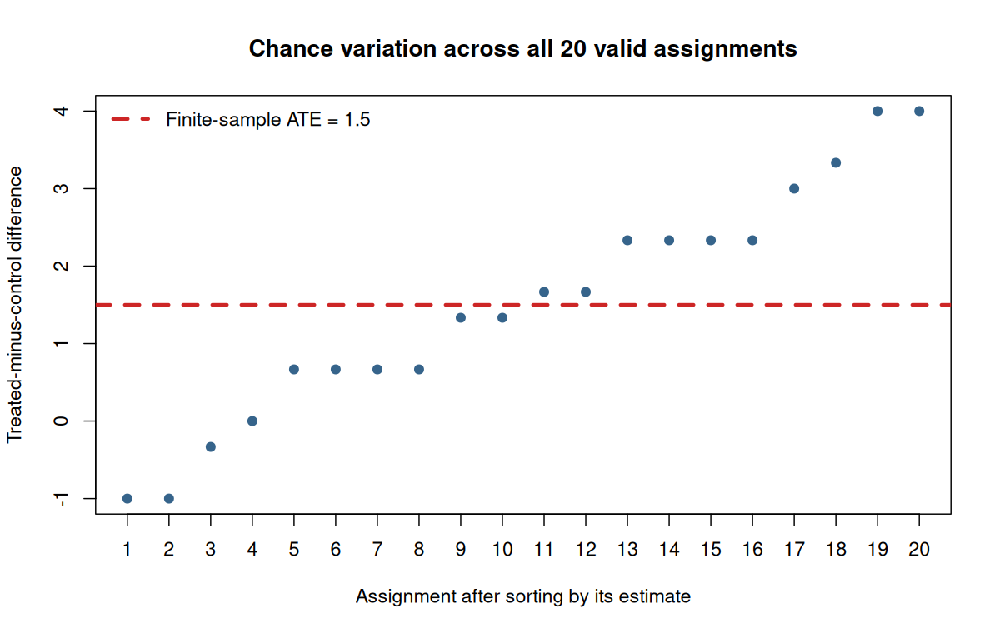

# Class 7: Randomized Experiments, Observational Studies, and Causal Effects

**Date:** Wednesday, September 30, 2026  
**Status:** Complete first version  
**Last updated:** August 30, 2026

[← Class 6](../06-populations-samples-surveys-and-selection-bias/) · [Practice 7](practice/) · [Course syllabus](../../ECO202-Fall2026-Syllabus.pdf) · [Class 8 →](../08-probability-rules-and-probability-models/)

**Class-folder workflow:** Use this guide for preparation, class, and review; run adjacent files when directed; then complete [ungraded practice](practice/) before studying the [worked solutions](practice/solutions/).

<!-- Source lineage: Econ202-UlrichMueller/LectureNotes.tex, Correlation vs. Causation and Data Collection, Sample Designs, Experimental Designs (especially lines 748--833 and 929--963); Spring 2026 PS2, Problem 3, for correlation-versus-causation calibration; Moore, McCabe, and Craig, Chapter 3. The empirical example uses the documented jtrain2 CSV distributed with the course. The six-unit potential-outcomes table and all public prompts, questions, and prose are newly authored. -->

## Central question

How does the treatment-assignment mechanism determine whether an observed difference can estimate a causal effect?

## Learning goals

By the end of class, you should be able to:

1. identify experimental units, treatments, factors, levels, outcomes, and comparison groups;
2. use potential outcomes to define a finite-sample average treatment effect and distinguish it from a realized difference in means;
3. explain why random assignment creates comparability on average without guaranteeing exact balance in one experiment;
4. compare completely randomized, block, and matched-pair designs;
5. distinguish random assignment from random sampling and state what each licenses;
6. interpret the `jtrain2` treatment-control comparisons as intention-to-treat estimates for the randomized study; and
7. identify noncompliance, attrition, interference, measurement, treatment-version, and external-validity threats that random assignment does not remove.

<a id="lecture-map"></a>

## In-class route

| Stop | Live focus | Mode |
|---|---|---|
| **C7.1** | [From a causal question to an experiment](#c7-stop-1) | Experiment anatomy + Board work 1 |
| **C7.2** | [What random assignment accomplishes](#c7-stop-2) | Randomization demonstration + Checkpoint 1 |
| **C7.3** | [Completely randomized, block, and matched-pair designs](#c7-stop-3) | Board work 2 + Checkpoint 2 |
| **C7.4** | [Random assignment is not random sampling](#c7-stop-4) | Two-axis classification |
| **C7.5** | [The `jtrain2` randomized assignment](#c7-stop-5) | Data demonstration + Checkpoint 3 |
| **C7.6** | [Audit the design before the estimate](#c7-stop-6) | AI interaction + non-AI audit + verification |

## How to use this guide

**Prepare:** Review the potential-outcomes notation and missing-counterfactual problem from Class 5. For one proposed policy, identify the units, binary treatment, outcome, treatment timing, and comparison state.

**In class:** Define the causal target before calculating a difference. The first board calculation shows that random assignment works through a distribution of possible assignments, not through a promise of perfect balance in the assignment that happened.

**Review:** For any experiment, reconstruct the chain units → treatment → potential outcomes → assignment mechanism → estimator → causal interpretation → remaining limitations.

**Practice:** Complete the checks in Section 7 after class, then use [Practice 7](practice/) for sustained work on assignment mechanisms, potential-outcome calculations, design repair, replication, and interpretation.

**Prerequisites:** Class 5 potential outcomes and causal distinctions; Class 6 populations, samples, selection, parameters, and statistics.

## Full guide map

1. [From a causal question to an experiment](#1-from-a-causal-question-to-an-experiment)
2. [What random assignment accomplishes](#2-what-random-assignment-accomplishes)
3. [Completely randomized, block, and matched-pair designs](#3-completely-randomized-block-and-matched-pair-designs)
4. [Random assignment is not random sampling](#4-random-assignment-is-not-random-sampling)
5. [The `jtrain2` randomized assignment](#5-the-jtrain2-randomized-assignment)
6. [Audit the design before the estimate](#6-audit-the-design-before-the-estimate)
7. [Practice and answer checks](#7-practice-and-answer-checks)
8. [Common mistakes and boundary cases](#8-common-mistakes-and-boundary-cases)
9. [Common core, optional paths, and recap](#9-common-core-optional-paths-and-recap)

<a id="c7-stop-1"></a>

## 1. From a causal question to an experiment

An experiment begins with a causal contrast, not with a software command. The **experimental units** are the objects assigned to conditions. A **factor** is a variable deliberately varied by the investigator, its possible values are **levels**, and the complete condition applied to a unit is a **treatment**. The **outcome** is measured after assignment. A useful control condition represents the comparison state in the causal question.

For a binary treatment, retain the Class 5 notation. Let $D_i=1$ indicate assignment to treatment and $D_i=0$ assignment to control. Let $Y_i(1)$ and $Y_i(0)$ be unit $i$'s potential outcomes under the two assignments. The observed outcome is

$$
Y_i=D_iY_i(1)+(1-D_i)Y_i(0).
$$

For $n$ fixed experimental units, the finite-sample average treatment effect is

$$
\mathrm{ATE}=\frac{1}{n}\sum_{i=1}^n\bigl[Y_i(1)-Y_i(0)\bigr].
$$

The usual difference-in-means estimator is

$$
\widehat\tau=\overline Y_1-\overline Y_0,
$$

where each mean uses the outcomes observed under that unit's assigned condition. The formula alone is not causal: its justification depends on how $D_i$ was generated.

> [!IMPORTANT]
> **Board work 1 — Six units, two assignments, one fixed causal target**
>
> The complete potential-outcome table below is fictional and visible only for teaching. In a real experiment, one potential outcome per unit would be missing.
>
> | Unit | $Y_i(0)$ | $Y_i(1)$ | Individual effect |
> |---|---:|---:|---:|
> | A | 4 | 7 | 3 |
> | B | 6 | 7 | 1 |
> | C | 2 | 4 | 2 |
> | D | 5 | 6 | 1 |
> | E | 3 | 5 | 2 |
> | F | 8 | 8 | 0 |
>
> 1. Calculate the six individual effects and verify that the finite-sample ATE is $1.5$.
> 2. Under Assignment I, treat A, B, and F and control C, D, and E. Construct the six observed outcomes and show that $\widehat\tau=4$.
> 3. Under Assignment II, treat C, D, and E and control A, B, and F. Construct the observed outcomes and show that $\widehat\tau=-1$.
> 4. Explain how both assignments can come from a valid completely randomized design even though one estimate exceeds every individual effect and the other is negative.
> 5. There are $\binom{6}{3}=20$ equally likely assignments of three units to treatment. State what averaging $\widehat\tau$ across all 20 assignments should recover, then verify the prediction with the data demonstration in Section 2.

The potential outcomes and ATE are fixed across the 20 assignments. The assignment indicators, observed outcomes, and estimate change. This distinction is the foundation of randomization-based causal reasoning.

<a id="c7-stop-2"></a>

## 2. What random assignment accomplishes

A **completely randomized design** chooses the prescribed number of treated units by a known chance mechanism. In Board work 1, each group of three units has probability $1/20$ of receiving treatment. No unit's potential outcomes determine its assignment.

Random assignment therefore makes the average of the difference in means across all possible assignments equal the finite-sample ATE. Class 13 will call this an **unbiasedness** property of the estimator; here the substantive point is that averaging over the chance mechanism recovers the fixed causal target. The result does not guarantee that the treated and control groups will have identical potential outcomes, baseline characteristics, or observed outcomes in the assignment that occurs.

The script [`class-07-randomized-experiments.R`](class-07-randomized-experiments.R) enumerates all 20 assignments in the six-unit example. The estimates range from $-1$ to $4$, but their average is exactly $1.5$, the fixed ATE.



Open this class folder as the working folder, then run:

```sh
Rscript class-07-randomized-experiments.R
```

### Checkpoint 1

1. Does a baseline difference between randomized groups prove that randomization failed?
2. What evidence would show that the stated assignment procedure was not followed?
3. If every individual effect is nonnegative, how can one realized difference in means be negative?

**Answer check:** Chance imbalance can occur under valid random assignment. Failure concerns the procedure or its execution, not the mere presence of an imbalance. A negative realized difference can occur because different units supply the two observed group means.

<a id="c7-stop-3"></a>

## 3. Completely randomized, block, and matched-pair designs

Randomization can be organized in several ways. The best design uses pre-treatment information to make the treatment-control comparison more precise while keeping the assignment mechanism known.

| Design | Assignment mechanism | Principal reason to use it |
|---|---|---|
| Completely randomized | Randomly choose the required number of treated units from all units | Simple design when no strong pre-treatment grouping is needed |
| Randomized block | Divide units into pre-treatment blocks and randomize within every block | Ensure treatment comparisons are represented within important groups |
| Matched pair | Form pre-treatment pairs and randomly assign one unit in each pair to treatment | Remove much between-pair variation from the treatment comparison |

Blocking in an experiment resembles stratification in sampling, but the mechanisms answer different questions. Stratified sampling selects units from a population; blocking assigns treatments among units already in an experiment.

> [!IMPORTANT]
> **Board work 2 — Design the assignment before seeing outcomes**
>
> Eight job-training applicants have been enrolled in a study. Four have low prior earnings $(L_1,L_2,L_3,L_4)$ and four have higher prior earnings $(H_1,H_2,H_3,H_4)$. Exactly four applicants will be assigned to the training group.
>
> 1. Describe a completely randomized assignment and count its $\binom{8}{4}=70$ possible treatment groups.
> 2. Describe a randomized block design that assigns two of the four applicants within each earnings block to treatment. State which pre-treatment imbalance the design directly limits.
> 3. Pair $L_1$ with $L_2$, $L_3$ with $L_4$, $H_1$ with $H_2$, and $H_3$ with $H_4$. Describe a matched-pair assignment that treats one applicant in each pair.
> 4. For every design, identify what remains random and why analyzing the assignment as if it had been completely randomized can discard useful design information.
> 5. State one reason blocking or matching can fail to improve precision even when implemented correctly.

Comparison, randomization, and replication work together. A control group supplies a contemporaneous comparison, randomization protects that comparison from systematic assignment based on potential outcomes, and replication reduces assignment-to-assignment variability. Blinding and placebos can reduce behavioral and measurement changes, but neither substitutes for random assignment.

### Checkpoint 2

Classify each feature as principally addressing assignment bias, precision, behavioral response, measurement, or generalization: randomization, replication, blocking, participant blinding, outcome-assessor blinding, and random population sampling.

<a id="c7-stop-4"></a>

## 4. Random assignment is not random sampling

Random assignment and random sampling are separate chance mechanisms. Random assignment determines which observed units receive treatment and supports a causal comparison for the experimental units. Random sampling determines which population units enter the study and supports generalization to that population.

| Sampling and assignment | What the design can support, subject to execution and assumptions |
|---|---|
| Random sample and random assignment | Causal comparison for study units and design-based generalization to the sampled population |
| Selected study group and random assignment | Causal comparison for study units; broader generalization needs an argument |
| Random sample and observed exposure | Population association; causality still needs an identification argument |
| Selected study group and observed exposure | Both causality and generalization need additional assumptions |

Internal validity asks whether the study's comparison identifies the causal effect for its experimental units. External validity asks whether that result applies to other people, places, treatments, or times. A strong answer states the population and causal target separately rather than calling a study simply “representative” or “random.”

### Two-axis classification

For each study below, state whether treatment assignment is randomized, whether entry into the study is a probability sample, and what conclusion each mechanism supports:

1. volunteers for a campus study are randomly assigned to two study tools;
2. an SRS is surveyed about a self-selected health behavior and later outcomes;
3. randomly sampled schools are assigned to two curriculum programs; and
4. customers who choose a loyalty program are compared using company records.

<a id="c7-stop-5"></a>

## 5. The `jtrain2` randomized assignment

The historical [`jtrain2` data](data/jtrain2.csv) contain 445 participants from the National Supported Work Demonstration. The package documentation defines `train` as one for participants **assigned to job training**. It is therefore an assignment indicator, not a measure of training received or months attended; `mostrn` separately records months in training. The group comparison below is an intention-to-treat comparison by assigned group.

Real earnings in 1978 are recorded in thousands of 1982 dollars. The unemployment indicator `unem78` equals one when the participant was unemployed throughout 1978. The local [provenance notes](data/README.md) record the source, variable meanings, and limitations.

| Outcome | Assigned training ($n_1=185$) | Control ($n_0=260$) | Assigned minus control |
|---|---:|---:|---:|
| Mean 1978 real earnings | 6.349 | 4.555 | 1.794 thousand dollars |
| Proportion unemployed throughout 1978 | 0.243 | 0.354 | $-0.111$ |

The earnings difference estimates that assignment to the training group raised mean 1978 earnings by about 1.794 thousand 1982 dollars in this experimental comparison. The unemployment difference estimates a reduction of about $11.1$ percentage points. These are intention-to-treat estimates: they concern assignment under the experiment's implementation, not the causal effect of each additional month of training.

Randomized groups can exhibit realized baseline imbalance. Mean 1975 earnings are 1.532 in the assigned-training group and 1.267 in control, a difference of 0.265 thousand dollars. The proportions without a high-school degree are 0.708 and 0.835, a difference of $-0.127$. These differences do not show that randomization failed; they show that randomization balances pre-treatment variables over possible assignments rather than exactly in every realized assignment.

The assignment mechanism supports a causal interpretation for the experimental comparison, but the CSV alone cannot establish complete compliance, absence of attrition, lack of interference, perfect outcome measurement, or applicability to a broader population. Those questions require design and implementation evidence beyond the numerical file.

### Checkpoint 3

1. What assigned intervention does the `train` group comparison represent, and why is “months of training” a different treatment?
2. Why may the earnings difference be called causal for the randomized experimental comparison while the baseline earnings difference is not evidence of a pre-treatment effect?
3. Which conclusion requires more evidence: the effect for these study participants or the effect for all unemployed U.S. workers in 2026?

<a id="c7-stop-6"></a>

## 6. Audit the design before the estimate

Randomization protects the assignment comparison, not every step between assignment and interpretation. A complete audit asks whether the assigned treatment was well defined, assignments were implemented, outcomes were measured for both groups, missingness or attrition depended on assignment and potential outcomes, units interfered with one another, analysis followed the design, and the target population matches the claim.

### Non-AI route

Audit this prewritten analysis without consulting an AI system:

> Because `train` was randomized, the 1.794 difference is the exact effect of completing training for every unemployed U.S. worker. The baseline education imbalance proves that randomization failed, but controlling for every recorded variable repairs it. The negative unemployment difference also proves that nobody was harmed.

Identify the first unsupported step, then classify every remaining error under treatment definition, individual-versus-average effect, chance imbalance, adjustment, outcome scope, or external validity. Rewrite the statement as the strongest two-sentence conclusion supported by the design and reported summaries.

> [!TIP]
> **AI interaction 1 — Audit a randomized-study interpretation**
>
> First complete the non-AI audit above. Then copy the prompt into an AI interface and check whether the response distinguishes assignment from receipt, average from individual effects, random imbalance from design failure, and internal from external validity.

```text
The historical jtrain2 data contain 445 experimental participants. The
variable train equals one for 185 participants assigned to job training and
zero for 260 controls. Mean 1978 real earnings, in thousands of 1982 dollars,
are 6.349 and 4.555, respectively. Mean 1975 earnings are 1.532 and 1.267,
and the proportions without a high-school degree are 0.708 and 0.835.

Audit this claim: "Randomization proves that completing training raises every
unemployed U.S. worker's earnings by exactly 1.794 thousand dollars. The
baseline differences prove randomization failed, but regression controls fix
the problem."

Identify units, assigned treatment, outcome, potential outcomes, causal target,
assignment mechanism, estimator, and target population. Explain what the
baseline differences do and do not show. Distinguish assignment from training
received, average from individual effects, and internal from external validity.
List remaining threats involving compliance, attrition, interference,
measurement, treatment versions, and generalization. End with the strongest
two-sentence conclusion supported by the randomized assignment and summaries.
```

**Audit question:** Does the response preserve the causal interpretation of the randomized assignment while refusing stronger claims about treatment receipt, every individual, or a modern national population?

## 7. Practice and answer checks

### Practice A — Reconstruct the design

For a randomized evaluation of an employment-search workshop, define the units, assignment indicator, two potential outcomes, finite-sample ATE, observed outcome, and difference-in-means estimator. Then state one treatment version that must be standardized.

### Practice B — Chance imbalance

Return to Board work 1. Assignment III treats A, C, and E and controls B, D, and F. Construct the observed outcomes and calculate the treated-minus-control difference.

**Answer check:** The treated outcomes are $(7,4,5)$ and the control outcomes are $(6,5,8)$, so $\widehat\tau=16/3-19/3=-1$.

### Practice C — Sampling versus assignment

A firm invites all employees to volunteer for a study and randomly assigns volunteers to two scheduling policies. Explain separately what the design supports about the volunteers and what additional evidence is needed to generalize to all employees.

### Practice D — Repair a design

An analyst lets applicants choose whether to receive a training program and compares later earnings. Propose a completely randomized design, a blocked randomized design, and a matched-pair design. For each, state the treatment and comparison and one implementation threat that remains.

## 8. Common mistakes and boundary cases

- **“Randomized” means everything is random.** Only the stated assignment mechanism is randomized unless sampling or another stage also uses chance.
- **Any baseline imbalance invalidates the experiment.** Exact imbalance is expected in some assignments; investigate the assignment procedure rather than declaring failure from one difference.
- **Balance proves valid randomization.** Observed balance can occur under a manipulated or self-selected assignment, so implementation evidence still matters.
- **Assignment and receipt are interchangeable.** An intention-to-treat effect concerns assignment; noncompliance makes the effect of receipt a different causal question.
- **A significant average effect means everyone benefits.** Average effects can hide heterogeneous or harmful individual effects.
- **Blinding creates comparability.** Blinding can protect behavior or measurement, but random assignment creates the treatment comparison.
- **More controls always improve a randomized estimate.** Pre-treatment adjustment may improve precision when planned appropriately, but cannot replace the known assignment mechanism; post-treatment controls can change the target or introduce bias.
- **Internal validity guarantees generalization.** A well-executed experiment can identify an effect for its study units while leaving effects in other populations unresolved.

## 9. Common core, optional paths, and recap

**Common core:** Experimental units; factors, levels, treatments, and outcomes; potential outcomes and observed outcomes; finite-sample ATE; the difference-in-means estimator; comparison, randomization, and replication; complete randomization, blocks, and matched pairs; chance imbalance; random sampling versus random assignment; intention-to-treat interpretation; internal and external validity; and the main threats that remain after random assignment.

**Explore further:** Exact randomization inference; treatment-effect heterogeneity; noncompliance and instrumental variables; attrition bounds; cluster randomization; interference and spillovers; factorial designs; covariate-adjusted estimators; and transportability.

The durable lesson is that a randomized assignment supplies a principled counterfactual comparison. It does not turn assignment into receipt, an average into every individual's effect, the study group into every population, or the rest of the research process into an assumption-free exercise.

### Notation

- $D_i$: binary assignment indicator for unit $i$.
- $Y_i(1)$ and $Y_i(0)$: potential outcomes under treatment and control assignment.
- $Y_i$: observed outcome.
- $\mathrm{ATE}$: finite-sample average treatment effect for the experimental units.
- $\overline Y_1$ and $\overline Y_0$: observed outcome means by assigned group.
- $\widehat\tau=\overline Y_1-\overline Y_0$: difference-in-means estimator.

## References

- Moore, McCabe, and Craig, *Introduction to the Practice of Statistics*, 10th ed., Chapter 3.
- Huntington-Klein, *The Effect: An Introduction to Research Design and Causality*, 2nd ed., chapters on experiments and causal questions.
- Wooldridge, *Introductory Econometrics: A Modern Approach*, 7th ed.; [`jtrain2` data and provenance notes](data/README.md).
- Stock and Watson, *Introduction to Econometrics*, 4th ed., chapters on experiments and causal effects.
- Robert J. LaLonde, “Evaluating the Econometric Evaluations of Training Programs with Experimental Data,” *American Economic Review* 76(4), 1986, 604–620; [Princeton Industrial Relations Section record](https://irs.princeton.edu/publications/working-papers/evaluating-econometric-evaluations-training-programs-experimental-data).
