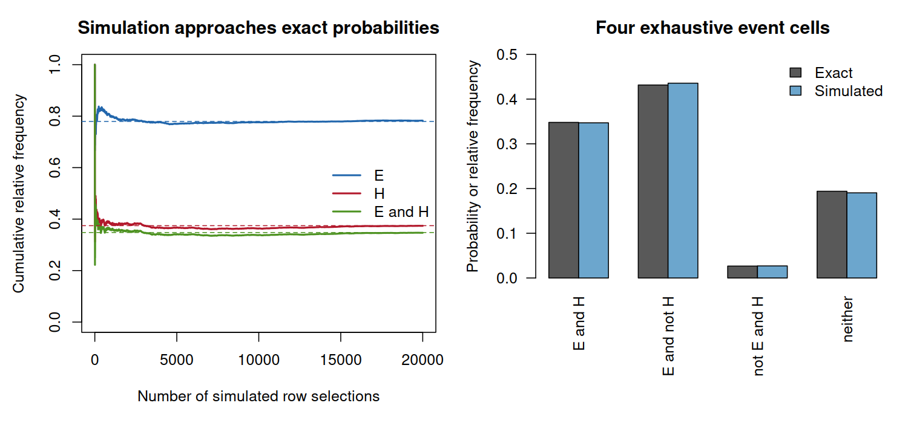

# Class 8: Probability Rules and Probability Models

**Date:** Monday, October 5, 2026  
**Status:** Complete first version  
**Last updated:** August 30, 2026

[← Class 7](../07-randomized-experiments-observational-studies-and-causal-effects/) · [Practice 8](practice/) · [Course syllabus](../../ECO202-Fall2026-Syllabus.pdf) · [Class 9 →](../09-conditional-probability-independence-and-bayes-rule/)

**Class-folder workflow:** Use this guide for preparation, class, and review; run adjacent files when directed; then complete [ungraded practice](practice/) before studying the [worked solutions](practice/solutions/).

<!-- Source lineage: Econ202-UlrichMueller/LectureNotes.tex, Formalizing Probability, lines 964--1199; legacy PS3; Moore, McCabe, and Craig, Chapter 4. Historical exercises and examinations were used only to calibrate scope and difficulty. The random-assignment and empirical examples are newly authored. The empirical example uses the documented wage1 CSV distributed with the course. -->

## Central question

How can a precisely stated random mechanism and a small set of probability rules turn uncertain outcomes into quantitative predictions that we can check?

## Learning goals

By the end of class, you should be able to:

1. define a sample space and events for a random phenomenon;
2. translate complements, unions, intersections, and disjointness between words, symbols, and diagrams;
3. state the probability axioms and derive short consequences from them;
4. calculate probabilities in finite models without assuming outcomes are equally likely unless the mechanism justifies that claim;
5. use complement and addition rules with correct overlap; and
6. distinguish an empirical frequency, a probability model, and a simulation-based check.

<a id="lecture-map"></a>

## In-class route

| Stop | Live focus | Mode |
|---|---|---|
| **C8.1** | [From a design to possible outcomes](#c8-stop-1) | Discuss + Checkpoint 1 |
| **C8.2** | [Sample spaces and event algebra](#c8-stop-2) | Board work 1 |
| **C8.3** | [The probability axioms](#c8-stop-3) | Explain + diagnose |
| **C8.4** | [Rules derived from the axioms](#c8-stop-4) | Board work 2 + Checkpoint 2 |
| **C8.5** | [A finite probability model from real data](#c8-stop-5) | Board work 3 + data demonstration |
| **C8.6** | [Model probabilities, frequencies, and simulation](#c8-stop-6) | Predict + run + verify |
| **C8.7** | [Audit a probability argument](#c8-stop-7) | AI interaction 1 + transfer |

## How to use this guide

**Prepare:** Describe all possible outcomes when exactly two of four firms are assigned to a program. Then describe one event as a set of outcomes before assigning it a probability.

**In class:** Begin with the random mechanism, sample space, and event. The board work develops the set logic and probability calculations; the data demonstration separates exact finite-model probabilities from simulated frequencies.

**Review:** Reconstruct the complement and general addition rules from disjoint pieces, then explain why a simulation can check a calculation without proving that a model describes the world.

**Practice:** Complete the short calculations and audits in Section 8, then use [Practice 8](practice/) for sustained self-study. Probability concepts and essential calculations are common core; software syntax and the optional coherence extension are not independent-mastery targets.

**Prerequisites:** Classes 6–7, fractions, and basic set notation. Random sampling and random assignment supply chance mechanisms; probability describes the outcomes those mechanisms can produce.

## Full guide map

1. [From a design to possible outcomes](#1-from-a-design-to-possible-outcomes)
2. [Sample spaces and event algebra](#2-sample-spaces-and-event-algebra)
3. [The probability axioms](#3-the-probability-axioms)
4. [Rules derived from the axioms](#4-rules-derived-from-the-axioms)
5. [A finite probability model from real data](#5-a-finite-probability-model-from-real-data)
6. [Model probabilities, frequencies, and simulation](#6-model-probabilities-frequencies-and-simulation)
7. [Audit a probability argument](#7-audit-a-probability-argument)
8. [Practice, common mistakes, and recap](#8-practice-common-mistakes-and-recap)

<a id="c8-stop-1"></a>

## 1. From a design to possible outcomes

Probability begins with a phenomenon whose outcome is not known in advance but whose possible outcomes can be described. In a randomized experiment, the assignment mechanism creates that uncertainty. In a sampling design, the selection mechanism does. A statistical model may also represent unexplained variation as random, but the source and interpretation of that randomness must be stated.

The forward probability question and the later inferential question point in opposite directions:

$$
\text{specified mechanism and population}
\longrightarrow
\text{probabilities of possible data},
$$

$$
\text{observed data}
\longrightarrow
\text{learning about an unknown population or effect}.
$$

Probability calculations cannot repair a selected sample, a failed randomization, or an unsuitable model. They quantify uncertainty conditional on the mechanism and assumptions supplied.

### Checkpoint 1

Suppose a program assigns exactly two of four firms to receive an invitation by drawing one of the six unordered pairs with equal probability. Which information defines the chance mechanism, and which information would be needed later to assess whether the invitation affected an outcome?

<a id="c8-stop-2"></a>

## 2. Sample spaces and event algebra

The **sample space** $\Omega$ is the set of mutually exclusive and exhaustive outcomes of the random phenomenon. An **event** $A$ is a subset of $\Omega$. The event occurs when the realized outcome belongs to that subset.

For events $A$ and $B$:

- $A^c=\Omega\setminus A$ is the event that $A$ does not occur;
- $A\cup B$ is the event that at least one of $A$ or $B$ occurs;
- $A\cap B$ is the event that both $A$ and $B$ occur; and
- $A$ and $B$ are **disjoint** when $A\cap B=\varnothing$.

The word *or* is inclusive in $A\cup B$: it includes outcomes in both events. Disjointness is about whether two events share outcomes. It is not the same as statistical independence, which is introduced in Class 9.

> [!IMPORTANT]
> **Board work 1 — Build a finite random-assignment model**
>
> Four firms are labeled $1,2,3,4$. Exactly two receive an invitation, and each unordered pair is equally likely.
>
> 1. Write the sample space $\Omega$ using the six possible pairs.
> 2. Let $A$ be the event that firm 1 is invited and $B$ the event that firm 2 is invited. List $A$, $B$, $A^c$, $A\cap B$, and $A\cup B$.
> 3. Decide whether $A$ and $B$ are disjoint.
> 4. Define two events that are complements and two nonempty events that are disjoint.
> 5. Before calculating, explain why the six elementary outcomes are equally likely.

Here $\Omega=\lbrace12,13,14,23,24,34\rbrace$, $A=\lbrace12,13,14\rbrace$, and $B=\lbrace12,23,24\rbrace$. Their intersection is $\lbrace12\rbrace$ and their union contains every outcome except $34$. The events overlap, so they are not disjoint.

<a id="c8-stop-3"></a>

## 3. The probability axioms

A probability model assigns a number $\mathbb P(A)$ to every event while obeying three requirements:

1. **Nonnegativity:** $\mathbb P(A)\geq0$ for every event $A$.
2. **Total probability:** $\mathbb P(\Omega)=1$.
3. **Additivity:** if $A_1,A_2,\ldots$ are pairwise disjoint, then

$$
\mathbb P\left(\bigcup_j A_j\right)=\sum_j\mathbb P(A_j).
$$

These axioms express coherent bookkeeping. They imply $\mathbb P(\varnothing)=0$ and $0\leq\mathbb P(A)\leq1$. They do not determine the substantively appropriate probability assignments: those come from a random mechanism, symmetry, an empirical model, long-run evidence, or another stated basis.

For the six-pair assignment mechanism, equal randomization gives probability $1/6$ to each elementary outcome. Additivity then gives $\mathbb P(A)=3/6$, $\mathbb P(B)=3/6$, and $\mathbb P(A\cap B)=1/6$.

An assignment such as $\mathbb P(A)=0.7$ and $\mathbb P(A^c)=0.5$ is impossible because probabilities of exhaustive, disjoint complements must add to one. A plausible decimal is not enough; the complete assignment must obey the axioms.

<a id="c8-stop-4"></a>

## 4. Rules derived from the axioms

Because $A$ and $A^c$ are disjoint and their union is $\Omega$, additivity gives the **complement rule**:

$$
\mathbb P(A^c)=1-\mathbb P(A).
$$

For two events with possible overlap, the **general addition rule** is

$$
\mathbb P(A\cup B)=\mathbb P(A)+\mathbb P(B)-\mathbb P(A\cap B).
$$

The intersection is subtracted once because it was counted in both $\mathbb P(A)$ and $\mathbb P(B)$. When $A$ and $B$ are disjoint, the intersection probability is zero and the rule reduces to additivity. If $A\subseteq B$, then $B$ is the disjoint union of $A$ and $B\setminus A$, so nonnegativity implies $\mathbb P(A)\leq\mathbb P(B)$.

> [!IMPORTANT]
> **Board work 2 — Derive before substituting**
>
> Use only disjoint decompositions and the three axioms.
>
> 1. Derive the complement rule from $\Omega=A\cup A^c$.
> 2. Decompose $A\cup B$ into $A\setminus B$, $A\cap B$, and $B\setminus A$ to derive the general addition rule.
> 3. Apply both rules to the four-firm assignment model: calculate $\mathbb P(A^c)$ and $\mathbb P(A\cup B)$.
> 4. Verify the union probability by counting its elementary outcomes.
> 5. Explain the error in adding $\mathbb P(A)+\mathbb P(B)$ without subtracting the overlap.

The assignment model gives $\mathbb P(A^c)=3/6=1/2$ and

$$
\mathbb P(A\cup B)=\frac{3}{6}+\frac{3}{6}-\frac{1}{6}=\frac{5}{6},
$$

which agrees with the five elementary outcomes in the union.

### Checkpoint 2

If $\mathbb P(A)=0.60$, $\mathbb P(B)=0.55$, and $\mathbb P(A\cap B)=0.30$, calculate $\mathbb P(A\cup B)$ and the probability that neither event occurs. Which calculation uses a complement?

<a id="c8-stop-5"></a>

## 5. A finite probability model from real data

The historical `wage1` file contains 526 workers from a 1976 Current Population Survey extract. The rows are observed records, not random outcomes by themselves. To create a finite probability model for this demonstration, define a new random mechanism: select one of the 526 rows uniformly at random.

Let $E$ be the event that the selected worker has at least 12 years of education and let $H$ be the event that the worker's recorded hourly wage is at least $6$. The dollar cutoff is a teaching definition applied to historical wages, not a current economic threshold.

| | $H$ | $H^c$ | Total |
|---|---:|---:|---:|
| $E$ | 183 | 227 | 410 |
| $E^c$ | 14 | 102 | 116 |
| Total | 197 | 329 | 526 |

Uniform row selection makes the finite outcomes equally likely. Therefore,

$$
\mathbb P(E)=\frac{410}{526}=0.7795,
\qquad
\mathbb P(H)=\frac{197}{526}=0.3745,
$$

$$
\mathbb P(E\cap H)=\frac{183}{526}=0.3479,
\qquad
\mathbb P(E\cup H)=\frac{424}{526}=0.8061.
$$

The union count is $410+197-183=424$. Its complement contains the 102 workers in neither event, so $\mathbb P((E\cup H)^c)=102/526=0.1939$. The two routes agree exactly before rounding.

> [!IMPORTANT]
> **Board work 3 — Reconstruct the event table and audit the denominator**
>
> Begin only with $N=526$, $n(E)=410$, $n(H)=197$, and $n(E\cap H)=183$.
>
> 1. Reconstruct all four interior cells and both margins.
> 2. Calculate $\mathbb P(E\cup H)$ using inclusion–exclusion.
> 3. Calculate the probability of neither event using the complement rule.
> 4. Verify that the four disjoint cell probabilities sum to one.
> 5. State the random mechanism that makes every denominator equal to 526.
> 6. Explain why these calculations do not establish a causal effect of education on wages.

The empirical file supplies the counts; the uniform-row mechanism supplies the probability interpretation. A different selection mechanism could assign different probabilities to the same 526 records.

<a id="c8-stop-6"></a>

## 6. Model probabilities, frequencies, and simulation

An **empirical frequency** reports what fraction of observed records satisfy an event. A **model probability** describes the chance of an event under a specified random mechanism or statistical model. In the uniform-row teaching model, the two have the same numerical value because each observed row receives probability $1/526$; they remain conceptually different objects.

A simulation repeatedly executes the stated mechanism and records the resulting events. Its relative frequencies fluctuate around the exact model probabilities. More repetitions generally reduce Monte Carlo noise, but they do not repair incorrect event definitions or an unsuitable model.



The linear, line-by-line commented script [`class-08-probability-models.R`](class-08-probability-models.R) reads the local [`wage1` data](data/README.md), verifies the five supplied event counts, simulates 20,000 uniform row selections with a fixed seed, and regenerates the figure. The exact calculation is authoritative for this finite teaching model; the simulation is an implementation check.

Simulation agreement checks that the code plausibly implements the model and that the analytic result is on the right scale. It does not show that a uniformly selected row represents a current worker, recover the original CPS sampling design, or turn the education–wage association into a causal relationship.

<a id="c8-stop-7"></a>

## 7. Audit a probability argument

> [!TIP]
> **AI interaction 1 — Separate mechanism, algebra, and simulation**
>
> Before using AI, calculate the four event-cell probabilities and the union probability from Section 5. Then use the prompt below to obtain an auditable argument. Check every claimed sample space, event definition, denominator, use of equal likelihood, overlap correction, and interpretation against the table and script.

```text
We define a teaching probability model by selecting one row uniformly from a
fixed historical dataset of 526 workers. Event E is at least 12 years of
education and event H is hourly wage at least $6. The counts are n(E)=410,
n(H)=197, n(E intersection H)=183, n(E union H)=424, and n(neither)=102.

Explain the sample space and why its elementary outcomes are equally likely
under this stated mechanism. Reconstruct the four-cell event table; derive the
union and neither probabilities from the probability axioms; and distinguish
the observed data counts, exact model probabilities, and simulated relative
frequencies.

Audit your own answer for double counting, an incorrect denominator,
unsupported representativeness, or causal language. End with two independent
numerical checks.
```

### Complete non-AI route

Audit this prewritten response using the same checklist:

> “Because 410 workers meet $E$ and 197 meet $H$, the probability of $E$ or $H$ is $(410+197)/526=1.154$. The result above one simply means the events are associated. A simulation that produces a frequency near 0.806 proves both that the model is correct and that education raises wages.”

The first mathematical error is double counting the 183 workers in the intersection. Association cannot justify a probability above one, and neither an exact finite-table calculation nor a simulation supplies representativeness or causal identification. A correct audit ends with $424/526=0.8061$ for the union and $102/526=0.1939$ for its complement.

### Common misconceptions

- **“Every listed outcome is equally likely.”** Equal likelihood follows from the mechanism, not from a tidy list.
- **“Or means exactly one.”** A union includes the intersection unless the events are disjoint.
- **“Disjoint means independent.”** Disjointness means no shared outcomes; independence is a different probability property studied in Class 9.
- **“A frequency is automatically a population probability.”** The relevant population and selection mechanism must be specified.
- **“A close simulation proves the real-world model.”** It checks computation under the model, not the substantive assumptions behind the model.

### Unaided transfer

Suppose a model gives $\mathbb P(A)=0.48$, $\mathbb P(B)=0.36$, and $\mathbb P(A\cap B)=0.21$. Without AI, calculate the probability of the union, neither event, and exactly one event. Then state what additional mechanism or evidence would be needed before interpreting these model probabilities as frequencies in a target population. After attempting the problem, check that the three numerical results are $0.63$, $0.37$, and $0.42$; the substantive answer must identify the source and target of the probability assignments.

## 8. Practice, common mistakes, and recap

### Quick practice

1. In the four-firm assignment model, find the probability that firm 1 is invited but firm 2 is not.
2. Suppose $\mathbb P(A)=0.72$, $\mathbb P(B)=0.41$, and $\mathbb P(A\cap B)=0.28$. Find the union probability and the probability of neither event.
3. Construct an example of three elementary outcomes that are not equally likely, assign coherent probabilities, and calculate the probability of an event containing two outcomes.
4. In the `wage1` model, calculate $\mathbb P(E\cap H^c)$ and $\mathbb P(E^c\cap H)$, then verify that neither exceeds its corresponding marginal probability.
5. Explain what would change if rows were selected with unequal probabilities.

### Compact answer checks

1. The event is $\lbrace13,14\rbrace$, so its probability is $2/6=1/3$.
2. The union probability is $0.72+0.41-0.28=0.85$; neither has probability $1-0.85=0.15$.
3. The probabilities must be nonnegative and sum to one; the event probability is the sum assigned to its two outcomes.
4. The probabilities are $227/526=0.4316$ and $14/526=0.0266$.
5. Counts divided by 526 would no longer be the model probabilities; the assigned row probabilities would have to be summed over each event.

### Common core

You should be able to define $\Omega$ and events from a random mechanism; use complements, unions, intersections, and disjointness; state the three axioms; derive and apply complement, addition, and monotonicity rules; calculate in finite spaces; justify or reject equal likelihood; and distinguish data frequencies, model probabilities, simulations, and substantive assumptions.

### Explore further

- Prove De Morgan's laws and the three-event inclusion–exclusion rule.
- Use combinations to count outcomes under sampling or assignment without replacement.
- Study probability coherence through state-contingent payoffs and explain why a pricing probability in finance need not equal a physical event frequency.
- Compare Monte Carlo error after 100, 1,000, and 20,000 repetitions.

### Recap

Probability begins with a mechanism and a sample space. Events organize possible outcomes; the axioms constrain their probabilities; derived rules prevent double counting; and a simulation checks an implementation without replacing either the analytic argument or the substantive model audit. The next class adds conditioning and asks how probabilities change when new information restricts the relevant set of outcomes.

## Notation

| Symbol | Meaning |
|---|---|
| $\Omega$ | sample space |
| $A,B$ | events, or subsets of the outcome space ($\Omega$) |
| $A^c$ | complement of event ($A$) |
| $A\cup B$ | union: at least one event occurs |
| $A\cap B$ | intersection: both events occur |
| $\varnothing$ | empty event |
| $\mathbb P(A)$ | probability of event ($A$) under the stated model |

## References and continuity

- Moore, McCabe, and Craig, *Introduction to the Practice of Statistics*, 10th ed., Chapter 4.
- Diez, Çetinkaya-Rundel, and Barr, *OpenIntro Statistics*, 4th ed., probability chapters.
- Jeffrey M. Wooldridge, `wage1` data distributed with the [`wooldridge` R package](https://CRAN.R-project.org/package=wooldridge); local provenance and limitations are recorded in [`data/README.md`](data/README.md).
- Continuity with prior ECO 202: randomness and inference, sample spaces, events, complements, unions, intersections, disjointness, probability axioms, derived rules, finite spaces, the source of probability assignments, and a brief optional coherence connection are retained. Extended betting arguments and risk-neutral finance are optional rather than part of the common core.
