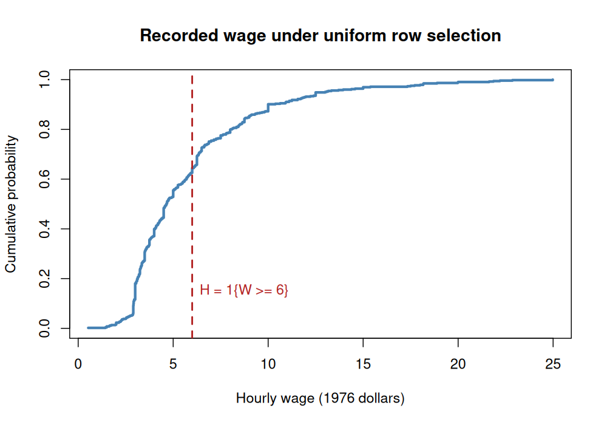

# Class 10: Random Variables, Expectations, Variance, and Covariance

**Date:** Monday, October 26, 2026  
**Status:** Complete first version  
**Last updated:** August 30, 2026

**Previous meeting:** In-Class Exam 2 · [Practice 10](practice/) · [Course syllabus](../../ECO202-Fall2026-Syllabus.pdf) · [Class 11 →](../11-sampling-distributions-for-counts-proportions-and-means/)

**Class-folder workflow:** Use this guide for preparation, class, and review; run adjacent files when directed; then complete [ungraded practice](practice/) before studying the [worked solutions](practice/solutions/).

<!-- Source lineage: Scope is calibrated against Econ202-UlrichMueller/LectureNotes.tex, lines 1337--2013; Spring 2026 PS4; selected private second-midterm calibration material; and Moore, McCabe, and Craig, Chapter 4. The fixed-row wage probability model uses the documented course-distributed wage1 CSV. The profit, portfolio, and audit examples are newly authored; no protected exercise or reserved exam question is reproduced. -->

## Central question

How can a probability model turn uncertain economic outcomes into numerical variables—and how do expectation, variance, and covariance describe what happens when those variables are transformed or combined?

## Learning goals

By the end of class, you should be able to:

1. distinguish a random variable from one realization and from its probability distribution;
2. describe discrete random variables with a probability mass function, continuous random variables with a density, and either kind with a cumulative distribution function;
3. calculate and interpret expectations of variables, transformations, and indicators;
4. calculate variance and standard deviation while tracking units and linear transformations;
5. obtain marginal distributions from a joint distribution and calculate covariance and correlation;
6. find the variance of a sum using covariance; and
7. explain why independence implies zero covariance while zero covariance does not generally imply independence.

<a id="lecture-map"></a>

## In-class route

| Stop | Live focus | Mode |
|---|---|---|
| **C10.1** | [From an outcome to a random variable](#c10-stop-1) | Board work 1 + classification |
| **C10.2** | [Expectation, transformations, and indicators](#c10-stop-2) | Board work 2 + Checkpoint 1 |
| **C10.3** | [Variance, standard deviation, and units](#c10-stop-3) | Calculation + scale audit |
| **C10.4** | [Joint distributions, covariance, and correlation](#c10-stop-4) | Board work 3 + joint-table calculation |
| **C10.5** | [Sums, dependence, and diversification](#c10-stop-5) | Board work 4 + Checkpoint 2 |
| **C10.6** | [A fixed-file wage probability model](#c10-stop-6) | Data demonstration + verification |
| **C10.7** | [Audit a moment report](#c10-stop-7) | AI interaction 1 + non-AI route |

## How to use this guide

**Prepare:** Review the Class 8 probability-model workflow and the Class 9 distinction between joint, marginal, and conditional probabilities. Before class, write one sentence distinguishing an uncertain quantity $X$ from a realized value $x$.

**In class:** Name the probability experiment before calculating a moment. Keep the distribution, its numerical summaries, and any observed or selected realization separate; predict the sign and units of each answer before trusting arithmetic or software.

**Review:** Reconstruct the profit, joint wage–education, and portfolio examples from their probability tables. Then explain the indicator identity and the variance-of-a-sum rule without referring to R syntax.

**Practice:** Complete the short problems in Section 8, then use [Practice 10](practice/) for a 45–55 minute staged core with compact checks and public worked solutions after an attempt. The statistical reasoning and calculations are common core, while memorized software syntax is not.

**Prerequisites:** Classes 8–9; weighted averages, squared deviations, probability tables, and correlation from Class 4.

## Full guide map

1. [From an outcome to a random variable](#1-from-an-outcome-to-a-random-variable)
2. [Expectation, transformations, and indicators](#2-expectation-transformations-and-indicators)
3. [Variance, standard deviation, and units](#3-variance-standard-deviation-and-units)
4. [Joint distributions, covariance, and correlation](#4-joint-distributions-covariance-and-correlation)
5. [Sums, dependence, and diversification](#5-sums-dependence-and-diversification)
6. [A fixed-file wage probability model](#6-a-fixed-file-wage-probability-model)
7. [Audit a moment report](#7-audit-a-moment-report)
8. [Practice and answer checks](#8-practice-and-answer-checks)
9. [Common core, optional paths, and recap](#9-common-core-optional-paths-and-recap)

<a id="c10-stop-1"></a>

## 1. From an outcome to a random variable

A **random variable** assigns a number to each outcome of a specified random phenomenon. Before the outcome is known, use an uppercase letter such as $X$ for the random variable. After one outcome occurs, use a lowercase letter such as $x$ for its realized value.

Consider a seller whose next-day net profit $X$, measured in hundreds of dollars, depends on demand. The probability model is

| Demand state | Low | Regular | High |
|---|---:|---:|---:|
| Profit realization ($x$) | $-1$ | $2$ | $5$ |
| $\mathbb P(X=x)$&nbsp;probability | $0.25$ | $0.50$ | $0.25$ |

Before demand is observed, $X$ is a random variable with three possible values. If regular demand occurs, the realization is $x=2$, or 200 dollars. That one realization is not the distribution of $X$.

### Discrete variables, continuous variables, and the CDF

A **discrete random variable** has a finite or countable set of possible values. Its probability mass function is

$$
p_X(x)=\mathbb P(X=x),
$$

with $p_X(x)\geq0$ and the masses summing to one. The profit variable is discrete.

A **continuous random variable** is modeled with a probability density function $f_X(x)$. Probability is area under the density:

$$
\mathbb P(a\leq X\leq b)=\int_a^b f_X(x)\mkern3mu dx.
$$

For a continuous variable, the height $f_X(x)$ is not a point probability and $\mathbb P(X=x)=0$. For example, if a waiting time $T$ is uniform on $[0,2]$, then $f_T(t)=1/2$ on that interval and $\mathbb P(0.5\leq T\leq1.5)=1/2$. A Normal variable is written $Z\sim\mathsf{N}(\mu,\sigma^2)$ in this course: the second argument is the variance, while the standard deviation is $\sigma$.

The **cumulative distribution function** works for discrete and continuous variables:

$$
F_X(x)=\mathbb P(X\leq x).
$$

It is nondecreasing, remains between zero and one, and approaches zero on the far left and one on the far right. For the profit variable,

$$
F_X(x)=
\begin{cases}
0, & x<-1, \\
0.25, & -1\leq x<2, \\
0.75, & 2\leq x<5, \\
1, & x\geq5.
\end{cases}
$$

> [!IMPORTANT]
> **Board work 1 — Construct and read a distribution**
>
> 1. verify that the profit probabilities form a valid probability mass function;
> 2. draw its probability-mass graph and step CDF;
> 3. calculate $\mathbb P(X<5)$, $\mathbb P(X\geq2)$, and $F_X(2)$;
> 4. explain why $F_X(2)$ includes the mass at 2; and
> 5. contrast $p_X(2)$ with a density height $f_T(1)$.

The answers are $0.75$, $0.75$, and $0.75$. The identical decimals answer different probability questions, so notation and the event must remain visible.

<a id="c10-stop-2"></a>

## 2. Expectation, transformations, and indicators

For a discrete random variable, the **expectation** is its probability-weighted average:

$$
\mathbb E[X]=\sum_x x\mathbb P(X=x).
$$

For a continuous random variable with density, replace the sum with an integral:

$$
\mathbb E[X]=\int_{-\infty}^{\infty}x f_X(x)\mkern3mu dx,
$$

provided the expectation exists. Expectation summarizes the center of the probability distribution; it need not be a possible realization, a guarantee, or the most likely value.

For the profit variable,

$$
\mathbb E[X]
=(-1)(0.25)+(2)(0.50)+(5)(0.25)
=2.
$$

Expected profit is therefore 2 hundred dollars, or 200 dollars. It is not a statement that tomorrow's realized profit must equal 200 dollars.

If $g$ transforms the outcomes, then

$$
\mathbb E[g(X)]=\sum_x g(x)\mathbb P(X=x)
$$

in the discrete case, with the analogous density integral in the continuous case. In general,

$$
\mathbb E[g(X)]\ne g(\mathbb E[X])
$$

for nonlinear $g$. For example,

$$
\mathbb E[X^2]
=(1)(0.25)+(4)(0.50)+(25)(0.25)
=8.5
\ne4=(\mathbb E[X])^2.
$$

Linearity is the important exception. For constants $a$ and $b$,

$$
\mathbb E[a+bX]=a+b\mathbb E[X],
$$

and for any jointly distributed $X$ and $Y$ whose expectations exist,

$$
\mathbb E[X+Y]=\mathbb E[X]+\mathbb E[Y].
$$

Independence is not required for linearity of expectation.

An **indicator random variable** converts an event into a zero-one variable. Let

$$
H=\mathbf 1\lbrace X\geq2\rbrace.
$$

Then $H=1$ when profit is at least 200 dollars and $H=0$ otherwise. Because $H$ is either zero or one,

$$
\mathbb E[H]
=0\mathbb P(H=0)+1\mathbb P(H=1)
=\mathbb P(X\geq2)
=0.75.
$$

The identity $\mathbb E[\mathbf 1\lbrace A\rbrace]=\mathbb P(A)$ is a bridge between probabilities and expectations.

> [!IMPORTANT]
> **Board work 2 — Transform a payoff and an event**
>
> Let dollar profit including a fixed 50-dollar payment be $Y=50+100X$.
>
> 1. list the three possible realizations of $Y$ and their probabilities;
> 2. calculate $\mathbb E[Y]$ directly from its distribution;
> 3. verify the result using linearity of expectation;
> 4. write the distribution of $H=\mathbf 1\lbrace X\geq2\rbrace$; and
> 5. explain why $\mathbb E[H]=0.75$ is possible even though $H$ can realize only 0 or 1.

The transformed profits are $-50$, 250, and 550 dollars, and both expectation routes give $\mathbb E[Y]=250$ dollars.

### Checkpoint 1

Suppose $A$ and $B$ are dependent zero-one variables. Which of the following calculations require independence: $\mathbb E[A+B]=\mathbb E[A]+\mathbb E[B]$; $\mathbb E[3-2A]=3-2\mathbb E[A]$; $\mathbb E[AB]=\mathbb E[A]\mathbb E[B]$? Explain the distinction rather than supplying only a yes or no.

<a id="c10-stop-3"></a>

## 3. Variance, standard deviation, and units

The **variance** of $X$ is the expected squared distance from its expectation:

$$
\mathrm{Var}(X)
=\mathbb E[(X-\mathbb E[X])^2]
=\mathbb E[X^2]-(\mathbb E[X])^2.
$$

The **standard deviation** is

$$
\mathrm{SD}(X)=\sqrt{\mathrm{Var}(X)}.
$$

Variance has squared units, while standard deviation has the same units as the random variable. For profit in hundreds of dollars,

$$
\mathrm{Var}(X)=8.5-2^2=4.5
$$

in squared hundreds of dollars, and

$$
\mathrm{SD}(X)=\sqrt{4.5}\approx2.1213
$$

in hundreds of dollars.

For constants $a$ and $b$,

$$
\mathrm{Var}(a+bX)=b^2\mathrm{Var}(X),
\qquad
\mathrm{SD}(a+bX)=|b|\mathrm{SD}(X).
$$

Adding a constant changes location but not spread. Multiplying by $b$ multiplies deviations by $b$, variance by $b^2$, and standard deviation by $|b|$. Therefore the dollar-profit variable $Y=50+100X$ has

$$
\mathrm{Var}(Y)=100^2(4.5)=45{,}000
$$

in squared dollars and $\mathrm{SD}(Y)=100\sqrt{4.5}\approx212.13$ dollars.

**Units check:** A report that gives a variance of 212.13 dollars has mislabeled a standard deviation. A report that changes the variance after adding 50 dollars has mishandled a location shift.

<a id="c10-stop-4"></a>

## 4. Joint distributions, covariance, and correlation

A **joint distribution** assigns probabilities to pairs $(X,Y)$. The **marginal distribution** of one variable is obtained by summing joint probabilities over the possible values of the other. For discrete variables,

$$
\mathbb P(X=x)=\sum_y\mathbb P(X=x,Y=y).
$$

The variables are independent when every joint probability factors into its marginals:

$$
\mathbb P(X=x,Y=y)=\mathbb P(X=x)\mathbb P(Y=y)
$$

for every pair of possible values. One failed pair is enough to disprove independence; a few successful pairs are not enough to prove it.

Covariance summarizes whether two variables tend to lie above or below their expectations together:

$$
\mathrm{Cov}(X,Y)
=\mathbb E[(X-\mathbb E[X])(Y-\mathbb E[Y])]
=\mathbb E[XY]-\mathbb E[X]\mathbb E[Y].
$$

A positive covariance indicates that above-mean values tend to accompany above-mean values; a negative covariance indicates opposite movement. Its units are the product of the variables' units, so its magnitude changes under rescaling.

When both standard deviations are positive, correlation standardizes covariance:

$$
\mathrm{Corr}(X,Y)
=\frac{\mathrm{Cov}(X,Y)}{\mathrm{SD}(X)\mathrm{SD}(Y)}.
$$

Correlation is unitless and lies between $-1$ and 1. As in Class 4, covariance and correlation describe co-movement under the stated distribution; neither alone identifies a causal effect.

> [!IMPORTANT]
> **Board work 3 — Calculate covariance and correlation from a joint table**
>
> In a stylized teaching distribution, $W$ is hourly wage in dollars and $Q$ is completed education in years. The four interior cells give joint probabilities.
>
> | Education row | $W=4$ | $W=8$ | Marginal probability |
> |---|---:|---:|---:|
> | $Q=12$ | $0.40$ | $0.10$ | $0.50$ |
> | $Q=16$ | $0.10$ | $0.40$ | $0.50$ |
> | **Marginal probability** | **$0.50$** | **$0.50$** | **$1.00$** |
>
> 1. verify both marginal distributions from the four joint cells;
> 2. calculate $\mathbb E[W]$ and $\mathbb E[Q]$;
> 3. calculate $\mathrm{Var}(W)$, $\mathrm{SD}(W)$, $\mathrm{Var}(Q)$, and $\mathrm{SD}(Q)$;
> 4. calculate $\mathbb E[WQ]$ and then $\mathrm{Cov}(W,Q)$;
> 5. standardize the covariance to obtain $\mathrm{Corr}(W,Q)$; and
> 6. use one joint cell to test independence and state why the association is not automatically causal.

The marginal calculations give $\mathbb E[W]=6$, $\mathbb E[Q]=14$, $\mathrm{Var}(W)=\mathrm{Var}(Q)=4$, and $\mathrm{SD}(W)=\mathrm{SD}(Q)=2$. The product expectation is

$$
\mathbb E[WQ]
=48(0.40)+96(0.10)+64(0.10)+128(0.40)
=86.4,
$$

so

$$
\mathrm{Cov}(W,Q)=86.4-(6)(14)=2.4
$$

and

$$
\mathrm{Corr}(W,Q)=\frac{2.4}{(2)(2)}=0.6.
$$

The variables are not independent because $\mathbb P(W=4,Q=12)=0.40$ while $\mathbb P(W=4)\mathbb P(Q=12)=0.25$. This is a complete probability calculation for a stylized distribution, not evidence that education causes wages.

<a id="c10-stop-5"></a>

## 5. Sums, dependence, and diversification

Expectation of a sum depends only on marginal expectations, but variance of a sum depends on the joint distribution:

$$
\mathrm{Var}(X+Y)
=\mathrm{Var}(X)+\mathrm{Var}(Y)+2\mathrm{Cov}(X,Y).
$$

More generally,

$$
\mathrm{Var}(aX+bY)
=a^2\mathrm{Var}(X)+b^2\mathrm{Var}(Y)+2ab\mathrm{Cov}(X,Y).
$$

The covariance term records whether deviations reinforce or offset one another.

> [!IMPORTANT]
> **Board work 4 — Dependence changes the risk of a sum**
>
> Two assets have returns $X$ and $Y$, measured in percentage points, under three equally likely economic states.
>
> | State | Slow | Stable | Strong |
> |---|---:|---:|---:|
> | $x$ | $-2$ | $1$ | $4$ |
> | $y$ | $4$ | $1$ | $-2$ |
> | Probability | $1/3$ | $1/3$ | $1/3$ |
>
> 1. obtain the marginal distribution and expectation of each return;
> 2. calculate both variances and the covariance;
> 3. calculate $\mathrm{Var}(X+Y)$ from the three possible sums;
> 4. verify it with the variance-of-a-sum formula; and
> 5. compare the result with two independent returns that have the same marginal distributions.

Here $\mathbb E[X]=\mathbb E[Y]=1$, $\mathrm{Var}(X)=\mathrm{Var}(Y)=6$, and $\mathrm{Cov}(X,Y)=-6$. Because $X+Y=2$ in every state, its variance is zero. The formula agrees: $6+6+2(-6)=0$. Independent variables with the same marginals would instead have covariance zero and sum variance 12.

### Independence and uncorrelatedness are not equivalent

If $X$ and $Y$ are independent and have finite second moments, then $\mathrm{Cov}(X,Y)=0$. Independence is a statement about the complete joint distribution; zero covariance checks only one weighted average of joint deviations. The converse therefore fails.

For a concrete counterexample, let $U$ take the values $-1$, 0, and 1 with probability $1/3$ each, and define $V=U^2$. Then

$$
\mathbb E[U]=0,
\qquad
\mathbb E[V]=\frac23,
\qquad
\mathbb E[UV]=\mathbb E[U^3]=0,
$$

so $\mathrm{Cov}(U,V)=0$. Yet $U$ and $V$ are dependent because $V$ is completely determined by $U$; for example,

$$
\mathbb P(V=0\mid U=0)=1
\ne
\frac13=\mathbb P(V=0).
$$

### Checkpoint 2

Classify each statement as always true or not always true: independence implies zero covariance; zero covariance implies independence; zero covariance makes variances add; zero covariance makes a product expectation factor; zero covariance makes all conditional distributions equal to their marginals.

<a id="c10-stop-6"></a>

## 6. A fixed-file wage probability model

The historical `wage1` file contains 526 records from a 1976 Current Population Survey extract. For this class only, define the random experiment to be: select one of those 526 rows uniformly, so each row has probability $1/526$. The 526 recorded rows are treated as a fixed teaching population. This course-created mechanism does not reconstruct the original CPS design, establish representativeness for a broader population, or make the data current.

For the selected row, define

- $W$: recorded hourly wage in 1976 dollars per hour;
- $Q$: completed education in years; and
- $H=\mathbf 1\lbrace W\geq6\rbrace$: an indicator that recorded hourly wage is at least 6 dollars.

These are discrete random variables under the uniform-row model, even though wage and education are quantitative. Their support consists of the values recorded in the finite file.

The fixed-file calculations give

$$
\mathbb E[W]
=\frac{1}{526}\sum_{i=1}^{526}w_i
\approx5.896103,
$$

$$
\mathrm{Var}(W)
=\frac{1}{526}\sum_{i=1}^{526}(w_i-\mathbb E[W])^2
\approx13.61295,
$$

and

$$
\mathrm{SD}(W)\approx3.689574.
$$

The expectation and standard deviation are in 1976 dollars per hour; the variance is measured in the square of that unit.

For education, the corresponding fixed-file moments are

$$
\mathbb E[Q]\approx12.56274,
\qquad
\mathrm{Var}(Q)\approx7.652908,
\qquad
\mathrm{SD}(Q)\approx2.766389.
$$

Exactly 197 of the 526 records meet the wage threshold, so

$$
\mathbb E[H]
=\mathbb P(W\geq6)
=\frac{197}{526}
\approx0.3745247.
$$

The weak inequality matters because 10 rows have recorded wage exactly equal to 6. The relevant complement uses the left limit of the CDF:

$$
\mathbb P(W\geq6)
=1-F_W(6^-)
=1-\mathbb P(W<6)
=1-\frac{329}{526}
=\frac{197}{526}.
$$

The same left limit is also written $F_W(6-)$. In contrast,

$$
1-F_W(6)
=\mathbb P(W>6)
=\frac{187}{526},
$$

which excludes the 10-row atom at $W=6$.

Finally,

$$
\mathrm{Cov}(W,Q)\approx4.142973
$$

in (1976 dollars per hour) times years of education, and

$$
\mathrm{Corr}(W,Q)
=\frac{\mathrm{Cov}(W,Q)}{\mathrm{SD}(W)\mathrm{SD}(Q)}
\approx0.405903.
$$

The positive sign describes co-movement under uniform row selection. It does not show that another year of education would cause the selected worker's wage to rise.

The line-by-line commented script [`class-10-random-variables-and-moments.R`](class-10-random-variables-and-moments.R) calculates each result from [`data/wage1.csv`](data/wage1.csv), explicitly uses divisor 526 for fixed-population variance and covariance, checks the correlation two ways, and regenerates the CDF figure. The [data notes](data/README.md) record provenance and license information.

Open this class folder as the working folder, then run:

```sh
Rscript class-10-random-variables-and-moments.R
```



The graph is a step CDF because the row-selected wage has finite support. It describes the fixed file under the stated probability model, not uncertainty about a population estimate.

<a id="c10-stop-7"></a>

## 7. Audit a moment report

First audit this proposed report without assistance:

> “Recorded wage is continuous because it is numerical. The expected wage is approximately 5.896103, so every selected worker should earn about that amount, and the variance is approximately 13.61295 dollars per hour. The indicator's expectation cannot be 0.3745 because the indicator is always zero or one. Positive wage–education covariance proves that education raises wages. If two variables have zero covariance, they are independent, so the variance of their sum equals the sum of their variances. R's `var()` command automatically computes the 526-row population variance.”

> [!TIP]
> **AI interaction 1 — Audit definitions, denominators, units, and claims**
>
> Attempt the audit yourself first. Then ask an AI system to identify and repair each claim. Verify every numerical correction from the formulas or class script and reject any causal or independence conclusion that exceeds the probability model.

```text
Treat 526 recorded wage rows as a fixed teaching population. Select one row
uniformly, so each row has probability 1/526. Define W as recorded hourly
wage, Q as completed education, and H=1{W>=6}. The rounded moment values are
approximately expected value of W = 5.896103, Var(W)=13.61295, SD(W)=3.689574,
SD(Q)=2.766389, Cov(W,Q)=4.142973, and Corr(W,Q)=0.405903; exactly
expected value of H = 197/526.

Audit this report: "W is continuous because it is numerical; the expected
value of W is what
every selected row should realize; variance has wage units; a zero-one
indicator cannot have expectation 0.3745; positive covariance proves a
causal education effect.
If two variables have zero covariance, they are independent, so the variance
of their sum equals the sum of their variances.
R var() automatically uses divisor 526."

Identify the first error, then repair every claim. Check the probability
mechanism, uppercase-versus-lowercase notation, units, divisor, indicator
identity, covariance-versus-correlation distinction, variance-of-a-sum
formula, independence logic, and causal scope. For the zero-covariance
sentence, distinguish a correct variance conclusion from an invalid
independence justification. Do not extend the report to claims about a
broader population or current workers.
```

**Complete non-AI route:** Audit the same quoted report above. Label the experiment, list the support of $H$, and apply the definitions of expectation, variance, covariance, correlation, and independence. Check the divisor in the displayed fixed-population formula against the output of `var()`, whose default calculation uses divisor 525 here. Audit this exact statement: “If two variables have zero covariance, they are independent, so the variance of their sum equals the sum of their variances.” Zero covariance does make the variances add, but it does not establish independence; use the $U,U^2$ counterexample to verify the distinction. Finish by rewriting the report as a fixed-file descriptive statement with no causal or current-population conclusion.

**Audit question:** Does the response preserve the distinction between a quantitative variable and a continuous probability model, give variance squared units, recover $\mathbb E[H]=\mathbb P(H=1)$, and explain both that zero covariance makes the variance of a sum additive and that zero covariance does not prove independence?

## 8. Practice and answer checks

These short checks support immediate retrieval. The separate [Practice 10 module](practice/) provides a longer staged route, compact checks, and public worked solutions after an attempt.

### Practice A — A new discrete payoff

A payoff $R$ takes values $-2$, 1, and 4 with probabilities 0.20, 0.50, and 0.30. Calculate $\mathbb E[R]$, $\mathrm{Var}(R)$, $\mathrm{SD}(R)$, and $\mathbb E[\mathbf 1\lbrace R\geq1\rbrace]$.

**Answer check:** $\mathbb E[R]=1.3$, $\mathbb E[R^2]=6.1$, $\mathrm{Var}(R)=6.1-1.3^2=4.41$, $\mathrm{SD}(R)=2.1$, and the indicator expectation is 0.80.

### Practice B — Risk of a sum

Suppose $\mathrm{Var}(A)=9$, $\mathrm{Var}(B)=4$, and $\mathrm{Cov}(A,B)=-3$. Find $\mathrm{Corr}(A,B)$ and $\mathrm{Var}(A+B)$. Which answer would change if $A$ and $B$ were independent but retained the same marginal variances?

**Answer check:** The standard deviations are 3 and 2, so $\mathrm{Corr}(A,B)=-3/(3\cdot2)=-0.5$ and $\mathrm{Var}(A+B)=9+4+2(-3)=7$. Under independence, correlation and covariance would be zero and the sum variance would be 13.

### Practice C — From a CDF to probabilities

Using the profit CDF in Section 1, find $\mathbb P(X=2)$ from the jump at 2, $\mathbb P(-1<X\leq2)$, and $\mathbb P(X>2)$.

**Answer check:** The answers are $0.75-0.25=0.50$, 0.50, and $1-F_X(2)=0.25$.

## 9. Common core, optional paths, and recap

**Common core:** Random variables versus realizations; discrete versus continuous models; pmfs, densities, and CDFs; expectations of variables and functions; linearity; indicators; variance, standard deviation, and units; transformations; joint and marginal distributions; covariance and correlation; variance of sums; independence versus uncorrelatedness; and interpretation within the stated probability model.

**Explore further:** Mixed discrete–continuous distributions; formal existence conditions for moments; full proofs of expectation and covariance identities; covariance under general affine transformations; the Cauchy–Schwarz proof that correlation lies in $[-1,1]$; expected utility; and portfolio optimization. These paths deepen the framework but are not substitutes for the common-core calculations and distinctions.

Common mistakes to avoid:

- calling every quantitative variable continuous without naming its probability model;
- treating a realization $x$ as the random variable $X$ or as its distribution;
- interpreting density height as point probability;
- assuming that expectation must be a possible or guaranteed realization;
- replacing $\mathbb E[g(X)]$ with $g(\mathbb E[X])$ for nonlinear $g$;
- forgetting squared units for variance or the $b^2$ scale factor;
- applying linearity of expectation only under independence;
- omitting covariance from the variance of a sum;
- inferring independence from zero covariance; and
- interpreting covariance or correlation causally.

The durable workflow is:

> Define the random experiment → define the random variable and units → display its distribution → calculate moments → check transformations and dependence → verify units and identities → interpret only within scope

## Notation introduced in this class

- $X$ and $x$: a random variable and one possible realization;
- $p_X(x)=\mathbb P(X=x)$: probability mass function;
- $f_X(x)$: probability density function;
- $F_X(x)=\mathbb P(X\leq x)$: cumulative distribution function;
- $\mathbb E[X]$: expectation;
- $\mathrm{Var}(X)$ and $\mathrm{SD}(X)$: variance and standard deviation;
- $\mathbf 1\lbrace A\rbrace$: indicator of event $A$;
- $\mathrm{Cov}(X,Y)$ and $\mathrm{Corr}(X,Y)$: covariance and correlation; and
- $Z\sim\mathsf{N}(\mu,\sigma^2)$: Normal variable with mean $\mu$ and variance $\sigma^2$.

## References

- Moore, McCabe, and Craig, *Introduction to the Practice of Statistics*, 10th ed., Chapter 4.
- Diez, Çetinkaya-Rundel, and Barr, *OpenIntro Statistics*, 4th ed., sections on random variables and distributions.
- Wooldridge, *Introductory Econometrics: A Modern Approach*, 7th ed.; [`wage1` data and provenance notes](data/README.md).

[↑ In-class route](#lecture-map)
