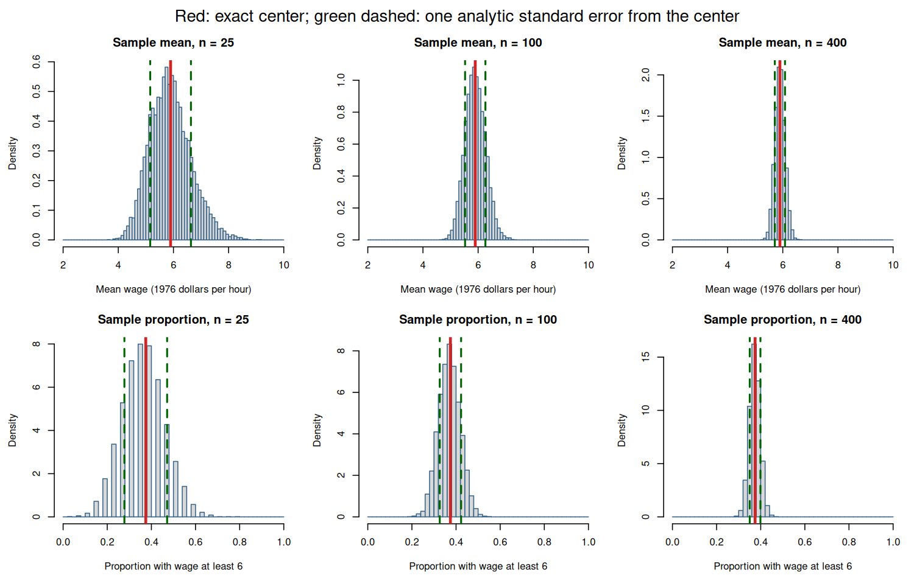

# Class 11: Sampling Distributions for Counts, Proportions, and Means

**Date:** Wednesday, October 28, 2026  
**Status:** Complete first version  
**Last updated:** August 30, 2026

[← Class 10](../10-random-variables-expectations-variance-and-covariance/) · [Practice 11](practice/) · [Course syllabus](../../ECO202-Fall2026-Syllabus.pdf) · [Class 12 →](../12-laws-of-large-numbers-and-central-limit-theorem/)

**Class-folder workflow:** Use this guide for preparation, class, and review; run adjacent files when directed; then complete [ungraded practice](practice/) before studying the [worked solutions](practice/solutions/).

<!-- Source lineage: Scope is calibrated against Econ202-UlrichMueller/LectureNotes.tex, lines 2014--2192 and 2455--2536; Spring 2026 PS5, especially Problem 3; selected private second-midterm calibration material; and Moore, McCabe, and Craig, Chapter 5. The fixed-row sampling model extends the current Class 10 course-created wage1 model. The three-row enumeration, audit report, prompts, checks, simulation organization, and figure are newly authored; no protected exercise or reserved exam question is reproduced. -->

## Central question

Why does a statistic change from sample to sample even when the population and sampling design stay fixed—and how can we predict the center and spread of that change?

## Learning goals

By the end of class, you should be able to:

1. distinguish a fixed population distribution, one realized sample, a statistic, one realized statistic, and a sampling distribution;
2. explain why a statistic is a random variable before sampling and becomes one realized value after a sample is observed;
3. derive the exact center and standard deviation of a sample mean under independent sampling with replacement;
4. represent a count as a sum of indicators and derive the exact center and standard deviation of a count and sample proportion;
5. calculate how the sampling-distribution spread changes when the sample size is 25, 100, or 400;
6. compare an empirical simulation with its analytic benchmark and explain ordinary simulation-to-simulation discrepancy; and
7. state what these center-and-spread results do not yet imply about distributional shape, probability approximations, estimation, or inference.

<a id="lecture-map"></a>

## In-class route

| Stop | Live focus | Mode |
|---|---|---|
| **C11.1** | [A statistic has a distribution](#c11-stop-1) | Board work 1 + object classification |
| **C11.2** | [One sample is one realization](#c11-stop-2) | Fixed-file setup + Checkpoint 1 |
| **C11.3** | [Center and spread of a sample mean](#c11-stop-3) | Board work 2 + exact standard errors |
| **C11.4** | [Counts and proportions from indicators](#c11-stop-4) | Board work 3 + Checkpoint 2 |
| **C11.5** | [Simulation meets the analytic benchmark](#c11-stop-5) | Data demonstration + Checkpoint 3 |
| **C11.6** | [Audit a sampling-distribution report](#c11-stop-6) | AI interaction 1 + non-AI verification |

## How to use this guide

**Prepare:** Review the fixed-file wage probability model in Class 10, especially the distinction between a random variable and a realization, the indicator identity, and the variance rules for independent sums. Predict what should happen to the spread of an average when the number of independent draws increases.

**In class:** Name the random mechanism and the object whose distribution is under discussion before calculating. Predict the center and relative spread before viewing a simulation, and keep an analytic identity separate from an empirical approximation to it.

**Review:** Reconstruct the three-row enumeration and both variance derivations from a blank page. Then classify examples as a population distribution, one sample distribution, a realized statistic, or a sampling distribution.

**Practice:** Complete the short checks in Section 7, then use [Practice 11](practice/) for an exact 40–55 minute staged core with compact checks and public worked solutions after an attempt.

**Prerequisites:** Class 10 expectation, variance, indicators, independence, covariance, and transformations; Class 6 population and sampling-design distinctions; algebra with sums and square roots.

## Full guide map

1. [A statistic has a distribution](#1-a-statistic-has-a-distribution)
2. [One sample is one realization](#2-one-sample-is-one-realization)
3. [Center and spread of a sample mean](#3-center-and-spread-of-a-sample-mean)
4. [Counts and proportions from indicators](#4-counts-and-proportions-from-indicators)
5. [Simulation meets the analytic benchmark](#5-simulation-meets-the-analytic-benchmark)
6. [Audit a sampling-distribution report](#6-audit-a-sampling-distribution-report)
7. [Practice and answer checks](#7-practice-and-answer-checks)
8. [Common core, optional paths, and recap](#8-common-core-optional-paths-and-recap)

<a id="c11-stop-1"></a>

## 1. A statistic has a distribution

A **population distribution** describes how a variable is distributed across the units in a specified population. A **sample** is the collection of units or values produced by a sampling design. A **statistic** is a numerical function of the sample. Before the sample is selected, the statistic is a random variable because different possible samples produce different values. Its probability distribution over the sampling design's possible samples is the **sampling distribution**.

After one sample is observed, the statistic has one realization. One realized value is not its sampling distribution, just as one realized profit in Class 10 was not the profit distribution.

| Object | What it contains | Question it answers |
|---|---|---|
| Population distribution | Values across the fixed population | How does the variable vary across population units? |
| One sample distribution | Values observed in one selected sample | What values did this sample contain? |
| Statistic before sampling | A rule applied to every possible sample | Which random numerical summary will be calculated? |
| Realized statistic | One number from the observed sample | What value did the rule produce this time? |
| Sampling distribution | Statistic values and probabilities over possible samples | How does the statistic vary from sample to sample? |

> [!IMPORTANT]
> **Board work 1 — Enumerate a complete sampling distribution**
>
> A three-row teaching population has hourly wages 2, 4, and 6 dollars. Select two rows independently and uniformly with replacement, so the ordered sample is one of nine equally likely pairs.
>
> 1. list all nine ordered samples;
> 2. calculate the sample mean $\overline W_2$ for every sample;
> 3. complete the sampling distribution over possible means 2, 3, 4, 5, and 6;
> 4. calculate $\mathbb E[\overline W_2]$ and $\mathrm{Var}(\overline W_2)$ directly from that distribution;
> 5. calculate the population mean and variance of one uniform draw; and
> 6. explain why the realized sample $(2,6)$, its observed values, and its mean 4 are three different objects.

The nine means are 2; 3, 3; 4, 4, 4; 5, 5; and 6. Therefore,

| Possible mean ($\overline w_2$) | 2 | 3 | 4 | 5 | 6 |
|---|---:|---:|---:|---:|---:|
| Probability | $1/9$ | $2/9$ | $3/9$ | $2/9$ | $1/9$ |

The population mean is 4 and the population variance of one draw is $8/3$. The sampling distribution has

$$
\mathbb E[\overline W_2]=4,
\qquad
\mathrm{Var}(\overline W_2)=\frac43=\frac{8/3}{2}.
$$

The sampling distribution is less spread out than the population distribution because an average combines two independent draws. Its exact shape still comes from the nine possible samples; center and variance alone do not specify that shape.

<a id="c11-stop-2"></a>

## 2. One sample is one realization

Return to the historical `wage1` file from Class 10. The 526 rows remain a fixed teaching population. One draw selects one row uniformly. Class 11 now selects $n$ rows **independently with replacement**, so the same fixed-file row may appear more than once and every draw has the same distribution.

For draw $i$, define:

- $W_i$: the selected row's recorded hourly wage in 1976 dollars per hour; and
- $H_i=\mathbf 1\lbrace W_i\geq6\rbrace$: the indicator that its recorded wage is at least 6 dollars.

The fixed-population quantities from Class 10 are

$$
\mu_W=\mathbb E[W_i]\approx5.896103,
\qquad
\sigma_W=\mathrm{SD}(W_i)\approx3.689574,
$$

and

$$
p=\mathbb P(H_i=1)=\frac{197}{526}\approx0.3745247.
$$

The class script uses seed `202611`. Its one sample of size 25 has realized mean $\overline w_{25}=5.5708$, realized count $c_{25}=7$, and realized proportion $\widehat p_{25}=7/25=0.28$. It contains 24 distinct rows because one row was selected twice. Duplication is permitted by the stated with-replacement design and does not invalidate the sample.

Those three realized statistics describe one sample. If the selection is repeated, their values change while the fixed population, sampling design, $\mu_W$, $\sigma_W$, and $p$ remain unchanged.

### Checkpoint 1

Classify each item: the histogram of all 526 fixed-file wages; the 25 wage values selected by seed `202611`; the number 5.5708; the rule $\overline W_{25}=25^{-1}\sum_{i=1}^{25}W_i$ before sampling; and the distribution of that rule over all possible samples of size 25.

**Answer check:** These are, respectively, the population distribution, one realized sample distribution, one realized statistic, a statistic viewed as a random variable, and its sampling distribution.

<a id="c11-stop-3"></a>

## 3. Center and spread of a sample mean

Define the sample-mean statistic

$$
\overline W_n=\frac{1}{n}\sum_{i=1}^n W_i.
$$

Linearity of expectation gives the exact center

$$
\mathbb E[\overline W_n]
=\frac{1}{n}\sum_{i=1}^n\mathbb E[W_i]
=\mu_W.
$$

Independence under sampling with replacement makes every covariance between distinct draws zero. The Class 10 variance rules therefore give

$$
\mathrm{Var}(\overline W_n)
=\frac{1}{n^2}\mathrm{Var}\left(\sum_{i=1}^nW_i\right)
=\frac{1}{n^2}\sum_{i=1}^n\mathrm{Var}(W_i)
=\frac{\sigma_W^2}{n},
$$

so

$$
\mathrm{SD}(\overline W_n)=\frac{\sigma_W}{\sqrt n}.
$$

The standard deviation of a statistic's sampling distribution is called its **standard error**:

$$
\mathrm{SE}(\overline W_n)=\mathrm{SD}(\overline W_n).
$$

Here it is an exact analytic quantity because the fixed teaching population and sampling mechanism are fully specified. It is not the standard deviation of the $n$ observations and not the realized difference $\overline w_n-\mu_W$ in any one sample.

> [!IMPORTANT]
> **Board work 2 — Derive and scale the sample-mean spread**
>
> Use $\mu_W\approx5.896103$ and $\sigma_W\approx3.689574$ for the fixed population.
>
> 1. predict whether the center changes when $n$ changes from 25 to 100 to 400;
> 2. derive $\mathrm{Var}(\overline W_n)=\sigma_W^2/n$ from the variance of an independent sum;
> 3. calculate the exact analytic standard error for each sample size;
> 4. state the units of the three standard errors;
> 5. explain why multiplying $n$ by four divides the standard error by two rather than four; and
> 6. explain which derivation step would fail if the draws were dependent.

The exact benchmarks, rounded to six decimals, are

| Sample size ($n$) | Center ($\mathbb E[\overline W_n]$) | Standard error ($\sigma_W/\sqrt n$) |
|---:|---:|---:|
| 25 | 5.896103 | 0.737915 |
| 100 | 5.896103 | 0.368957 |
| 400 | 5.896103 | 0.184479 |

Both the sample mean and its standard error are measured in 1976 dollars per hour. Larger samples reduce sampling variability; they do not change the fixed-file population distribution or guarantee that every realized mean is close to $\mu_W$ by a specified amount.

<a id="c11-stop-4"></a>

## 4. Counts and proportions from indicators

Because $H_i$ is zero or one, $H_i^2=H_i$. Therefore,

$$
\mathbb E[H_i]=p,
\qquad
\mathrm{Var}(H_i)=\mathbb E[H_i^2]-p^2=p(1-p).
$$

Define the count and sample-proportion statistics

$$
C_n=\sum_{i=1}^nH_i,
\qquad
\widehat P_n=\frac{C_n}{n}.
$$

Under independent sampling with replacement,

$$
\mathbb E[C_n]=np,
\qquad
\mathrm{Var}(C_n)=np(1-p),
$$

and

$$
\mathbb E[\widehat P_n]=p,
\qquad
\mathrm{Var}(\widehat P_n)=\frac{p(1-p)}{n},
\qquad
\mathrm{SE}(\widehat P_n)=\sqrt{\frac{p(1-p)}{n}}.
$$

A zero-one random variable with success probability $p$ is called a **Bernoulli random variable**. The count has a **binomial distribution** under this design because it sums $n$ independent Bernoulli indicators with the same success probability $p$. The exact binomial probability-mass formula is optional here; the center-and-spread derivation is common core.

> [!IMPORTANT]
> **Board work 3 — Counts and proportions use different scales**
>
> Use $p=197/526\approx0.3745247$.
>
> 1. for $n=25$, calculate the expected count, count standard deviation, expected sample proportion, and sample-proportion standard error;
> 2. repeat for $n=100$ and $n=400$;
> 3. explain why an expected count need not be an integer although every realized count is an integer;
> 4. compare what happens to the count's center and spread as $n$ grows;
> 5. compare what happens to the proportion's center and spread; and
> 6. identify where independence is used and where linearity of expectation needs no independence.

| $n$ | $\mathbb E[C_n]$ | $\mathrm{SD}(C_n)$ | $\mathbb E[\widehat P_n]$ | $\mathrm{SE}(\widehat P_n)$ |
|---:|---:|---:|---:|---:|
| 25 | 9.3631 | 2.4200 | 0.3745247 | 0.0968 |
| 100 | 37.4525 | 4.8400 | 0.3745247 | 0.0484 |
| 400 | 149.8099 | 9.6800 | 0.3745247 | 0.0242 |

The expected count and count standard deviation grow because the count is on a growing $0$ to $n$ scale. The sample proportion always remains on the zero-to-one scale; its center stays at $p$ while its standard error shrinks at rate $1/\sqrt n$.

### Checkpoint 2

If $n$ is multiplied by four, classify each change: $\mathbb E[C_n]$, $\mathrm{SD}(C_n)$, $\mathbb E[\widehat P_n]$, and $\mathrm{SE}(\widehat P_n)$. Which conclusions use the independent with-replacement design?

**Answer check:** The expected count is multiplied by four, the count standard deviation by two, the expected proportion is unchanged, and the proportion standard error is divided by two. The simple variance and standard-error formulas use independence; the expectation formulas use linearity and common marginal means.

<a id="c11-stop-5"></a>

## 5. Simulation meets the analytic benchmark

The line-by-line commented script [`class-11-sampling-distributions.R`](class-11-sampling-distributions.R) reads the local [`wage1` file](data/wage1.csv), verifies the fixed-population inputs, draws one reproducible sample of size 25, and then generates 10,000 independent with-replacement samples for each of $n=25$, 100, and 400. The [data notes](data/README.md) record the historical source, course-created sampling mechanism, license, and limitations.

Open this class folder as the working folder, then run:

```sh
Rscript class-11-sampling-distributions.R
```

The sample-mean results are

| $n$ | Analytic center | Simulated center | Analytic SE | Simulation SD |
|---:|---:|---:|---:|---:|
| 25 | 5.896103 | 5.890950 | 0.737915 | 0.745032 |
| 100 | 5.896103 | 5.898524 | 0.368957 | 0.368206 |
| 400 | 5.896103 | 5.897653 | 0.184479 | 0.183028 |

The sample-proportion results are

| $n$ | Analytic center | Simulated center | Analytic SE | Simulation SD |
|---:|---:|---:|---:|---:|
| 25 | 0.3745247 | 0.373296 | 0.096800 | 0.097396 |
| 100 | 0.3745247 | 0.374579 | 0.048400 | 0.048797 |
| 400 | 0.3745247 | 0.374313 | 0.024200 | 0.023938 |

The analytic columns follow exactly from the probability model. The simulated columns are empirical summaries of 10,000 generated statistic values, so they should be close but not identical to the analytic targets. A fixed seed makes this implementation reproducible; it does not turn the simulation into a proof.



All three panels in each row use the same horizontal scale. The red center does not move as $n$ increases, while the green one-standard-error interval contracts and the simulated values concentrate around the center. The figure displays empirical sampling distributions from the simulation. It does not establish a Normal model or provide a probability approximation; those questions begin in Class 12.

### Checkpoint 3

Why do the simulated centers and standard deviations fail to equal the analytic targets exactly? Would doubling the number of repetitions change the analytic benchmark, the simulation's Monte Carlo discrepancy, the sample size inside each repeated sample, or the population being sampled?

**Answer check:** Finite simulation produces Monte Carlo variation. More repetitions generally reduce that simulation discrepancy but do not change the analytic benchmark, $n$, the fixed population, or the sampling distribution being approximated.

<a id="c11-stop-6"></a>

## 6. Audit a sampling-distribution report

First audit this proposed report without assistance:

> “The one sample mean 5.5708 is the sampling distribution. Because the standard error for $n=400$ is 0.184479, every sample mean must lie within 0.184479 of 5.896103 and the observed error in any one sample equals 0.184479. The histograms prove that the statistics are exactly Normal. Sampling 400 rows makes the historical file representative of current workers and removes selection bias. Repeated rows show that sampling with replacement failed. Finally, a simulated SD that differs at all from the analytic SE proves that the code is wrong.”

> [!TIP]
> **AI interaction 1 — Audit the object, mechanism, benchmark, and scope**
>
> Attempt the complete audit yourself first. Then ask an AI system to classify every object and claim. Require it to verify the exact center-and-spread calculations, preserve with-replacement sampling, and avoid Normal approximations or inferential conclusions.

```text
Treat 526 historical wage rows as a fixed teaching population. Repeatedly
select rows independently and uniformly with replacement. The fixed-file
mean wage is 5.896103, the fixed-file wage SD is 3.689574, and the proportion
with wage at least 6 is 197/526 = 0.3745247. For n=25, 100, and 400, the
analytic sample-mean SEs are 0.737915, 0.368957, and 0.184479; the analytic
sample-proportion SEs are 0.0968, 0.0484, and 0.0242. A seeded simulation
uses 10,000 repeated samples at each n. One realized n=25 sample has mean
5.5708, count 7, proportion 0.28, and 24 distinct rows.

Audit this report claim by claim: "The one mean 5.5708 is the sampling
distribution. Every n=400 mean lies within one SE of 5.896103, and SE is the
realized error. The simulated histograms prove exact Normality. A sample of
400 makes the historical file representative of current workers. A repeated
row invalidates with-replacement sampling. Any simulation SD different from
the analytic SE proves a coding error."

Distinguish the population distribution, one sample, statistic, realized
statistic, and sampling distribution. Verify both 1/sqrt(n) patterns. Explain
the role of independence, why duplicates are permitted, what simulation can
check, and why larger n does not repair population coverage. Do not use a CLT,
Normal probability approximation, confidence interval, hypothesis test, or
estimated standard-error formula. End with the strongest fixed-file statement
supported by the analytic and simulated results.
```

**Complete non-AI route:** Label the five statistical objects in the proposed report. Recalculate $\sigma_W/\sqrt n$ and $\sqrt{p(1-p)/n}$ for all three sample sizes. Compare an analytic standard error with a realized error and with a simulation SD. Return to the definition of sampling with replacement to assess duplicates. Then separate reduced sampling variability inside the fixed model from representativeness, current relevance, and causal identification. Finish without invoking a Normal approximation or any inferential procedure.

**Audit question:** Does the response describe a standard error as sampling-distribution spread rather than a bound or realized error, treat simulation as an empirical check rather than proof, preserve the stated sampling design, and keep all conclusions inside the historical fixed-file model?

The defensible conclusion is narrower: under independent uniform sampling with replacement from these 526 fixed records, the sample mean and sample proportion are centered on their fixed-file targets, and their exact sampling-distribution standard deviations shrink as $1/\sqrt n$. A larger $n$ reduces variability generated by this sampling mechanism; it does not update the data source, repair coverage, prove a distributional shape, or guarantee the error in one sample.

## 7. Practice and answer checks

These short checks support immediate retrieval. The separate [Practice 11 module](practice/) provides a longer staged route, compact checks, and public worked solutions after an attempt.

### Practice A — Transfer the sample-mean calculation

Under the same fixed population and with-replacement design, find the center and standard error of $\overline W_{64}$. State the units and whether the answer specifies a Normal distribution.

**Answer check:** The center is $\mu_W\approx5.896103$ and the standard error is $3.689574/\sqrt{64}\approx0.461197$ in 1976 dollars per hour. These moment identities do not specify the distributional shape.

### Practice B — Transfer the count and proportion calculation

For $n=225$, find $\mathbb E[C_{225}]$, $\mathrm{SD}(C_{225})$, $\mathbb E[\widehat P_{225}]$, and $\mathrm{SE}(\widehat P_{225})$ using $p=197/526$.

**Answer check:** The values are approximately 84.2681, 7.2600, 0.3745247, and 0.032267. The first two use the count scale; the last two use the proportion scale.

### Practice C — Change the sampling mechanism

Suppose 400 distinct rows are selected without replacement from the 526-row file. Which Class 11 assumption changes, and may the with-replacement variance formulas be reused as exact identities without modification?

**Answer check:** The draws are no longer independent because earlier selections change later selection probabilities. The displayed with-replacement variance formulas are therefore not exact for that design; a design-respecting calculation would include the dependence or finite-population correction. That extension is not common core for this meeting.

## 8. Common core, optional paths, and recap

**Common core:** Population distribution versus one sample distribution; statistic versus realized statistic; sampling distribution; independent sampling with replacement; exact centers and variances of sample means, counts, and proportions; standard error as sampling-distribution standard deviation; $1/\sqrt n$ scaling; indicator derivations; analytic benchmark versus empirical simulation; duplicates under with-replacement sampling; and interpretation within the fixed historical population.

**Explore further:** Exact enumeration for other small populations; the full binomial probability-mass formula; simulation design and Monte Carlo error; sampling without replacement and finite-population corrections; unequal selection probabilities; cluster dependence and covariance terms; and bootstrap approximations. These extensions do not replace the common-core derivations.

**Not yet:** Class 12 develops laws of large numbers, the central limit theorem, and conditions for Normal approximations. Class 13 develops estimands, estimators, bias, estimated standard errors, and the estimation workflow. Confidence intervals and hypothesis tests come later. None of those later conclusions follows merely from the center-and-spread identities in this guide.

Common mistakes to avoid:

- calling one sample, one statistic, or one histogram “the sampling distribution”;
- treating a fixed parameter as if it changes from sample to sample;
- confusing the spread of observations with the spread of a statistic;
- interpreting a standard error as a bound or as the realized error;
- dividing spread by $n$ rather than $\sqrt n$;
- using variance additivity without checking independence or covariance;
- treating permitted duplicate rows as a sampling failure;
- requiring simulated and analytic summaries to match exactly;
- inferring exact Normality from a smooth histogram; and
- claiming that larger $n$ repairs selection, historical relevance, measurement, or causal limitations.

The durable workflow is:

> Fix the population and sampling design → define the sample → define the statistic → derive its center and spread → predict the sample-size pattern → simulate → compare with the analytic benchmark → interpret within scope

## Notation introduced in this class

- $N=526$: number of rows in the fixed teaching population;
- $n$: number of independent with-replacement draws in one sample;
- $W_i$ and $H_i$: recorded wage and wage-threshold indicator on draw $i$;
- $\mu_W$ and $\sigma_W^2$: fixed-population mean and variance of one wage draw;
- $p=197/526$: fixed-population probability that $H_i=1$;
- $\overline W_n$ and $\overline w_n$: sample-mean statistic and one realized sample mean;
- $C_n$ and $c_n$: count statistic and one realized count;
- $\widehat P_n$ and $\widehat p_n$: sample-proportion statistic and one realized sample proportion; and
- $\mathrm{SE}(T)=\mathrm{SD}(T)$: standard deviation of statistic $T$ over its sampling distribution.

## References

- Moore, McCabe, and Craig, *Introduction to the Practice of Statistics*, 10th ed., Chapter 5.
- Diez, Çetinkaya-Rundel, and Barr, *OpenIntro Statistics*, 4th ed., sections on sampling distributions.
- Wooldridge, *Introductory Econometrics: A Modern Approach*, 7th ed.; [`wage1` data and provenance notes](data/README.md).

[↑ In-class route](#lecture-map)
