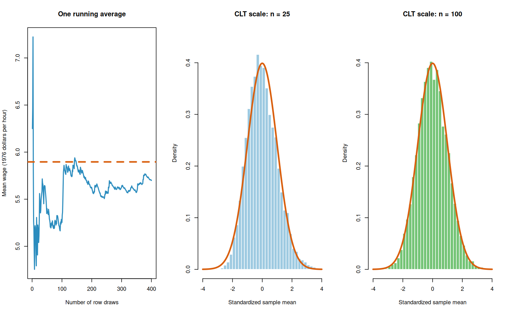

# Class 12: Laws of Large Numbers and the Central Limit Theorem

**Date:** Monday, November 2, 2026  
**Status:** Complete first version  
**Last updated:** August 30, 2026

[← Class 11](../11-sampling-distributions-for-counts-proportions-and-means/) · [Practice 12](practice/) · [Course syllabus](../../ECO202-Fall2026-Syllabus.pdf) · [Class 13 →](../13-point-estimation-bias-variance-and-standard-errors/)

**Class-folder workflow:** Use this guide for preparation, class, and review; run adjacent files when directed; then complete [ungraded practice](practice/) before studying the [worked solutions](practice/solutions/).

<!-- Source lineage: Econ202-UlrichMueller/LectureNotes.tex, Averages of Independent Bernoulli RVs through Normal Approximation to Binomial; Spring 2026 PS6; selected private historical exams used only for scope calibration; Moore, McCabe, and Craig, Chapter 5. The empirical demonstration uses the documented wage1 CSV distributed with the course. The numerical examples, checkpoints, AI audit, and prose are newly authored. -->

## Central question

Why do averages become stable, and why can the Normal distribution describe their remaining sampling variation?

## Learning goals

By the end of class, you should be able to:

1. derive the center and spread of a sample mean under independent, identically distributed sampling;
2. explain the law of large numbers as concentration of an average around its population mean;
3. explain the central limit theorem as an approximation to the distribution of a centered and scaled average;
4. distinguish what the LLN and CLT do—and do not—claim;
5. calculate Normal approximations for sample means, counts, and proportions, using a continuity correction for a discrete count when appropriate; and
6. audit the sampling, independence, tail, and approximation assumptions behind a large-sample calculation.

<a id="lecture-map"></a>

## In-class route

| Stop | Live focus | Mode |
|---|---|---|
| **C12.1** | [What averaging does exactly](#c12-stop-1) | Prediction + Board work 1 |
| **C12.2** | [Law of large numbers](#c12-stop-2) | Data demonstration + Checkpoint 1 |
| **C12.3** | [Central limit theorem](#c12-stop-3) | Standardize + visualize |
| **C12.4** | [LLN and CLT answer different questions](#c12-stop-4) | Contrast + Checkpoint 2 |
| **C12.5** | [A wage-mean tail probability](#c12-stop-5) | Board work 2 + verification |
| **C12.6** | [Counts, proportions, and the discrete boundary](#c12-stop-6) | Board work 3 + boundary check |
| **C12.7** | [When a large-sample argument fails](#c12-stop-7) | AI interaction + synthesis |

## How to use this guide

**Prepare:** Review the Class 11 distinction among a population distribution, one sample distribution, and a statistic's sampling distribution. Without calculating, predict what happens to the center and standard error of a sample mean when the sample size is multiplied by four.

**In class:** Keep three objects visible: the distribution of individual observations, the unstandardized sample mean, and the centered and scaled sample mean. State whether each conclusion is exact, asymptotic, simulated, or empirical.

**Review:** Reconstruct Board works 1–3 without looking. Then explain the LLN and CLT in words without using either theorem's name before translating the explanation into notation.

**Practice:** Complete the short questions in Section 8, then use [Practice 12](practice/) for a 45–55 minute ungraded self-study route. The calculations, theorem distinctions, assumptions, and interpretations are common core; memorized software syntax is not.

**Prerequisites:** Classes 10–11, especially expectation, variance, independence, sampling distributions, and the standard Normal distribution.

## Full guide map

1. [What averaging does exactly](#1-what-averaging-does-exactly)
2. [Law of large numbers](#2-law-of-large-numbers)
3. [Central limit theorem](#3-central-limit-theorem)
4. [LLN and CLT answer different questions](#4-lln-and-clt-answer-different-questions)
5. [A wage-mean tail probability](#5-a-wage-mean-tail-probability)
6. [Counts, proportions, and the discrete boundary](#6-counts-proportions-and-the-discrete-boundary)
7. [When a large-sample argument fails](#7-when-a-large-sample-argument-fails)
8. [Practice and answer checks](#8-practice-and-answer-checks)
9. [Common core, optional paths, and recap](#9-common-core-optional-paths-and-recap)

<a id="c12-stop-1"></a>

## 1. What averaging does exactly

Predict what changes when $n$ is multiplied by four, then derive the exact center and spread before discussing any limiting theorem.

Let $X_1,\ldots,X_n$ be independent random variables with the same population mean $\mu$ and finite population variance $\sigma^2$. The sample mean is

$$
\bar X_n=\frac{1}{n}\sum_{i=1}^n X_i.
$$

Linearity of expectation and variance additivity under independence give

$$
\mathbb E[\bar X_n]=\mu,
\qquad
\mathrm{Var}(\bar X_n)=\frac{\sigma^2}{n},
\qquad
\mathrm{SD}(\bar X_n)=\frac{\sigma}{\sqrt n}.
$$

These identities are exact under the stated model. They locate the sampling distribution and measure its spread, but they do not by themselves establish its shape.

An **asymptotic result** describes what happens as the sample size grows without bound. Using such a limiting result at a particular finite $n$ produces an approximation whose adequacy must be assessed; it does not turn the finite-sample statement into an exact identity.

> [!IMPORTANT]
> **Board work 1 — The square-root rule**
>
> Begin with $\bar X_n=n^{-1}\sum_iX_i$ and derive all three identities. Then compare sample sizes $n$, $4n$, and $9n$. Their standard errors are $\sigma/\sqrt n$, one-half of that value, and one-third of that value. To cut a standard error in half, the sample size must be multiplied by four—not two.

The simple variance formula uses independence. With dependent observations, covariance terms remain:

$$
\mathrm{Var}(\bar X_n)
=\frac{1}{n^2}\left(\sum_{i=1}^n\mathrm{Var}(X_i)+2\sum_{i<j}\mathrm{Cov}(X_i,X_j)\right).
$$

This covariance expression is an optional extension; recognizing that dependence changes the simple $\sigma/\sqrt n$ rule is common core.

[↑ In-class route](#lecture-map) · [Next →](#c12-stop-2)

<a id="c12-stop-2"></a>

## 2. Law of large numbers

Follow one running average, locate the fixed target, and separate a realized path from the repeated-sampling probability statement.

The **law of large numbers** says that, under suitable conditions, the sample mean becomes concentrated around the population mean as $n$ grows. For independent, identically distributed observations with finite mean,

$$
\bar X_n\xrightarrow{p}\mu.
$$

Equivalently, for every fixed $\varepsilon>0$,

$$
\mathbb P\left(\left|\bar X_n-\mu\right|>\varepsilon\right)\longrightarrow0.
$$

The conclusion concerns probability across hypothetical repeated sequences. It does not say that every larger sample must be closer than the preceding sample, and it does not say that the observations become Normally distributed.

The script [`class-12-lln-and-clt.R`](class-12-lln-and-clt.R) treats the 526 observed wages in the local `wage1` file as a fixed teaching population. It draws rows independently with replacement so that the complete row-sampling mechanism is visible. Open this class folder as the working folder, then run:

```sh
Rscript class-12-lln-and-clt.R
```



The left panel follows one particular running average. It may move away from the target at some steps even though the general scale of its fluctuations shrinks. One simulated path illustrates the idea; it does not prove the theorem. Repetition across many paths can check that large deviations become less frequent under this teaching model.

### Checkpoint 1

In a hypothetical running-average path, the average moves from $5.91$ after 199 observations to $5.94$ after 200. Does this contradict the LLN? What repeated-sampling probability would the theorem ask us to examine instead?

[← Previous](#c12-stop-1) · [↑ In-class route](#lecture-map) · [Next →](#c12-stop-3)

<a id="c12-stop-3"></a>

## 3. Central limit theorem

Center and scale the sample mean, then compare the simulated standardized sampling distributions with the standard Normal reference curve.

The LLN describes concentration but does not provide the shape of the remaining error. Under independent, identically distributed sampling with finite positive variance, the **central limit theorem** states

$$
Z_n=\frac{\bar X_n-\mu}{\sigma/\sqrt n}
\xrightarrow{d}\mathsf N(0,1).
$$

Thus, for sufficiently large $n$, we use the approximation

$$
\bar X_n\ \mathrel{\dot\sim}\ \mathsf N\left(\mu,\frac{\sigma^2}{n}\right).
$$

In this notation, the second argument of $\mathsf N(\mu,\sigma^2)$ is a variance. The approximation concerns the sampling distribution of the mean. It does not claim that individual wages—or the 526-row empirical population—are Normal.

The right panels of the figure show 10,000 standardized sample means for $n=25$ and $n=100$ together with the standard Normal density. Standardization is essential: without it, the unstandardized means collapse toward $\mu$ as $n$ grows; after multiplying their error by $\sqrt n/\sigma$, the distribution retains a nondegenerate scale.

> [!NOTE]
> **Why a Normal limit? Optional intuition.** Split a long sum into independent blocks. If a finite-variance limiting shape exists and is unchanged, apart from recentering and rescaling, when independent copies are added, it must have the stability property of the Normal family. This is intuition, not a proof of the CLT.

[← Previous](#c12-stop-2) · [↑ In-class route](#lecture-map) · [Next →](#c12-stop-4)

<a id="c12-stop-4"></a>

## 4. LLN and CLT answer different questions

Classify claims by their random object and conclusion so the exact variance rule, LLN, and CLT do not become interchangeable slogans.

| Question | Relevant result | Object studied | Conclusion |
|---|---|---|---|
| Does the average settle near the target? | LLN | $\bar X_n$ | Large fixed deviations become unlikely. |
| What is the shape of the remaining error? | CLT | $(\bar X_n-\mu)/(\sigma/\sqrt n)$ | Its distribution approaches standard Normal. |
| How fast does the usual standard-error scale shrink? | Exact variance calculation | $\bar X_n$ | The scale ($\sigma/\sqrt n$) applies under independence. |

These statements reinforce one another but are not interchangeable. The LLN can hold even when the ordinary finite-variance CLT does not apply. Conversely, saying “the CLT works” is incomplete until the statistic, centering, scaling, sampling mechanism, and approximation target are specified.

### Checkpoint 2

Classify each claim as an LLN claim, a CLT claim, an exact moment claim, or an unsupported claim.

1. The standard deviation of an independent sample mean is $\sigma/\sqrt n$.
2. The chance that $\bar X_n$ lies more than $0.5$ from $\mu$ tends to zero.
3. The standardized sample mean has an approximately standard Normal distribution.
4. Once $n>30$, the original observations have a Normal distribution.

[← Previous](#c12-stop-3) · [↑ In-class route](#lecture-map) · [Next →](#c12-stop-5)

<a id="c12-stop-5"></a>

## 5. A wage-mean tail probability

Hold the target and threshold fixed, calculate two standard errors and tail approximations, then compare them with the repeated-sampling output.

Treat each draw as an independent, equally likely selection of one of the 526 recorded wages, with replacement. Under this explicit teaching model,

$$
\mu\approx5.8961,
\qquad
\sigma\approx3.6896
$$

in 1976 dollars per hour. For a sample of $n=25$ rows,

$$
\mathrm{SE}(\bar W_{25})\approx\frac{3.6896}{\sqrt{25}}=0.7379.
$$

> [!IMPORTANT]
> **Board work 2 — Approximate $\mathbb P(\bar W_n>6.5)$**
>
> For $n=25$,
>
> $$
> z\approx\frac{6.5-5.8961}{0.7379}=0.8184,
> $$
>
> so the CLT approximation is
>
> $$
> \mathbb P(\bar W_{25}>6.5)\approx1-\Phi(0.8184)=0.2066.
> $$
>
> For $n=100$, the standard error is $0.3690$, the standardized boundary is $1.6368$, and
>
> $$
> \mathbb P(\bar W_{100}>6.5)\approx1-\Phi(1.6368)=0.0508.
> $$

The target boundary $6.5$ remains fixed while the sampling distribution narrows. Because $6.5$ lies above $\mu$, exceeding it becomes less likely as $n$ grows. The script compares these analytic approximations with repeated sampling from the finite teaching population. Agreement assesses this approximation under the chosen row-sampling model; it does not establish that the file represents a broader labor market.

[← Previous](#c12-stop-4) · [↑ In-class route](#lecture-map) · [Next →](#c12-stop-6)

<a id="c12-stop-6"></a>

## 6. Counts, proportions, and the discrete boundary

Translate “at least 45” from an integer count to its half-unit continuous boundary and compare exact, corrected, and uncorrected tails.

Define $H_i=\mathbf 1\lbrace W_i\geq6\rbrace$. In the fixed teaching population, 197 of 526 records satisfy this threshold, so

$$
p=\mathbb P(H_i=1)=\frac{197}{526}\approx0.3745.
$$

For 100 independent row draws with replacement, the count $K=\sum_{i=1}^{100}H_i$ has the exact model distribution

$$
K\sim\mathsf{Binomial}(100,p),
\qquad
\mathbb E[K]=100p\approx37.4525,
\qquad
\mathrm{SD}(K)=\sqrt{100p(1-p)}\approx4.8400.
$$

> [!IMPORTANT]
> **Board work 3 — Exact and continuity-corrected tails**
>
> The event “at least 45” is $K\geq45$, or equivalently $K>44$. The exact binomial probability is
>
> $$
> \mathbb P(K\geq45)\approx0.07379.
> $$
>
> A continuous Normal variable has no gaps between integer values. Represent the discrete boundary between 44 and 45 by $44.5$:
>
> $$
> z_{\mathrm{cc}}\approx\frac{44.5-37.4525}{4.8400}=1.4561,
> $$
>
> which gives
>
> $$
> \mathbb P(K\geq45)\approx1-\Phi(1.4561)=0.07268.
> $$

Without the continuity correction, using 45 as the continuous boundary would give $0.05945$, a noticeably poorer approximation here. A continuity correction does not rescue every Normal approximation: expected successes and failures, dependence, and tail shape still matter.

The corresponding sample proportion is $\widehat p=K/100$. It contains exactly the same information, but its center is $p$ and its standard deviation is $\sqrt{p(1-p)/100}\approx0.0484$.

[← Previous](#c12-stop-5) · [↑ In-class route](#lecture-map) · [Next →](#c12-stop-7)

<a id="c12-stop-7"></a>

## 7. When a large-sample argument fails

Audit one fixed report first without assistance, then require the AI and non-AI routes to confront the same claims and verification evidence.

A responsible theorem application identifies the following chain:

1. the population or data-generating process;
2. the random observations and their dependence structure;
3. the statistic being averaged;
4. the relevant mean and variance;
5. whether the claim is exact, asymptotic, or approximate;
6. whether the approximation is plausible at the actual sample size and tail boundary; and
7. what selection, measurement, or external-validity problem remains outside the calculation.

First audit the following report without assistance:

> We have 100 wage observations, so the data are Normal because $n>30$. The CLT proves that the probability the sample mean exceeds 6.5 is exactly 0.0508. The large sample also removes any concern that the observations came from an unrepresentative source.

The report confuses observations with a statistic's sampling distribution, treats a context-dependent approximation as a universal sample-size rule, calls an approximation exact, and uses a probability theorem to erase a data-quality problem.

> [!TIP]
> **AI interaction 1 — Audit the same large-sample report**
>
> Complete the seven-link audit above first. A complete non-AI route is to label every sentence by its statistical object, theorem, assumption, and claim strength, then compare the report with the simulation and analytic calculation.

```text
Treat 526 recorded wages as a fixed teaching population. A proposed report
says: “We have 100 wage observations, so the data are Normal because n>30.
The CLT proves that the probability the sample mean exceeds 6.5 is exactly
0.0508. The large sample also removes any concern that the observations came
from an unrepresentative source.”

Audit this report sentence by sentence. Distinguish the observations from the
sampling distribution of their mean; identify the sampling and finite-variance
assumptions; distinguish an exact identity, an asymptotic theorem, a Normal
approximation, and a simulation estimate; and explain why sample size does not
repair selection or measurement bias. Do not invent a sampling design.
```

Verify the response against the exact center and variance calculation, the displayed CLT standardization, the row-sampling simulation, and the original wording. AI fluency is not verification.

[← Previous](#c12-stop-6) · [↑ In-class route](#lecture-map)

## 8. Practice and answer checks

### Practice A — Center, spread, and sample size

Independent observations have population mean 50 and population standard deviation 12. Find the mean and standard deviation of $\bar X_n$ for $n=36$ and $n=144$. State which conclusions are exact without a CLT.

<details>
<summary>Check after attempting Practice A</summary>

Both sample means have expectation 50. Their standard deviations are $12/\sqrt{36}=2$ and $12/\sqrt{144}=1$. These center and spread results are exact under the stated independence and common-moment assumptions; a CLT is needed only for a Normal shape approximation.

</details>

### Practice B — LLN or CLT?

For each target below, name the relevant theorem and explain its role: (i) showing that $\bar X_n$ is likely to lie within $0.1$ of $\mu$ for sufficiently large $n$; (ii) approximating $\mathbb P(\bar X_n>c)$ after centering and scaling; and (iii) claiming that the original population becomes Normal as $n$ grows.

<details>
<summary>Check after attempting Practice B</summary>

(i) is an LLN target, (ii) is a CLT target, and (iii) is not a conclusion of either theorem.

</details>

### Practice C — A discrete boundary

If $K$ is an integer count, which continuous boundary represents $K\geq31$ in a continuity-corrected Normal approximation? Which boundary represents $K\leq31$?

<details>
<summary>Check after attempting Practice C</summary>

Use $30.5$ for $K\geq31$ and $31.5$ for $K\leq31$.

</details>

## 9. Common core, optional paths, and recap

### Common core

You should be able to do the following without AI or software:

- derive $\mathbb E[\bar X_n]=\mu$ and $\mathrm{Var}(\bar X_n)=\sigma^2/n$ under the stated model;
- explain the LLN as concentration and the CLT as a centered-and-scaled distributional approximation;
- standardize a sample mean and approximate a probability using $\Phi$ values supplied when needed;
- translate between a Bernoulli proportion and its count, including a continuity-corrected boundary;
- state the sampling, independence, identical-distribution, and finite-moment conditions being used; and
- explain why neither theorem makes the observations Normal or repairs biased data collection.

### Optional paths

- **Theory:** Use Chebyshev's inequality to prove a basic LLN or study the block-sum intuition for the Normal limit.
- **Computation:** Increase the number of repetitions, compare empirical and Normal quantiles, or explore a more skewed or heavy-tailed population.
- **Dependence:** Add covariance terms and study how clustering changes the standard-error rate.
- **Approximation:** Compare exact binomial, continuity-corrected Normal, uncorrected Normal, and simulated tail probabilities.

### Durable recap

1. Averaging preserves the population mean and reduces independent sampling variance by a factor of $n$.
2. The LLN explains why the unscaled average concentrates near its target.
3. The CLT explains why the properly standardized remaining error is often approximately Normal.
4. Counts require careful translation to a continuous approximation; half-unit boundaries matter.
5. “Large $n$” is not a universal threshold, and no limit theorem repairs a bad target, selected data, measurement error, or dependence that the model ignores.

## Notation

| Symbol | Meaning |
|---|---|
| $X_i$ | Random observation (index: $i$) |
| $\bar X_n$ | Sample mean (sample size: $n$) |
| $\mu,\sigma^2$ | Population mean and variance |
| $\mathrm{SE}(\bar X_n)$ | Standard deviation of the sampling distribution for the sample mean ($\bar X_n$) |
| $Z_n$ | Centered and standard-error-scaled sample mean |
| $\Phi$ | Standard Normal cumulative distribution function |
| $H_i$ | Indicator of a wage at least 6 in the teaching population |
| $K$ | Count of threshold successes in 100 independent draws |
| $\widehat p$ | Sample proportion ($K/n$) |

## References and continuity

- Official textbook: Moore, McCabe, and Craig, 10th ed., Chapter 5.
- Complementary reference: *OpenIntro Statistics*, sections on sampling distributions and Normal approximations.
- Data source: Jeffrey M. Wooldridge's `wage1` data, distributed with the GPL-3 `wooldridge` R package; see the [class-local provenance note](data/README.md).
- Continuity with prior ECO 202: averages of Bernoulli and general independent random variables, exact mean and variance calculations, LLN, CLT, their distinction, Normal stability intuition, and Normal approximation to the binomial are retained. The presentation adds an explicit fixed-population simulation, approximation audit, and sharper separation of theorem, calculation, and data-quality claims.

[← Class 11](../11-sampling-distributions-for-counts-proportions-and-means/) · [Practice 12](practice/) · [↑ In-class route](#lecture-map) · [Class 13 →](../13-point-estimation-bias-variance-and-standard-errors/)
