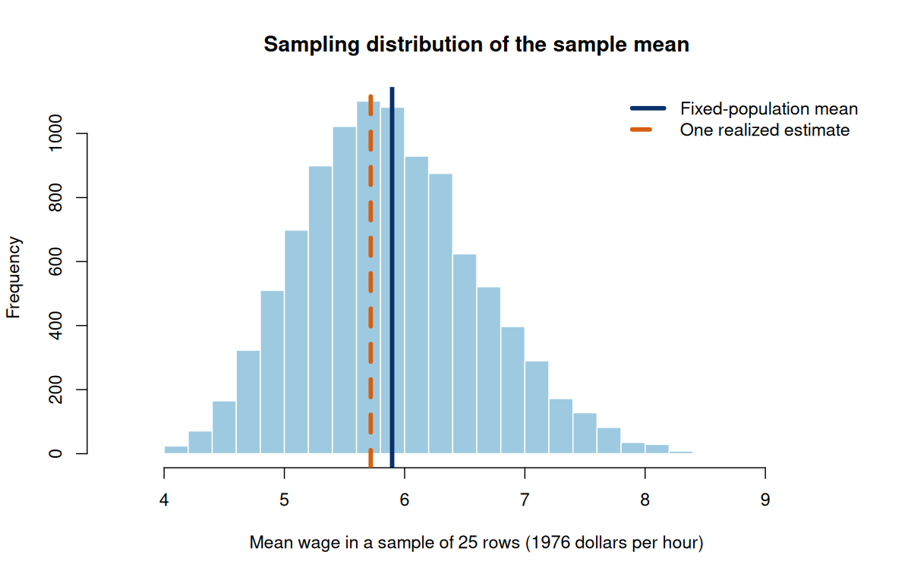

# Class 13: Point Estimation, Bias, Variance, and Standard Errors

**Date:** Wednesday, November 4, 2026  
**Status:** Complete first version  
**Last updated:** September 6, 2026

[← Class 12](../12-laws-of-large-numbers-and-central-limit-theorem/) · [Practice 13](practice/) · [Course syllabus](../../ECO202-Fall2026-Syllabus.pdf) · **Next meeting:** In-Class Exam 3

**Class-folder workflow:** Use this guide for preparation, class, and review; run adjacent files when directed; then complete [ungraded practice](practice/) before studying the [worked solutions](practice/solutions/).

<!-- Source lineage: Econ202-UlrichMueller/LectureNotes.tex, Sampling Distributions, Models and Hypothetical Populations, Estimators and Bias, and German Tank Problem; Spring 2026 PS6; selected private historical exams used only for scope calibration; Moore, McCabe, and Craig, Chapters 5--6. The empirical example uses the documented wage1 CSV distributed with the course. The bias--variance example, wording, checks, AI audit, and transfer tasks are newly authored. -->

## Central question

How should we judge a rule that turns one random sample into an estimate of an unknown target?

## Learning goals

By the end of class, you should be able to:

1. distinguish an estimand, estimator, estimate, sampling distribution, realized error, and standard error;
2. define and calculate an estimator's bias, variance, and mean squared error;
3. explain why unbiasedness is valuable but does not by itself identify the best estimator;
4. distinguish the true standard error of an estimator from an estimated standard error and from the spread of individual observations;
5. distinguish estimator bias from selection, nonresponse, and measurement bias in the data-generating process; and
6. compare alternative estimators while keeping the target, sampling mechanism, assumptions, and loss visible.

<a id="lecture-map"></a>

## In-class route

| Stop | Live focus | Mode |
|---|---|---|
| **C13.1** | [Target, rule, and realized number](#c13-stop-1) | Retrieval + Board work 1 |
| **C13.2** | [Sampling distributions and standard errors](#c13-stop-2) | Data demonstration + Checkpoint 1 |
| **C13.3** | [Bias, variance, and mean squared error](#c13-stop-3) | Board work 2 + comparison |
| **C13.4** | [The German tank problem](#c13-stop-4) | Board work 3 + estimator design |
| **C13.5** | [Estimator bias is not data bias](#c13-stop-5) | Mechanism audit |
| **C13.6** | [Choose, report, and audit an estimator](#c13-stop-6) | AI interaction + Exam 3 synthesis |

## How to use this guide

**Prepare:** Review the Class 11 sampling-distribution language and the Class 12 distinction between the law of large numbers and the central limit theorem. Bring one statistic from an empirical report and write what population or model quantity it appears intended to estimate.

**In class:** Keep three objects separate on every example: the fixed target, the random estimation rule before data are observed, and the numerical estimate after one sample is observed. Every statement about bias or standard error must name the repeated-sampling mechanism under which the estimator varies.

**Review:** Reconstruct the two board-work comparisons without looking. Then explain in words why a small standard error does not establish an unbiased sampling process or a substantively useful estimand.

**Practice:** Complete the short questions in Section 7, then use [Practice 13](practice/) for a 55–70 minute Class 13 core, an additional project-estimand transfer, and a separate Exam 3 checkpoint. The calculations and interpretations are common core; memorized software syntax is not.

**Prerequisites:** Classes 10–12, especially expectation, variance, sampling distributions, the LLN, and the CLT; Class 6 for population and selection concepts.

## Full guide map

1. [Target, rule, and realized number](#1-target-rule-and-realized-number)
2. [Sampling distributions and standard errors](#2-sampling-distributions-and-standard-errors)
3. [Bias, variance, and mean squared error](#3-bias-variance-and-mean-squared-error)
4. [The German tank problem](#4-the-german-tank-problem)
5. [Estimator bias is not data bias](#5-estimator-bias-is-not-data-bias)
6. [Choose, report, and audit an estimator](#6-choose-report-and-audit-an-estimator)
7. [Practice and answer checks](#7-practice-and-answer-checks)
8. [Common core, optional paths, and recap](#8-common-core-optional-paths-and-recap)

<a id="c13-stop-1"></a>

## 1. Target, rule, and realized number

An **estimand** $\theta$ is the population or model quantity the analysis seeks to learn. An **estimator** $T=T(X_1,\ldots,X_n)$ is a rule that maps the random sample into a number. Before the sample is drawn, $T$ is a random variable. An **estimate** $t$ is the realized value of that rule after observing one sample.

For a population mean $\mu=\mathbb E[X]$, the sample-mean estimator is

$$
\bar X=\frac{1}{n}\sum_{i=1}^{n}X_i.
$$

If one observed sample produces values $x_1,\ldots,x_n$, the estimate is the fixed number $\bar x=n^{-1}\sum_i x_i$. Capital and lowercase notation therefore mark a substantive distinction: $\bar X$ would vary across hypothetical samples, while the observed $\bar x$ does not.

> [!IMPORTANT]
> **Board work 1 — Name every object before calculating**
>
> Treat the 526 recorded hourly wages in the class-local `wage1` file as a fixed teaching population. The random mechanism selects 25 rows independently with replacement. The target is the fixed-file mean, and the estimator is the mean of the 25 selected wages.
>
> 1. define the estimand using both words and notation;
> 2. write the estimator before seeing a sample;
> 3. classify the fixed-file mean, the random sample mean, and one observed sample mean as a parameter, estimator, or estimate; and
> 4. explain what changes and what remains fixed when the same procedure is repeated.

The fixed-file target is $\mu=5.8961$ dollars per hour. With reproducible seed 202613, one selected sample produces $\bar x=5.7184$. The difference $5.7184-5.8961=-0.1777$ is the **realized estimation error** in this one sample. It is observable only because the teaching experiment treats the complete-file target as known; in an actual estimation problem, the target is generally unknown.

<a id="c13-stop-2"></a>

## 2. Sampling distributions and standard errors

The **sampling distribution** of an estimator is its probability distribution under repeated use of the stated sampling or assignment mechanism. Its mean locates the estimator across repetitions, and its variance measures sample-to-sample variability. The **standard error** is the standard deviation of that sampling distribution:

$$
\mathrm{SE}(T)=\sqrt{\mathrm{Var}(T)}.
$$

Under independent sampling with replacement from a population with variance $\sigma^2$,

$$
\mathbb E[\bar X]=\mu,
\qquad
\mathrm{Var}(\bar X)=\frac{\sigma^2}{n},
\qquad
\mathrm{SE}(\bar X)=\frac{\sigma}{\sqrt n}.
$$

The fixed teaching population has standard deviation $3.6896$ dollars per hour, so the true standard error of the mean for $n=25$ is $3.6896/\sqrt{25}=0.7379$ dollars per hour. Usually $\sigma$ is unknown. Replacing it with the sample standard deviation $s$ gives the estimated standard error

$$
\widehat{\mathrm{SE}}(\bar X)=\frac{s}{\sqrt n}.
$$

For the one reproducible sample, the estimated standard error is $0.7703$. That number is neither the sample standard deviation nor the realized error. The data values have sample standard deviation $3.8517$, the estimated sampling variability of the mean is $0.7703$, and the one realized error is $-0.1777$.

The line-by-line commented script [`class-13-estimation-and-standard-errors.R`](class-13-estimation-and-standard-errors.R) reproduces the one sample and then repeats the estimator 10,000 times. Open this class folder as the working folder, then run:

```sh
Rscript class-13-estimation-and-standard-errors.R
```



The center of the simulated distribution should be close to $5.8961$, and its standard deviation should be close to $0.7379$. Small differences remain because 10,000 repetitions are still a finite simulation. The simulation verifies an analytical result under the stated row-sampling model; it does not validate the file as a population for an external labor-market claim.

### Checkpoint 1

Suppose another sample of 25 wages has sample standard deviation $5$. What is its estimated standard error? Does that number reveal the realized error in the sample mean? Would a large sample automatically repair undercoverage in the original data collection?

<a id="c13-stop-3"></a>

## 3. Bias, variance, and mean squared error

The **bias** of an estimator $T$ for target $\theta$ is

$$
\mathrm{Bias}(T;\theta)=\mathbb E[T]-\theta.
$$

An estimator is **unbiased** for $\theta$ if $\mathbb E[T]=\theta$ under the stated model. Unbiasedness is a repeated-sampling property of the rule, not a claim that every realized estimate equals the target. The sample mean is unbiased because linearity of expectation gives $\mathbb E[\bar X]=n^{-1}\sum_i\mathbb E[X_i]=\mu$.

Bias alone does not measure estimator quality. Under squared-error loss, the **mean squared error** is

$$
\mathrm{MSE}(T;\theta)=\mathbb E[(T-\theta)^2]
=\mathrm{Var}(T)+\mathrm{Bias}(T;\theta)^2.
$$

> [!IMPORTANT]
> **Board work 2 — When a biased estimator can have smaller MSE**
>
> Suppose $X_1,\ldots,X_4$ are independent with $\mathbb E[X_i]=\theta$ and $\mathrm{Var}(X_i)=4$. Compare $T_1=\bar X$ with $T_2=0.8\bar X+0.2(8)$, which pulls the estimate toward an external benchmark of 8.
>
> 1. show that $T_1$ has bias 0, variance 1, and MSE 1;
> 2. show that $T_2$ has bias $1.6-0.2\theta$ and variance $0.64$;
> 3. at $\theta=10$, calculate $\mathrm{MSE}(T_2)=0.64+(-0.4)^2=0.80$;
> 4. at $\theta=14$, calculate $\mathrm{MSE}(T_2)=0.64+(-1.2)^2=2.08$; and
> 5. explain why the preferable rule depends on the target, the model, the benchmark, and the loss.

This comparison does not say that bias is harmless. It says that a judgment about an estimator must consider both systematic offset and sampling variability. A benchmark chosen after seeing the desired answer would not provide the honest prior information assumed by the example.

<a id="c13-stop-4"></a>

## 4. The German tank problem

Suppose a finite population contains serial numbers $1,2,\ldots,m$, and an SRS of $n$ distinct serial numbers is observed without replacement. The target is the unknown maximum $m$. Because the population mean is $(m+1)/2$, the sample mean suggests the unbiased estimator

$$
\widehat m_{\mathrm{mean}}=2\bar X-1.
$$

For the fictional sample $\lbrace3,4,8,25\rbrace$, $\bar x=10$, so this rule estimates $m$ as 19. The calculation is internally correct but logically awkward: it estimates a population maximum smaller than an observed serial number.

The observed maximum $M=\max(X_1,\ldots,X_n)$ respects the logical lower bound $m\geq M$, but it is biased downward because $M\leq m$ always and $M<m$ with positive probability. Under the specified SRS-without-replacement model,

$$
\mathbb E[M]=\frac{n(m+1)}{n+1}.
$$

Solving this relationship for an unbiased rule gives

$$
\widehat m_{\mathrm{max}}=\frac{n+1}{n}M-1.
$$

For $n=4$ and $M=25$, the estimate is $30.25$. The unknown target is an integer, yet mechanically rounding the estimate creates a new estimator with a new bias and variance. The example therefore exposes several distinct criteria: unbiasedness, variability, logical constraints, use of information, and the loss attached to different errors.

> [!IMPORTANT]
> **Board work 3 — Estimator design depends on the sampling mechanism**
>
> Before accepting either rule, identify the exact sampling design. The expectation formula for the maximum above depends on an SRS of distinct numbers without replacement. Independent draws with replacement produce a different maximum distribution. An estimator cannot be evaluated apart from the random mechanism that gives it a sampling distribution.

<a id="c13-stop-5"></a>

## 5. Estimator bias is not data bias

**Estimator bias** compares the mean of a rule's sampling distribution with its target under a stated model. **Selection bias**, **nonresponse bias**, and **measurement bias** concern how observed data connect to the intended population or construct. The two levels can coexist.

For example, a sample mean may be mathematically unbiased for the mean of the sampling frame while the frame systematically excludes part of the target population. Increasing $n$ shrinks the sample mean's standard error around the frame mean; it does not force the frame mean to equal the target-population mean. A precisely estimated answer to the wrong population question remains the wrong answer.

Economic data also do not always arise as literal random draws from a sharply defined finite list. Time series, country panels, administrative records, and firm data may instead be analyzed through a model or a hypothetical population of alternative data realizations. Either interpretation can support statistical reasoning, but it must identify what varies, what remains fixed, and what the probability statements mean.

### Mechanism audit

For each statement, identify whether the primary issue concerns the estimator, the data-generating process, or both:

1. A survey takes an SRS from a phone list that excludes residents without registered phones.
2. An analyst estimates a population mean with $\bar X+3$ under an SRS.
3. A precise administrative-data estimate uses a variable that systematically understates cash income.
4. An analyst reports $s$ as the standard error of $\bar X$ rather than $s/\sqrt n$.

<a id="c13-stop-6"></a>

## 6. Choose, report, and audit an estimator

A defensible estimator report should state:

1. the estimand and its substantive units;
2. the estimator as a rule applied to a random sample or assignment;
3. the realized estimate;
4. the repeated-sampling mechanism or model;
5. bias and variance properties relevant to the chosen loss;
6. the standard error and whether it is known or estimated; and
7. design, measurement, model, and external-validity limitations that a small standard error does not remove.

Before using AI, write that seven-part audit for the one-sample wage example. Then inspect whether the generated response keeps the objects distinct and verifies its numbers rather than treating fluent notation as proof.

### Project estimand transfer

Write a one-sentence candidate question for the individual empirical project. Then define the observational unit, target population or model, estimand, proposed estimator, and the source of repeated-sampling uncertainty. If the available data identify only a descriptive quantity, say so rather than turning it into a causal estimand. This is a project-development transfer, not a separate closed-book exam topic.

> [!TIP]
> **AI interaction 1 — Audit an estimator report**
>
> Copy the prompt below only after completing your own object map and calculations. A complete non-AI route is to use the seven-part list above, the analytical formulas, and the script's repeated-sampling output.

```text
Treat 526 recorded wages as a fixed teaching population. Select 25 rows
independently with replacement and estimate the fixed-file mean with the
sample mean. The target is 5.8961, the population SD is 3.6896, one realized
estimate is 5.7184, and the sample SD is 3.8517.

Distinguish the estimand, estimator, estimate, realized error, sampling
distribution, true standard error, and estimated standard error. Calculate
every available quantity, state the repeated-sampling mechanism, and explain
what a 10,000-repetition simulation should verify. Identify the first error
in the claim "the standard error is 3.8517, so the estimate missed the target
by about 3.85 dollars." End with one limitation of treating this file as a
population for the exercise. Do not invent a p-value or external population.
```

**Audit question:** Does the response obtain a true standard error of about $0.7379$, an estimated standard error of about $0.7703$, and a realized error of about $-0.1777$ while keeping their meanings separate?

### Exam 3 synthesis

The third module moves from random variables to repeated-sampling behavior and estimator quality. You should be able to work without AI, notes, software syntax, or outside assistance through the common chain

> Probability model → random variable and moments → sampling distribution → LLN or CLT → estimand and estimator → bias, variance, MSE, and standard error

For any calculation, state whether the result is exact or approximate and which assumptions make it valid.

## 7. Practice and answer checks

The checks below support immediate retrieval. The separate [Practice 13 module](practice/) provides the full Class 13 sequence, compact checks, complete worked solutions after an attempt, and an additional Exam 3 checkpoint.

### Practice A — Identify the objects

A teaching model treats 100 responses to a precisely worded renewal-intention question as independent Bernoulli trials with common yes probability $p$, and 62 responses are yes. Identify the estimand, estimator, estimate, and an estimated standard error.

**Answer check:** The estimand is the common yes-response probability $p$ in the model; the estimator is the random sample proportion $\widehat p$; the estimate is $0.62$; and the independent-Bernoulli estimate is $\sqrt{0.62(0.38)/100}\approx0.0485$. This does not by itself estimate actual later renewal behavior.

### Practice B — Compare two unbiased estimators

Suppose $X_1$ and $X_2$ are independent with mean $\mu$ and variance $9$. Compare $T_1=(X_1+X_2)/2$ and $T_2=(X_1+3X_2)/4$ as estimators of $\mu$.

**Answer check:** Both are unbiased. Their variances are $9/2=4.5$ and $9(1^2+3^2)/4^2=5.625$, so $T_1$ has smaller variance and MSE under squared-error loss.

### Practice C — Change the tank sampling mechanism

Explain why the corrected-maximum formula in Section 4 cannot be imported without checking if serial numbers were sampled independently with replacement. State which part of the estimator audit must change.

**Answer check:** The maximum has a different sampling distribution under sampling with replacement, so its expectation, bias correction, variance, and MSE must be recomputed under that mechanism.

### Practice D — Repair an uncertainty statement

Repair: “The sample standard deviation is small, so the estimator is unbiased and the sample represents the target population.”

**Answer check:** Data spread, estimator standard error, estimator bias, and sampling-process validity are separate. None alone establishes the others.

## 8. Common core, optional paths, and recap

**Common core:** Estimand, estimator, estimate, realized error, sampling distribution, true and estimated standard errors, bias, variance, MSE, unbiasedness, the bias–variance comparison, estimator bias versus data bias, and the role of the repeated-sampling mechanism. Applications include exact distributions in small examples by enumerating samples or using elementary probability rules, and bias–variance–MSE comparisons of benchmark-weighted estimators using supplied or directly calculated moments.

**Explore further:** Consistency; asymptotic bias; bootstrap and design-based standard errors; alternative loss functions; general shrinkage and regularization theory; general order-statistic distribution formulas; finite-population corrections; and optimality comparisons among unbiased estimators. These extensions go beyond the small numerical sampling examples and benchmark comparisons developed here and in the class practice.

**Scope clarification (September 6, 2026):** The optional labels refer to general theory, not to the elementary examples and estimator comparisons already developed in this guide and its practice.

The durable lesson is that an estimate is one number, while its credibility comes from a complete argument about the target, rule, data-generating mechanism, repeated-sampling behavior, and limitations.

## References

- Moore, McCabe, and Craig, *Introduction to the Practice of Statistics*, 10th ed., Chapters 5–6.
- Diez, Barr, and Çetinkaya-Rundel, *OpenIntro Statistics*, 4th ed., chapters on foundations for inference.
- Wooldridge, *Introductory Econometrics: A Modern Approach*, 7th ed.; [`wage1` data and provenance notes](data/README.md).
- Stock and Watson, *Introduction to Econometrics*, 4th ed., introductory chapters on estimation and sampling uncertainty.
- Prior ECO 202 continuity: sampling distributions, model and hypothetical-population interpretations, estimator bias and variance, sources of bias, and the German tank problem are retained; estimand language, estimated standard error, MSE, explicit loss, and the estimator-versus-design audit are developed more fully.
