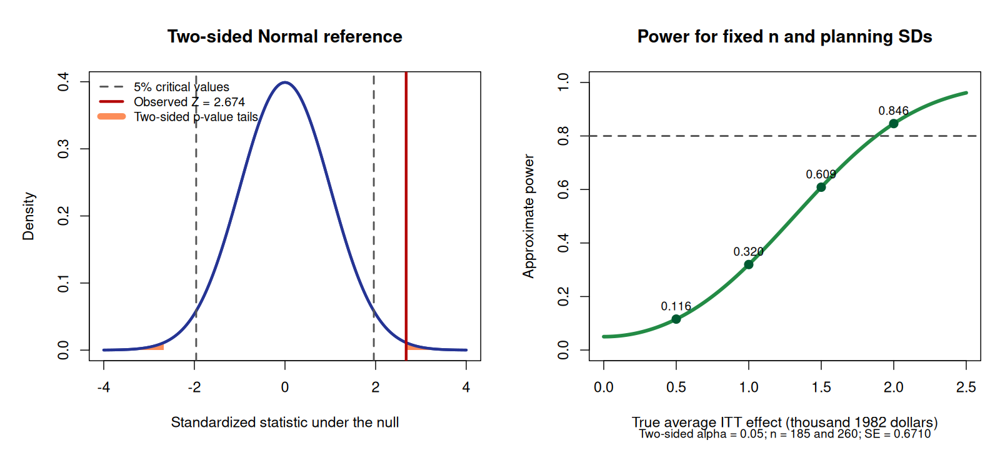

# Class 14: Hypothesis Tests, p-Values, Statistical Significance, Errors, and Power

**Date:** Wednesday, November 11, 2026  
**Status:** Complete first version  
**Last updated:** August 30, 2026

**Previous meeting:** In-Class Exam 3 · [Practice 14](practice/) · [Course syllabus](../../ECO202-Fall2026-Syllabus.pdf) · [Class 15 →](../15-confidence-intervals-and-hypothesis-tests/)

**Class-folder workflow:** Use this guide for preparation, class, and review; run adjacent files when directed; then complete [ungraded practice](practice/) before studying the [worked solutions](practice/solutions/).

<!-- Source lineage: Econ202-UlrichMueller/LectureNotes.tex, sections on hypothesis tests, p-values, significance, critical values, errors, and power; Spring 2026 PS7 and PS9; selected private historical exams used only for scope and difficulty calibration; Moore, McCabe, and Craig, Chapter 6. The empirical example uses the documented jtrain2 CSV distributed with the course. The exposition, worked calculations, power comparison, prompts, and transfer checks are newly authored and do not reproduce protected questions. -->

## Central question

What can one observed estimate tell us about a sharply stated benchmark, and what errors remain when we turn that evidence into a decision?

## Learning goals

By the end of class, you should be able to:

1. translate a substantive question into an estimand, a null hypothesis, and a prespecified one- or two-sided alternative;
2. construct a standardized statistic and identify the null reference distribution and assumptions used;
3. calculate and interpret one- and two-sided p-values without treating them as probabilities that a hypothesis is true;
4. apply a level $\alpha$ rule and distinguish rejecting from failing to reject the null;
5. identify Type I and Type II errors and calculate power at a specified alternative; and
6. separate statistical significance from effect magnitude, practical importance, causal identification, and external validity.

<a id="lecture-map"></a>

## In-class route

| Stop | Live focus | Mode |
|---|---|---|
| **C14.1** | [From a question to hypotheses](#c14-stop-1) | Prediction + Board work 1 |
| **C14.2** | [From an estimate to a null reference](#c14-stop-2) | Board work 2 + Checkpoint 1 |
| **C14.3** | [Test the job-training benchmark](#c14-stop-3) | Data demonstration + Checkpoint 2 |
| **C14.4** | [Decisions and two kinds of error](#c14-stop-4) | Board work 3 + error table |
| **C14.5** | [Power is a property of a procedure](#c14-stop-5) | Board work 4 + power curve |
| **C14.6** | [Audit a significance claim](#c14-stop-6) | AI interaction + non-AI route + Checkpoint 3 |

## How to use this guide

**Prepare:** Review the Class 13 distinction among an estimand, estimator, estimate, and estimated standard error. Revisit Class 7's distinction between random assignment and random sampling. Before class, write one claim that can be expressed as a precise benchmark for a population or study-group quantity.

**In class:** State the target, hypotheses, and direction before inspecting a p-value. Draw the relevant tail or tails before using software, and keep the statistical calculation separate from the design argument that might support a causal interpretation.

**Review:** Reconstruct the job-training calculation and the power calculation without looking. Then explain why a small p-value is neither the probability that the null is true nor a measure of an effect's size or importance.

**Practice:** Complete the short checks in Section 7, then use [Practice 14](practice/) for a 54-minute route through formulation, p-values, decisions, practical significance, errors, power, and an empirical audit. The statistical reasoning is common core; memorized software syntax is not.

**Prerequisites:** Class 7 for randomized experiments and intention-to-treat effects; Classes 11–13 for sampling distributions, Normal approximations, estimands, estimates, and standard errors.

## Full guide map

1. [From a question to hypotheses](#1-from-a-question-to-hypotheses)
2. [From an estimate to a null reference](#2-from-an-estimate-to-a-null-reference)
3. [Test the job-training benchmark](#3-test-the-job-training-benchmark)
4. [Decisions and two kinds of error](#4-decisions-and-two-kinds-of-error)
5. [Power is a property of a procedure](#5-power-is-a-property-of-a-procedure)
6. [Audit a significance claim](#6-audit-a-significance-claim)
7. [Practice and answer checks](#7-practice-and-answer-checks)
8. [Common core, optional paths, and recap](#8-common-core-optional-paths-and-recap)

<a id="c14-stop-1"></a>

## 1. From a question to hypotheses

A hypothesis test begins with a target and a benchmark, not with a software output. Let $\tau$ denote the finite-study-group average intention-to-treat effect of assignment to job training on 1978 earnings among the randomized participants in the `jtrain2` study. Earnings are measured in thousands of 1982 dollars.

The **null hypothesis** states a precise benchmark. The **alternative hypothesis** identifies which departures matter for the question. A two-sided question about any departure from zero uses

$$
H_0:\tau=0
\qquad\text{against}\qquad
H_a:\tau\ne0.
$$

If the research question had prespecified only a positive effect as relevant, the alternative would be $H_a:\tau>0$. Choosing a direction after seeing that the estimate is positive would use the data twice and would make the reported one-sided evidence misleading. A two-sided alternative is the appropriate default when departures in either direction would change the substantive conclusion.

### Prediction

Before calculating, predict which ingredients would change if the alternative were $H_a:\tau>0$ rather than $H_a:\tau\ne0$: the observed difference in group means, its estimated standard error, the standardized statistic, the reference distribution, the tail probability, or the substantive target.

> [!IMPORTANT]
> **Board work 1 — Fix the question before inspecting the answer**
>
> For the randomized job-training study:
>
> 1. name the randomized unit, factor, factor levels, outcome, estimand, and outcome units;
> 2. write a two-sided null and alternative about the average intention-to-treat effect;
> 3. write a prespecified upper-sided alternative and explain what substantive question it answers; and
> 4. identify which evidence would count as more incompatible with the null under each alternative.

The hypotheses concern a study-group effect, not the two realized sample means as fixed descriptive numbers. Random assignment supplies the repeated-assignment logic for causal comparison within the randomized study group; it does not by itself make that group a random sample from all workers.

<a id="c14-stop-2"></a>

## 2. From an estimate to a null reference

Suppose $\widehat\tau$ estimates $\tau$, and $\widehat{\mathrm{SE}}(\widehat\tau)$ estimates the standard deviation of the estimator's sampling or randomization distribution. To test $H_0:\tau=\tau_0$, a common standardized statistic is

$$
Z=\frac{\widehat\tau-\tau_0}{\widehat{\mathrm{SE}}(\widehat\tau)}.
$$

The statistic measures the estimate's distance from the null benchmark in estimated standard-error units. It becomes useful for testing only after we specify a **null reference distribution**: the distribution of the statistic across hypothetical repetitions when the null and the procedure's assumptions hold.

In this class, the reference approximation is $Z\mathrel{\dot\sim}\mathsf{N}(0,1)$ under $H_0$. The dot emphasizes approximation. For a two-sided test, values far into either tail count as at least as incompatible with the null as the observed value $z_{\mathrm{obs}}$, so

$$
p=\mathbb P_0\bigl(|Z|\geq|z_{\mathrm{obs}}|\bigr)
\approx2\mathbb P\bigl(\mathsf{N}(0,1)\geq|z_{\mathrm{obs}}|\bigr).
$$

For a prespecified upper-sided alternative, only the upper tail counts:

$$
p=\mathbb P_0(Z\geq z_{\mathrm{obs}}).
$$

For a prespecified lower-sided alternative, use $H_a:\tau<\tau_0$ and $p=\mathbb P_0(Z\leq z_{\mathrm{obs}})$. The direction comes from the substantive question before the estimate is inspected.

The subscript 0 is a reminder that the probability is calculated under the null. The p-value is the null probability of a statistic at least as incompatible with the null as the observed statistic, using the prespecified direction and procedure. It is not $\mathbb P(H_0\mid\text{data})$.

> [!IMPORTANT]
> **Board work 2 — Standardize, choose the tail, and interpret**
>
> Suppose an estimate is $1.20$, its estimated standard error is $0.50$, and the null value is 0. Under a standard Normal reference approximation:
>
> 1. calculate $z_{\mathrm{obs}}=1.20/0.50=2.40$;
> 2. use $\mathbb P(\mathsf{N}(0,1)\geq2.40)=0.0082$ to obtain the upper-sided p-value $0.0082$;
> 3. obtain the two-sided p-value $2(0.0082)=0.0164$; and
> 4. explain why neither number is the probability that the null is true.

### Checkpoint 1

If the observed estimate changed from $1.20$ to $-1.20$ while its estimated standard error remained $0.50$, what would happen to the two-sided p-value? What would happen to the p-value for the prespecified upper-sided alternative $H_a:\tau>0$?

<a id="c14-stop-3"></a>

## 3. Test the job-training benchmark

The local [`jtrain2` data](data/README.md) describe a historical randomized job-training experiment. The observational and randomized unit is a participant. The factor is assignment, with levels training and control; the outcome `re78` is 1978 real earnings in thousands of 1982 dollars. The comparison below estimates the average intention-to-treat effect of assignment, not the effect of treatment received for every individual.

| Quantity | Training assignment | Control assignment |
|---|---:|---:|
| Number of participants | 185 | 260 |
| Mean 1978 earnings | 6.3491 | 4.5548 |
| Standard deviation of 1978 earnings | 7.8674 | 5.4838 |

The difference in assigned-group means is

$$
\widehat\tau=6.3491-4.5548=1.7943,
$$

or about \$1,794 in 1982 dollars. A large-sample unpooled estimated standard error is

$$
\widehat{\mathrm{SE}}(\widehat\tau)
=\sqrt{\frac{7.8674^2}{185}+\frac{5.4838^2}{260}}
=0.6710.
$$

Under $H_0:\tau=0$, the standardized statistic and two-sided Normal-reference p-value are

$$
z_{\mathrm{obs}}=\frac{1.7943-0}{0.6710}=2.6741,
$$

$$
p\approx2\mathbb P\bigl(\mathsf{N}(0,1)\geq2.6741\bigr)=0.00749.
$$

If the positive direction had been prespecified, the corresponding upper-sided p-value would be $0.003746$. Its smaller value reflects the narrower prespecified alternative; it is not permission to switch directions after seeing a positive estimate.

This calculation is an approximation, not an exact randomization result. Its interpretation relies on the documented random assignment being implemented, assigned groups being preserved in the analysis, the outcome being observed comparably, stable treatment and no important interference, and an adequate large-sample reference approximation for the standardized difference in means. The calculation alone cannot diagnose consequential attrition, noncompliance, outcome manipulation, or departures from the documented design.

The line-by-line commented script [`class-14-hypothesis-tests-and-power.R`](class-14-hypothesis-tests-and-power.R) reproduces the group summaries, test calculation, and power comparison. Open this class folder as the working folder, then run:

```sh
Rscript class-14-hypothesis-tests-and-power.R
```



The left panel shades outcomes at least as extreme as the observed statistic in either direction and marks the 5% critical values. At $\alpha=0.05$, a two-sided test rejects when $|Z|>1.96$. Because $0.00749<0.05$ and $0.00749<0.01$, the result rejects the zero-effect benchmark at the 5% and 1% levels; because $0.00749>0.001$, it does not reject at the 0.1% level.

Under the documented randomized design and the stated assumptions, the result provides evidence against a zero average intention-to-treat effect for the randomized participants. The estimate remains the magnitude to discuss: about \$1,794 in 1982 dollars. Whether that magnitude is economically important requires costs, a substantive benchmark, and context. Random assignment supports internal causal interpretation under its assumptions; it does not establish that the same effect applies to another population, program, or era.

### Checkpoint 2

An analyst reports only “the program works because $p=0.00749$.” Identify four missing parts of the argument. Then state a defensible statistical and causal conclusion in no more than two sentences.

<a id="c14-stop-4"></a>

## 4. Decisions and two kinds of error

A **significance level** $\alpha$ is chosen before inspecting the result. A level $\alpha$ rule rejects $H_0$ when $p\leq\alpha$ and otherwise **fails to reject** $H_0$. Failing to reject does not prove, accept, or make the null true. It says that this procedure and this evidence did not cross the prespecified rejection threshold.

The action can be correct or mistaken because the truth is unknown:

| Truth and action | Fail to reject ($H_0$) | Reject ($H_0$) |
|---|---|---|
| $H_0$&nbsp;true | Correct action | Type I error |
| Specified alternative true | Type II error | Correct action |

For a valid level $\alpha$ procedure, the **Type I error probability** is at most $\alpha$: the long-run probability of rejecting when the null is true. This is not the probability that a particular rejection is false. At a specified alternative value $\tau_1$, the **Type II error probability** is

$$
\beta(\tau_1)=\mathbb P_{\tau_1}(\text{fail to reject }H_0),
$$

and **power** is

$$
\mathrm{Power}(\tau_1)=1-\beta(\tau_1)=\mathbb P_{\tau_1}(\text{reject }H_0).
$$

Power is not one property of a study without qualification. It depends on the alternative effect, sampling or assignment mechanism, sample sizes, variability, test statistic, significance level, and decision rule.

> [!IMPORTANT]
> **Board work 3 — Translate the error table into the job-training setting**
>
> Use $H_0:\tau=0$ and the two-sided 5% rule.
>
> 1. describe a Type I error in words;
> 2. describe a Type II error at the specific alternative $\tau=1$ thousand 1982 dollars;
> 3. explain why $\alpha=0.05$ is not a 5% probability that this rejection is wrong; and
> 4. predict the Type I and Type II tradeoff if the same design changes from $\alpha=0.05$ to $\alpha=0.01$.

With the rest of the procedure fixed, lowering $\alpha$ shrinks the rejection region and reduces Type I error, but it increases Type II error and reduces power at a given alternative. No threshold removes both error types.

<a id="c14-stop-5"></a>

## 5. Power is a property of a procedure

To make power numerical, we must state a complete alternative and reference model. For the illustration below, hold the realized `jtrain2` assignment-group sizes at 185 and 260 and use the observed group standard deviations, 7.8674 and 5.4838, as fixed planning values. This gives a fixed reference standard error of 0.6710. Use a two-sided level-0.05 Normal-reference test, so the rejection rule is $|Z|>1.96$.

Under a true average intention-to-treat effect $\tau_1$, approximate

$$
Z\mathrel{\dot\sim}\mathsf{N}\left(\frac{\tau_1}{0.6710},1\right).
$$

The resulting illustrative powers are:

| True effect ($\tau_1$) | Shift ($\tau_1/0.6710$) | Approximate power |
|---:|---:|---:|
| 0.5 | 0.745 | 0.116 |
| 1.0 | 1.490 | 0.320 |
| 1.5 | 2.235 | 0.609 |
| 2.0 | 2.981 | 0.846 |

Effects are in thousands of 1982 dollars. The symmetric two-sided setup gives the same power at negative effects of the same magnitude, and its rejection probability at the null effect is $0.05$. These are reference-model calculations, not four empirical findings. Because they use variability estimated from the same realized data, they illustrate how power works rather than constituting a data-independent prospective power analysis.

> [!IMPORTANT]
> **Board work 4 — Calculate power at a specified alternative**
>
> At $\tau_1=1$, the reference distribution is approximately $\mathsf{N}(1.490,1)$. The two-sided 5% procedure rejects when $Z<-1.96$ or $Z>1.96$.
>
> 1. calculate the upper rejection probability as $\mathbb P_{\tau_1}(Z>1.96)=\mathbb P(\mathsf{N}(0,1)>1.96-1.490)\approx0.319$;
> 2. calculate the lower rejection probability as $\mathbb P_{\tau_1}(Z<-1.96)=\mathbb P(\mathsf{N}(0,1)<-1.96-1.490)\approx0.0003$;
> 3. add the two tails to obtain power $\approx0.320$; and
> 4. explain why the probability of a Type II error at this alternative is about $0.680$.

For the same test and alternative, larger sample sizes reduce the standard error and increase power; lower outcome variability also increases power. Larger true departures from the null are easier to distinguish. A larger $\alpha$ raises power by expanding the rejection region, but it also raises the allowed Type I error probability. “High power” therefore has meaning only after naming an effect size and the rest of the design.

<a id="c14-stop-6"></a>

## 6. Audit a significance claim

Statistical significance answers a narrow question about incompatibility with a benchmark under a procedure. It does not by itself establish that the effect is large, important, causal, correctly modeled, precisely estimated, or applicable beyond the studied group. Nonsignificance does not prove zero effect; a substantively large estimate can fail to cross a threshold when uncertainty is large.

### Common misconceptions

- **“The p-value is the probability that the null is true.”** The p-value is a probability about possible statistics under the null, not a posterior probability for a hypothesis.
- **“Statistically significant means large or important.”** Significance compares an estimate with its uncertainty and a benchmark; magnitude and importance require the estimate, units, and context.
- **“Random assignment plus significance proves the effect for everyone.”** Random assignment can support an average causal comparison for the study group under assumptions; it does not identify every individual effect or establish external validity.
- **“Failing to reject proves no effect.”** The evidence may be compatible with zero and with substantively relevant alternatives, especially when precision or power is limited.
- **“Alpha is the chance that this rejection is false.”** Alpha controls the long-run Type I error probability of a valid prespecified procedure when the null is true.

Before opening an AI tool, independently mark every unsupported step in the memo below. Then use either the AI route or the complete non-AI route. Both routes should produce the same six-part audit: target and hypotheses, numerical verification, p-value meaning, decision language, design boundary, and practical or external-validity boundary.

> [!TIP]
> **AI interaction 1 — Audit a confident testing memo**
>
> The prompt supplies the numerical inputs so no private data need to be uploaded. Commit to your own audit first. Treat the response as a claim to check, not as statistical authority.

```text
A randomized job-training study assigned 185 participants to training and 260
to control. Mean 1978 earnings were 6.3491 and 4.5548, in thousands of 1982
dollars. A large-sample unpooled estimated standard error for the difference
is 0.6710. Audit this memo:

"The difference is 1.7943 and p = 0.00749, so there is a 99.251% probability
that training works. Every participant earns $1,794 more, the effect is
economically important and applies to today's workers, and alpha = 0.05 means
only a 5% chance this conclusion is false. If another study fails to reject,
that proves the other program has no effect."

State the estimand, H0, Ha, statistic, reference approximation, and assumptions.
Recalculate the two-sided p-value. Identify the first unsupported statement
and every later error. Separate statistical evidence, effect magnitude,
practical importance, internal causal validity, and external validity. Explain
reject versus fail to reject, Type I error, Type II error, and power. End with
a defensible two-sentence conclusion and a checklist for verifying your answer.
```

### Complete non-AI route

1. Compute $1.7943/0.6710$ and verify that it is about $2.674$.
2. Use a standard Normal table or the supplied result $2\mathbb P(\mathsf{N}(0,1)\geq2.6741)=0.00749$.
3. Rewrite the p-value as a probability about the statistic under $H_0$, not as a probability about $H_0$.
4. Replace the individual-effect claim with the average intention-to-treat estimand for the randomized study group.
5. Use the design assumptions to separate internal causal interpretation from external validity.
6. Compare the $1.7943$ estimate with an explicit economic benchmark rather than using the p-value as an importance measure.
7. Translate $\alpha$, Type I error, Type II error, and power as long-run properties of the prespecified procedure.

**Audit question:** Does the final response preserve the estimate and units, state the Normal reference as approximate, reject the zero benchmark without assigning a probability to it, and keep magnitude, importance, causality, and generalizability separate?

### Checkpoint 3

A well-designed study estimates an economically large effect but reports a two-sided p-value of $0.08$. Explain why “the effect is zero” and “the study proves an important effect” are both unsupported. What additional information would you request?

## 7. Practice and answer checks

These short checks support immediate retrieval. The separate [Practice 14 module](practice/) provides sustained practice, compact checks, complete worked solutions after an attempt, and a final unaided transfer.

### Practice A — Choose the alternative before seeing the estimate

A public agency asks whether a new reminder changes average application completion time in either direction. State the null and alternative using $\Delta$ for the average effect, and identify the appropriate tail structure.

**Answer check:** Use $H_0:\Delta=0$ against $H_a:\Delta\ne0$. Because both shorter and longer completion times answer “changes,” use a two-sided procedure.

### Practice B — Calculate and decide

An estimate is $0.80$, its estimated standard error is $0.40$, and a standard Normal null reference is justified. Test $H_0:\theta=0$ against $H_a:\theta\ne0$. Use $\mathbb P(\mathsf{N}(0,1)\geq2)=0.02275$.

**Answer check:** $z=0.80/0.40=2$. The two-sided p-value is $2(0.02275)=0.0455$, so reject at $\alpha=0.05$ but fail to reject at $\alpha=0.01$. This does not say that the null has probability 0.0455.

### Practice C — Name the error and power

For a test of $H_0:\theta=0$, describe a Type II error at the specific alternative $\theta=2$. If power at that alternative is $0.80$, what is the Type II error probability?

**Answer check:** A Type II error is failing to reject the zero benchmark when the true parameter is 2. The Type II error probability is $1-0.80=0.20$ under the specified alternative and procedure.

### Practice D — Repair the conclusion

Repair: “The result is not significant at 5%, so the null is true and the intervention is unimportant.”

**Answer check:** The procedure failed to reject at the 5% threshold; it did not prove the null. Assess the estimate, standard error, power at meaningful alternatives, design, and practical benchmark before judging what the result can say.

## 8. Common core, optional paths, and recap

**Common core:** Estimand and null benchmark; null and alternative hypotheses; one- and two-sided directions; standardized statistic; null reference distribution; p-value calculation and interpretation; significance level and critical value; reject versus fail to reject; Type I and Type II errors; power at a specified alternative; statistical versus practical significance; and the distinction among statistical evidence, causality, and external validity.

**Explore further:** Exact randomization tests; exact finite-sample distributions; equivalence and noninferiority testing; multiple-testing adjustments; selective reporting; likelihood and Bayesian evidence; prospective sample-size planning; and alternative loss functions. These extensions are not required to understand today's common core.

Class 15 will connect hypothesis tests to confidence intervals. Class 16 will develop application-specific inference procedures for means and proportions. Today's durable chain is:

> Target and benchmark → statistic → null reference distribution → p-value → prespecified decision → possible errors and power → interpretation with design and practical scale

## Notation

| Symbol | Meaning |
|---|---|
| $\tau$ | Average intention-to-treat effect for the randomized study group |
| $\widehat\tau$ | Difference-in-assigned-group-means estimator or its realized estimate, as context indicates |
| $\widehat{\mathrm{SE}}(\widehat\tau)$ | Estimated standard error of the estimator |
| $H_0,\mkern6mu H_a$ | Null and alternative hypotheses |
| $\alpha$ | Prespecified significance level; Type I error bound for a valid procedure (level: $\alpha$) |
| $\beta(\tau_1)$ | Type II error probability at the specified alternative ($\tau_1$) |
| $1-\beta(\tau_1)$ | Power at the specified alternative ($\tau_1$) |

## References

- Moore, McCabe, and Craig, *Introduction to the Practice of Statistics*, 10th ed., Chapter 6.
- Diez, Barr, and Çetinkaya-Rundel, *OpenIntro Statistics*, 4th ed., chapters on foundations for inference.
- Wooldridge, *Introductory Econometrics: A Modern Approach*, 7th ed.; [`jtrain2` data and provenance notes](data/README.md).
- Stock and Watson, *Introduction to Econometrics*, 4th ed., introductory chapters on hypothesis testing.
- Prior ECO 202 continuity: null and alternative hypotheses, test statistic and null distribution, one- and two-sided p-values, reject and fail-to-reject decisions, significance levels and critical values, Type I and Type II errors, and power are retained; estimand language, design boundaries, practical significance, and the auditable empirical spine are developed more fully.
