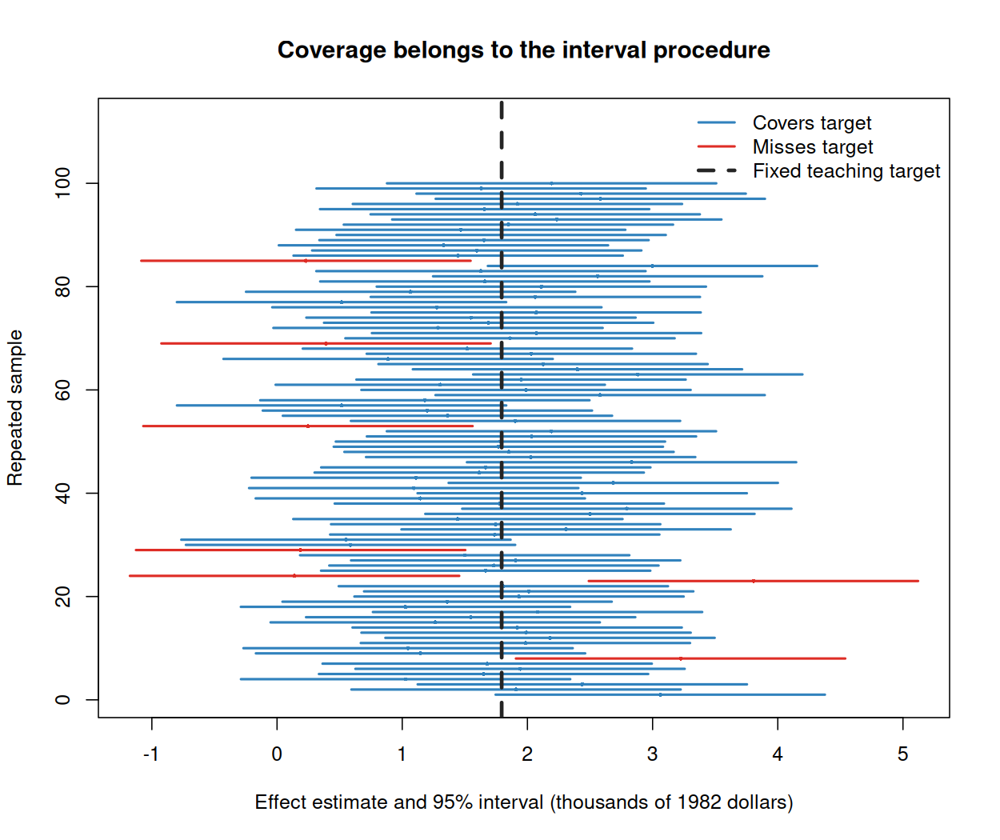

# Class 15: Confidence Intervals and Their Connection to Hypothesis Tests

**Date:** Monday, November 16, 2026  
**Status:** Complete first version  
**Last updated:** August 30, 2026

[← Class 14](../14-hypothesis-tests-p-values-significance-errors-and-power/) · [Practice 15](practice/) · [Course syllabus](../../ECO202-Fall2026-Syllabus.pdf) · [Class 16 →](../16-inference-for-means-and-proportions/)

**Class-folder workflow:** Use this guide for preparation, class, and review; run adjacent files when directed; then complete [ungraded practice](practice/) before studying the [worked solutions](practice/solutions/).

<!-- Source lineage: Econ202-UlrichMueller/LectureNotes.tex, hypothesis-test inversion, confidence intervals for a mean with unknown variance, repeated-sampling interpretation, margin of error, and general inference framework; Spring 2026 PS8; selected private historical assessments used only for scope calibration; Moore, McCabe, and Craig, Chapter 6. The empirical example uses the documented jtrain2 CSV distributed with the course. The coverage simulation, claim audits, checks, prompts, and prose are newly authored. -->

## Central question

How can an interval communicate an estimate's precision without pretending that sampling uncertainty, study design, and practical importance are the same thing?

## Learning goals

By the end of class, you should be able to:

1. construct a confidence interval from an estimate, standard error, confidence level, and critical value;
2. interpret confidence as repeated-sampling coverage of a procedure and identify what is random before and after sampling;
3. diagnose common probability, prediction, design, and causal misinterpretations of a realized interval;
4. explain how confidence level, standard error, and sample size affect interval width;
5. connect a two-sided level $\alpha$ test with its matching $(1-\alpha)$ confidence interval; and
6. report an empirical interval with its target, units, assumptions, substantive meaning, and limitations visible.

<a id="lecture-map"></a>

## In-class route

| Stop | Live focus | Mode |
|---|---|---|
| **C15.1** | [A procedure, not only two endpoints](#c15-stop-1) | Retrieval + prediction |
| **C15.2** | [Job-training effect and uncertainty](#c15-stop-2) | Board work 1 + data demonstration |
| **C15.3** | [What 95% confidence means](#c15-stop-3) | Coverage simulation + Checkpoint 1 |
| **C15.4** | [What a realized interval does not mean](#c15-stop-4) | Claim audit |
| **C15.5** | [Confidence, width, and sample size](#c15-stop-5) | Board work 2 + design reasoning |
| **C15.6** | [The interval–test connection](#c15-stop-6) | Board work 3 + decision map |
| **C15.7** | [Report uncertainty responsibly](#c15-stop-7) | AI interaction + synthesis |

## How to use this guide

**Prepare:** Review Class 14's null, alternative, standardized test statistic, two-sided p-value, and level $0.05$ decision rule. Predict whether higher confidence, a larger standard error, and a larger sample size make an interval wider or narrower.

**In class:** Keep the fixed target, random estimator, estimated standard error, random interval procedure, and one realized interval distinct. Every interpretation must name the target, repeated-sampling mechanism, units, and confidence procedure.

**Review:** Recalculate the job-training interval and reconstruct its coverage interpretation without looking. Then use the same endpoints to make five different two-sided test decisions.

**Practice:** Complete the short questions in Section 8, then use [Practice 15](practice/) for a 55-minute route through interval construction, coverage, realized-interval interpretation, width, sample size, compatible tests, and an empirical audit. The statistical reasoning is common core; memorized software syntax is not.

**Prerequisites:** Classes 13–14, especially estimands, estimators, standard errors, Normal reference distributions, p-values, significance levels, and error probabilities.

## Full guide map

1. [A procedure, not only two endpoints](#1-a-procedure-not-only-two-endpoints)
2. [Job-training effect and uncertainty](#2-job-training-effect-and-uncertainty)
3. [What 95% confidence means](#3-what-95-confidence-means)
4. [What a realized interval does not mean](#4-what-a-realized-interval-does-not-mean)
5. [Confidence, width, and sample size](#5-confidence-width-and-sample-size)
6. [The interval–test connection](#6-the-intervaltest-connection)
7. [Report uncertainty responsibly](#7-report-uncertainty-responsibly)
8. [Practice and answer checks](#8-practice-and-answer-checks)
9. [Common core, optional paths, and recap](#9-common-core-optional-paths-and-recap)

<a id="c15-stop-1"></a>

## 1. A procedure, not only two endpoints

Recover the four ingredients—estimate, standard error, confidence level, and reference distribution—then predict interval width before calculating.

Let $\theta$ be a fixed population, finite-study, or model target and let $\widehat\theta$ be an estimator with estimated standard error $\widehat{\mathrm{SE}}(\widehat\theta)$. If

$$
\frac{\widehat\theta-\theta}{\widehat{\mathrm{SE}}(\widehat\theta)}
$$

has an approximately standard Normal reference distribution, an approximate $(1-\alpha)$ confidence interval is

$$
\widehat\theta
\ \pm\
z^\star_{1-\alpha/2}\widehat{\mathrm{SE}}(\widehat\theta).
$$

The estimate locates the center. The standard error measures repeated-sampling spread. The critical value sets the intended confidence level under the reference approximation. Their product is the **margin of error**:

$$
m=z^\star_{1-\alpha/2}\widehat{\mathrm{SE}}(\widehat\theta).
$$

Before data are observed, the estimator, estimated standard error, and endpoints are random. After calculation, the reported endpoints are fixed numbers while the unknown target remains fixed throughout the frequentist analysis.

### Prediction checkpoint

Without calculating, state what happens to interval width when (i) the confidence level rises from 95% to 99%, (ii) the estimated standard error doubles, and (iii) the standard error falls by half while confidence stays fixed.

[↑ In-class route](#lecture-map) · [Next →](#c15-stop-2)

<a id="c15-stop-2"></a>

## 2. Job-training effect and uncertainty

Construct one empirical interval line by line, preserving the randomized assignment, outcome units, approximation, and target population.

The historical [`jtrain2` data](data/README.md) contain 445 participants from the National Supported Work Demonstration. The variable `train` records randomized assignment to job training, and `re78` records 1978 real earnings in thousands of 1982 dollars. There are 185 assigned-training participants and 260 assigned-control participants.

The assigned-group means are

$$
\bar Y_1\approx6.3491
\qquad\text{and}\qquad
\bar Y_0\approx4.5548,
$$

so the intention-to-treat difference in sample means is

$$
\widehat\tau=\bar Y_1-\bar Y_0=1.794343\approx1.7943
$$

thousand dollars. The conventional large-sample estimated standard error is

$$
\widehat{\mathrm{SE}}(\widehat\tau)
=\sqrt{\frac{s_1^2}{n_1}+\frac{s_0^2}{n_0}}
\approx0.6710
$$

thousand dollars. This is the usual large-sample Neyman design-based standard-error estimate. For a finite randomized study group it is conservative when individual assignment effects vary because the unobservable effect-heterogeneity term cannot be subtracted. Its justification remains tied to randomized assignment, the experiment's implementation, and the large-sample reference approximation.

> [!IMPORTANT]
> **Board work 1 — Construct and interpret the 95% interval**
>
> The standard Normal critical value is $z^\star_{0.975}=1.959964\approx1.96$. Preserving precision until the final display gives
>
> $$
> m=1.959964(0.6709967)=1.315129\approx1.3151
> $$
>
> thousand dollars, and
>
> $$
> 1.794343\pm1.315129
> \quad\Longrightarrow\quad
> [0.479214,3.109472]
> \quad\Longrightarrow\quad
> [0.4792,3.1095]
> $$
>
> thousand 1982 dollars.

The interval is entirely above zero. Under the randomized assignment and large-sample reference procedure, the data are compatible at the 95% confidence level with positive average assignment effects in the displayed range for the study participants. The interval does not identify every participant's individual effect, the effect of training actually received, or effects for current workers or other programs.

The line-by-line commented script [`class-15-confidence-intervals.R`](class-15-confidence-intervals.R) checks the group summaries, interval, matching test, and coverage demonstration. Open this folder as the working folder, then run:

```sh
Rscript class-15-confidence-intervals.R
```

[← Previous](#c15-stop-1) · [↑ In-class route](#lecture-map) · [Next →](#c15-stop-3)

<a id="c15-stop-3"></a>

## 3. What 95% confidence means

Make the interval procedure random before sampling, hold the target fixed, and inspect which realized intervals cover it.

Write the interval procedure as $[L(X),U(X)]$. Approximate 95% coverage means

$$
\mathbb P_\theta\bigl(L(X)\leq\theta\leq U(X)\bigr)\approx0.95
$$

under the stated repeated-sampling or random-assignment mechanism and reference approximation. If the same procedure is applied across many repetitions generated under the same target and assumptions, about 95% of the resulting intervals cover the fixed target.

The figure uses a deliberately transparent teaching model: it sets a fixed simulation target equal to 1.7943 and a known simulation standard error equal to 0.6710, then draws 100 independent Normal estimator realizations and applies the same 95% rule. This does **not** assert that 1.7943 is the true job-training effect or reproduce the original experiment's assignment mechanism. It isolates the logic of coverage.



With seed `202615`, 93 of the 100 intervals cover the teaching target. Coverage is a long-run probability, not a requirement that every batch of 100 contain exactly 95 covering intervals. Increasing the number of repetitions makes the simulated coverage rate settle near the model's coverage probability.

### Checkpoint 1

After a single interval $[0.4792,3.1095]$ has been calculated, which objects are fixed? Why is “there is a 95% probability that the fixed effect lies in these realized endpoints” not the frequentist coverage statement? What feature of the procedure, rather than the realized interval, carries the 95% label?

[← Previous](#c15-stop-2) · [↑ In-class route](#lecture-map) · [Next →](#c15-stop-4)

<a id="c15-stop-4"></a>

## 4. What a realized interval does not mean

Identify the statistical object behind every percentage and replace each unsupported interpretation with a coverage, design, or substantive statement.

The job-training interval does not mean any of the following:

- 95% of participants have individual assignment effects between 0.4792 and 3.1095 thousand dollars;
- 95% of 1978 earnings values lie between the endpoints;
- a future participant's earnings have 95% probability of lying in the interval;
- every value inside the interval is equally plausible and every value outside is impossible;
- the study design, measurement, compliance, and large-sample approximation are correct with 95% probability; or
- random assignment makes the participants representative of all workers.

It is also incomplete to say only that the target is “plausibly between the endpoints.” A defensible interpretation names the confidence procedure and study target:

> The approximate 95% confidence procedure is designed to cover the finite-study-group average intention-to-treat effect in approximately 95% or more of repetitions under the stated randomized-assignment and large-sample conditions; conservative coverage can result from the finite-study Neyman standard error when assignment effects vary. This realization is $[0.4792,3.1095]$ thousand 1982 dollars.

A narrow interval can be systematically wrong if its standard error is misspecified or the estimator targets the wrong quantity. Precision does not repair noncompliance, attrition, interference, outcome measurement problems, or external-validity limits.

### Claim repair

Rewrite each false claim above in one sentence. Preserve any useful idea—such as precision or compatibility—without changing an average-effect interval into an individual-effect, outcome, or prediction interval.

[← Previous](#c15-stop-3) · [↑ In-class route](#lecture-map) · [Next →](#c15-stop-5)

<a id="c15-stop-5"></a>

## 5. Confidence, width, and sample size

Hold the estimate and estimated standard error fixed to compare confidence levels, then hold the design constant to recover the square-root sample-size rule.

Using the same estimate and standard error gives:

| Confidence level | Critical value | Margin of error | Interval, thousands of 1982 dollars |
|---:|---:|---:|---:|
| 90% | 1.6449 | 1.1037 | $[0.6907,2.8980]$ |
| 95% | 1.9600 | 1.3151 | $[0.4792,3.1095]$ |
| 99% | 2.5758 | 1.7284 | $[0.0660,3.5227]$ |

Higher confidence requires a larger critical value and therefore a wider interval. Changing confidence does not alter the estimate or its standard error.

> [!IMPORTANT]
> **Board work 2 — Width and information**
>
> Suppose a comparable design preserves group proportions, outcome variability, and implementation as the total sample size is multiplied by $c$. Then the usual standard-error scale changes approximately from $\widehat{\mathrm{SE}}$ to $\widehat{\mathrm{SE}}/\sqrt c$. At fixed confidence, halving the margin of error requires $c=4$.
>
> This is a planning approximation, not a promise. Nonresponse, clustering, unequal allocation, changing populations, and fixed costs can alter both variability and effective sample size.

For a one-sample mean with planning standard deviation $\sigma$ and desired margin $m$,

$$
n=\left(\frac{z^\star\sigma}{m}\right)^2,
$$

rounded upward. A two-group randomized experiment additionally requires an allocation rule and group-specific variability, so the one-sample formula should not be applied mechanically to `jtrain2`.

[← Previous](#c15-stop-4) · [↑ In-class route](#lecture-map) · [Next →](#c15-stop-6)

<a id="c15-stop-6"></a>

## 6. The interval–test connection

Use one interval to decide an entire family of compatible two-sided tests while preserving the matching levels and assumptions.

For the same estimator, standard error, and two-sided Normal reference procedure, a level $\alpha$ test of

$$
H_0:\theta=\theta_0
$$

rejects exactly when $\theta_0$ lies outside the matching $(1-\alpha)$ confidence interval. Algebraically,

$$
\left|\frac{\widehat\theta-\theta_0}{\widehat{\mathrm{SE}}(\widehat\theta)}\right|>z^\star_{1-\alpha/2}
$$

is equivalent to

$$
\theta_0
\notin
\left[
\widehat\theta-z^\star_{1-\alpha/2}\widehat{\mathrm{SE}}(\widehat\theta),
\widehat\theta+z^\star_{1-\alpha/2}\widehat{\mathrm{SE}}(\widehat\theta)
\right].
$$

> [!IMPORTANT]
> **Board work 3 — Read test decisions from one interval**
>
> The job-training 95% interval is $[0.4792,3.1095]$. Compatible two-sided level $0.05$ tests reject $\tau_0=0$ and $\tau_0=4$, but do not reject $\tau_0=0.5$, $\tau_0=1.8$, or $\tau_0=3$. A value inside the interval is **not rejected**; it is not proved true.

For $H_0:\tau=0$, the Class 14 statistic is

$$
Z=\frac{1.7943-0}{0.6710}\approx2.6741,
$$

with two-sided p-value approximately $0.00749$. Because $0.00749<0.05$, the test rejects, matching the fact that zero lies outside the 95% interval. One-sided tests match one-sided confidence bounds, not the same two-sided interval.

[← Previous](#c15-stop-5) · [↑ In-class route](#lecture-map) · [Next →](#c15-stop-7)

<a id="c15-stop-7"></a>

## 7. Report uncertainty responsibly

Produce an unaided interval report first, then require AI to audit the same fixed report for calculation, coverage, design, causal target, and practical meaning.

First audit this report without assistance:

> The training assignment raised every participant's earnings by between 479 and 3,109 dollars. There is a 95% probability that the true effect lies in this range, and because zero is excluded, the program is economically important for all workers. Randomization also makes the study representative of current workers.

The first sentence changes an average intention-to-treat interval into an individual treatment-effect claim. The second misstates frequentist coverage. The third confuses statistical evidence with practical importance and external validity. The final sentence confuses random assignment with random sampling.

**Complete non-AI route:** Check the arithmetic; name the assignment, outcome, units, and estimand; write the repeated-sampling coverage statement; identify the matching test; separate statistical compatibility from substantive magnitude; and list internal- and external-validity limitations.

> [!TIP]
> **AI interaction 1 — Audit the same interval report**

```text
The historical jtrain2 experiment has 185 participants randomly assigned to
a job-training group and 260 assigned to control. The estimated difference in
mean 1978 real earnings is 1.7943 thousand 1982 dollars, its conservative
large-sample Neyman design-based standard error is 0.6710, and its approximate
95% interval is
[0.4792, 3.1095]. Audit this report:

“The training assignment raised every participant's earnings by between 479
and 3,109 dollars. There is a 95% probability that the true effect lies in this
range, and because zero is excluded, the program is economically important for
all workers. Randomization also makes the study representative of current
workers.”

Recalculate the margin and endpoints. Identify the estimand and units; repair
the coverage statement; connect the interval to the matching two-sided test;
and separate an average assignment effect, individual effects, treatment
receipt, practical importance, and external validity. Do not invent design or
implementation facts.
```

Verify every AI claim against the numerical calculation, the experiment description, and the coverage definition. A fluent causal story cannot extend the design beyond what random assignment supports.

[← Previous](#c15-stop-6) · [↑ In-class route](#lecture-map)

## 8. Practice and answer checks

These short checks support immediate retrieval. The separate [Practice 15 module](practice/) provides sustained practice, compact checks, complete worked solutions after an attempt, and a final unaided transfer.

### Practice A — Construct and interpret

An estimator is $2.40$ with estimated standard error $0.50$. Use $1.96$ to construct an approximate 95% interval. State a correct coverage interpretation and one incorrect interpretation involving a fixed realized interval.

<details>
<summary>Check after attempting Practice A</summary>

The margin is $1.96(0.50)=0.98$, so the interval is $[1.42,3.38]$. The 95% label belongs to the long-run coverage of the procedure under its assumptions, not to a post-data probability that a fixed parameter lies in the realized endpoints.

</details>

### Practice B — Test from an interval

A compatible 90% confidence interval is $[-0.2,1.4]$. What does it imply for two-sided level $0.10$ tests of $\theta_0=-0.5$, $0$, $1$, and $2$? What does it **not** prove about values inside the interval?

<details>
<summary>Check after attempting Practice B</summary>

Reject $-0.5$ and 2 because they lie outside; do not reject 0 and 1 because they lie inside. Nonrejection does not prove either value true or assign equal plausibility to all included values.

</details>

### Practice C — Width and sample size

At fixed confidence and under a design where standard error scales as $1/\sqrt n$, by what factor must sample size change to reduce the margin of error by 25%, from $m$ to $0.75m$?

<details>
<summary>Check after attempting Practice C</summary>

Solve $1/\sqrt c=0.75$, giving $c=1/0.75^2\approx1.7778$. The planned sample size must therefore be about 1.78 times as large and rounded upward to a feasible design.

</details>

## 9. Common core, optional paths, and recap

### Common core

You should be able to do the following without AI or software:

- construct an interval from an estimate, estimated standard error, and supplied critical value;
- distinguish the random interval procedure before sampling from fixed realized endpoints after sampling;
- state the repeated-sampling meaning of a confidence level;
- reject common probability, prediction, individual-effect, and representativeness misinterpretations;
- explain the effects of confidence level, standard error, and sample size on width;
- determine compatible two-sided test decisions from an interval; and
- report the target, units, design, approximation, practical magnitude, and limitations.

### Optional paths

- **Theory:** Derive interval–test duality by solving the standardized nonrejection inequality for $\theta_0$.
- **Simulation:** Increase the number of coverage repetitions or deliberately use a misspecified standard error and inspect undercoverage.
- **Alternative references:** Compare large-sample Normal and Student $t$ critical values while keeping assumptions explicit.
- **Design:** Explore unequal assignment, clustering, attrition, or noncompliance and how each changes the target or standard error.
- **Communication:** Compare confidence intervals with prediction intervals and Bayesian credible intervals without treating them as interchangeable.

### Durable recap

1. A confidence interval combines an estimate, an estimated sampling spread, and a reference critical value.
2. Confidence is a coverage property of a procedure under a repeated-sampling mechanism, not a post-data probability assigned to a fixed parameter by the frequentist procedure.
3. Greater confidence and greater uncertainty widen an interval; greater information usually narrows it at a square-root rate.
4. Matching two-sided tests and confidence intervals encode the same standardized comparisons.
5. An interval does not repair a weak design, change an average into an individual effect, establish practical importance, or create external validity.

## Notation

| Symbol | Meaning |
|---|---|
| $\theta$ | Fixed estimand |
| $\widehat\theta$ | Estimator before sampling or realized estimate in a reported calculation |
| $\widehat{\mathrm{SE}}(\widehat\theta)$ | Estimated standard error of the estimator |
| $z^\star_{1-\alpha/2}$ | Standard Normal critical value for a central probability ($1-\alpha$) |
| $m$ | Margin of error |
| $[L(X),U(X)]$ | Random interval procedure before the sample is observed |
| $\tau$ | Average intention-to-treat effect of assignment in the job-training study |
| $\widehat\tau$ | Difference in assigned-group mean outcomes |

## References and continuity

- Official textbook: Moore, McCabe, and Craig, 10th ed., Chapter 6.
- Complementary references: *OpenIntro Statistics*, confidence-interval sections; Spiegelhalter, *The Art of Statistics*.
- Data source: Jeffrey M. Wooldridge's `jtrain2` data, distributed with the GPL-3 `wooldridge` R package; see the [class-local provenance note](data/README.md).
- Continuity with prior ECO 202: confidence intervals by test inversion, large-sample intervals with estimated standard errors, repeated-sampling coverage, margin of error, and the general estimate-plus-or-minus-uncertainty framework are retained. The redesign adds an explicit empirical causal target, a transparent coverage simulation, and separate audits of probability, design, practical, and external-validity claims.

[← Class 14](../14-hypothesis-tests-p-values-significance-errors-and-power/) · [↑ In-class route](#lecture-map) · [Class 16 →](../16-inference-for-means-and-proportions/)
