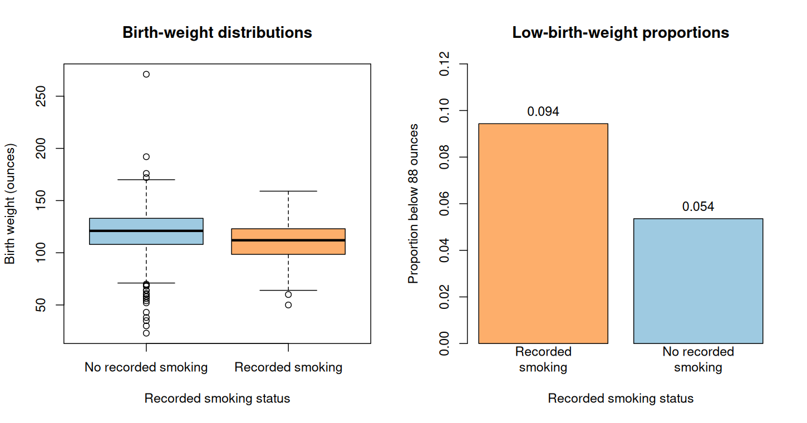

# Class 16: Inference for and Comparison of Means and Proportions

**Date:** Wednesday, November 18, 2026  
**Status:** Complete first version  
**Last updated:** August 30, 2026

[← Class 15](../15-confidence-intervals-and-hypothesis-tests/) · [Practice 16](practice/) · [Course syllabus](../../ECO202-Fall2026-Syllabus.pdf) · [Class 17 →](../17-conditional-distributions-expectations-and-simple-regression/)

**Class-folder workflow:** Use this guide for preparation, class, and review; run adjacent files when directed; then complete [ungraded practice](practice/) before studying the [worked solutions](practice/solutions/).

<!-- Source lineage: Econ202-UlrichMueller/LectureNotes.tex, unknown variance, sample variance, Student-t approximation, general inference, comparison of two means, matched pairs, binary variables, and inference for one and two proportions; Spring 2026 PS9; selected private historical assessments used only for scope calibration; Moore, McCabe, and Craig, Chapters 7--8. The empirical demonstration uses the documented bwght CSV distributed with the course. The procedure map, empirical contrasts, checks, prompts, and prose are newly authored. -->

## Central question

How do the target, outcome type, study design, and dependence structure determine the right standard error and interpretation?

## Learning goals

By the end of class, you should be able to:

1. select among one-sample, two-independent-sample, and paired procedures from the design rather than from keywords;
2. conduct large-sample or Student $t$ inference for one mean and for a difference of means;
3. recognize a proportion as the mean of a binary outcome and conduct inference for one or two proportions;
4. distinguish the estimate-based standard error for a one-proportion interval from the null-based standard error for its hypothesis test;
5. check sampling, assignment, independence, pairing, outlier, and success/failure conditions; and
6. report effect size and uncertainty while separating descriptive, population, and causal interpretations.

<a id="lecture-map"></a>

## In-class route

| Stop | Live focus | Mode |
|---|---|---|
| **C16.1** | [Choose the object before the formula](#c16-stop-1) | Design classification + Checkpoint 1 |
| **C16.2** | [One mean and paired differences](#c16-stop-2) | Board work 1 + contrast |
| **C16.3** | [Two independent means in the birth-weight data](#c16-stop-3) | Data demonstration + Board work 2 |
| **C16.4** | [A mean difference is not automatically causal](#c16-stop-4) | Design audit |
| **C16.5** | [A proportion is a binary mean](#c16-stop-5) | Derivation + Checkpoint 2 + approximation check |
| **C16.6** | [Two proportions in the birth-weight data](#c16-stop-6) | Board work 3 + comparison |
| **C16.7** | [Choose, report, and audit](#c16-stop-7) | AI interaction + synthesis |

## How to use this guide

**Prepare:** For each proposed comparison, identify the observational unit, quantitative or binary outcome, number of groups, whether observations are paired, the target parameter, and whether the design uses random sampling, random assignment, both, or neither.

**In class:** Begin from the design and estimator. Derive the standard error by naming which sample quantities vary and whether they are independent. Software output comes after the target, mechanism, and calculation.

**Review:** Reconstruct the procedure map and both `bwght` comparisons without looking. Then explain why the strong mean difference and the borderline binary-threshold difference answer different questions.

**Practice:** Complete the short questions in Section 8, then use [Practice 16](practice/) for an exact 40–55 minute staged core with public worked solutions after an attempt. Procedure selection, essential calculations, assumptions, interpretation, and limitations are common core; memorized software syntax is not.

**Prerequisites:** Classes 13–15, especially estimators, estimated standard errors, Normal and Student $t$ reference distributions, tests, confidence intervals, and design-based interpretation.

## Full guide map

1. [Choose the object before the formula](#1-choose-the-object-before-the-formula)
2. [One mean and paired differences](#2-one-mean-and-paired-differences)
3. [Two independent means in the birth-weight data](#3-two-independent-means-in-the-birth-weight-data)
4. [A mean difference is not automatically causal](#4-a-mean-difference-is-not-automatically-causal)
5. [A proportion is a binary mean](#5-a-proportion-is-a-binary-mean)
6. [Two proportions in the birth-weight data](#6-two-proportions-in-the-birth-weight-data)
7. [Choose, report, and audit](#7-choose-report-and-audit)
8. [Practice and answer checks](#8-practice-and-answer-checks)
9. [Common core, optional paths, and recap](#9-common-core-optional-paths-and-recap)

<a id="c16-stop-1"></a>

## 1. Choose the object before the formula

Classify the target, outcome, grouping, and dependence before allowing a procedure name or formula.

| Outcome and design | Estimator | Basic estimated standard error | Reference procedure |
|---|---|---|---|
| One quantitative sample | $\bar X$ | $s/\sqrt n$ | One-sample procedure: $t$&nbsp;or large-sample Normal |
| Paired quantitative observations | $\bar D$ ($D_i=X_{i,1}-X_{i,0}$) | $s_D/\sqrt n$ | One-sample procedure on pair differences |
| Two independent quantitative groups | $\bar X_1-\bar X_0$ | $\sqrt{s_1^2/n_1+s_0^2/n_0}$ | Welch procedure ($t$) or large-sample Normal |
| One binary sample | $\widehat p$ | $\sqrt{\widehat p(1-\widehat p)/n}$&nbsp;for an estimate-based interval | Large-sample proportion procedure |
| Two independent binary groups | $\widehat p_1-\widehat p_0$ | $\sqrt{\widehat p_1(1-\widehat p_1)/n_1+\widehat p_0(1-\widehat p_0)/n_0}$ | Large-sample difference-in-proportions procedure |

The table is a starting map, not a substitute for assumptions. Random sampling supports population generalization; random assignment supports an average causal interpretation for experimental units; pairing creates dependence that must be preserved; and clustering or repeated observations require a standard error that accounts for that dependence.

### Checkpoint 1

Classify each setting before calculating:

1. monthly spending for independent samples of 80 urban and 90 rural households;
2. blood pressure for the same 40 people before and after an intervention;
3. whether each of 500 sampled firms exports;
4. whether participants assigned to two experimental groups find a job; and
5. wages observed repeatedly for workers within the same 30 firms.

The fifth setting does not fit a simple independent-observation row in the table because within-firm dependence remains.

[↑ In-class route](#lecture-map) · [Next →](#c16-stop-2)

<a id="c16-stop-2"></a>

## 2. One mean and paired differences

Calculate one-sample inference, then show that a paired design becomes one-sample inference only after constructing within-pair differences.

For independent observations with population mean $\mu$ and unknown variance, estimate the sampling spread of $\bar X$ with

$$
s^2=\frac{1}{n-1}\sum_{i=1}^n(X_i-\bar X)^2,
\qquad
\widehat{\mathrm{SE}}(\bar X)=\frac{s}{\sqrt n}.
$$

Under an i.i.d. Normal population,

$$
T=\frac{\bar X-\mu_0}{s/\sqrt n}
$$

has an exact Student $t$ distribution with $n-1$ degrees of freedom. In large samples, a Student $t$ or Normal reference can be justified approximately under weaker shape conditions, but independence, outliers, and the sampling mechanism still require inspection.

The **degrees of freedom** index the shape of the Student $t$ reference distribution: smaller values produce heavier tails, and the distribution approaches the standard Normal as the degrees of freedom grow. This course supplies or software-computes the needed value; memorizing a degrees-of-freedom calculation is not the statistical target.

> [!IMPORTANT]
> **Board work 1 — One mean**
>
> A sample has $n=25$, $\bar x=52$, and $s=10$. For $H_0:\mu=50$,
>
> $$
> \widehat{\mathrm{SE}}(\bar X)=10/\sqrt{25}=2,
> \qquad
> t=(52-50)/2=1.
> $$
>
> With 24 degrees of freedom, the two-sided p-value is approximately $0.327$. Using $t^\star_{0.975,24}\approx2.064$, the 95% interval is
>
> $$
> 52\pm2.064(2)=[47.872,56.128].
> $$

For paired observations, define $D_i=X_{i,1}-X_{i,0}$ and apply the one-sample procedure to $D_1,\ldots,D_n$. The observational unit for inference is the pair. Treating the two columns as independent discards the within-pair covariance and generally uses the wrong standard error.

[← Previous](#c16-stop-1) · [↑ In-class route](#lecture-map) · [Next →](#c16-stop-3)

<a id="c16-stop-3"></a>

## 3. Two independent means in the birth-weight data

Build the uncertainty of a mean difference from two group variances, then interpret the result in ounces before discussing causality.

The historical [`bwght` data](data/README.md) contain 1,388 birth records from a 1988 National Health Interview Survey extract. The outcome `bwght` is birth weight in ounces. Define the smoking group as records with `cigs > 0` and the nonsmoking group as records with `cigs = 0`. For this simplified teaching calculation, treat the displayed records as independent; the CSV alone does not establish that assumption or preserve the NHIS complex survey design.

| Group | $n$ | Mean birth weight | Sample SD |
|---|---:|---:|---:|
| Recorded smoking during pregnancy | 212 | 111.1462 oz | 19.1814 oz |
| No recorded smoking during pregnancy | 1,176 | 120.0612 oz | 20.2685 oz |

The displayed difference is smoking minus nonsmoking:

$$
\widehat\Delta=111.1462-120.0612\approx-8.9150\text{ ounces}.
$$

> [!IMPORTANT]
> **Board work 2 — Welch inference for two means**
>
> The estimated standard error is
>
> $$
> \widehat{\mathrm{SE}}(\widehat\Delta)
> =\sqrt{\frac{19.1814^2}{212}+\frac{20.2685^2}{1176}}
> \approx1.4439\text{ ounces}.
> $$
>
> For $H_0:\Delta=0$,
>
> $$
> t\approx\frac{-8.9150}{1.4439}=-6.1743.
> $$
>
> Welch's approximation gives about 302.3 degrees of freedom and a two-sided p-value below $0.0001$. With $t^\star\approx1.9678$, the 95% interval is
>
> $$
> -8.9150\pm1.9678(1.4439)
> =[-11.7564,-6.0736]\text{ ounces}.
> $$

The script [`class-16-inference-means-and-proportions.R`](class-16-inference-means-and-proportions.R) reproduces the summaries, calculations, and figure. Open this class folder as the working folder, then run:

```sh
Rscript class-16-inference-means-and-proportions.R
```



The very small p-value is evidence against equality of the two group means under the reference procedure. The interval supplies the estimated magnitude and uncertainty. Neither calculation by itself establishes that smoking caused the entire observed difference.

[← Previous](#c16-stop-2) · [↑ In-class route](#lecture-map) · [Next →](#c16-stop-4)

<a id="c16-stop-4"></a>

## 4. A mean difference is not automatically causal

Separate the arithmetic of two independent groups from the design argument needed for a population or causal interpretation.

The `bwght` comparison is observational: smoking status was recorded, not randomly assigned. The difference in means describes these recorded groups. A causal claim requires an identification argument addressing differences in income, education, health, behavior, selection, measurement, and other relevant factors. The file also does not automatically constitute a simple random sample from a clearly defined current target population.

The same two-sample standard-error shape can appear in very different designs:

- two independent simple random samples can support a population mean comparison under their implemented sampling designs, while other probability samples require design-aware uncertainty calculations;
- a randomized experiment can support an average assignment-effect comparison for its experimental units;
- an observational comparison can be descriptive or predictive without identifying a causal effect; and
- clustered or matched observations violate the simple independent-group calculation unless the procedure preserves their dependence.

### Design audit

For the birth-weight result, write separate one-sentence conclusions that are (i) descriptive for the observed records, (ii) population-level under an explicitly added sampling assumption, and (iii) causal under an explicitly added identification assumption. Label which two require support not supplied by the raw calculation.

[← Previous](#c16-stop-3) · [↑ In-class route](#lecture-map) · [Next →](#c16-stop-5)

<a id="c16-stop-5"></a>

## 5. A proportion is a binary mean

Define a binary outcome, recover its mean and variance, and identify which standard error belongs to an interval or a null test.

For $Y_i\in\lbrace0,1\rbrace$,

$$
p=\mathbb E[Y_i],
\qquad
\mathrm{Var}(Y_i)=p(1-p),
\qquad
\widehat p=\bar Y.
$$

An estimate-based large-sample standard error is

$$
\widehat{\mathrm{SE}}(\widehat p)
=\sqrt{\frac{\widehat p(1-\widehat p)}{n}}.
$$

The simple Wald interval is $\widehat p\pm z^\star\widehat{\mathrm{SE}}(\widehat p)$. For a null test $H_0:p=p_0$, a null-based standard error can instead use $p_0(1-p_0)$. These procedures are close in many large samples but are not algebraically identical. Near 0 or 1 or with small success/failure counts, the Wald interval can perform poorly; score or exact methods are useful extensions.

### Checkpoint 2

In 80 independent Bernoulli observations, 52 are successes. Calculate $\widehat p$, the estimate-based standard error, and the approximate 95% Wald interval. Check the observed success and failure counts before using the approximation.

The answers are $0.65$, approximately $0.0533$, and approximately $[0.5455,0.7545]$.

[← Previous](#c16-stop-4) · [↑ In-class route](#lecture-map) · [Next →](#c16-stop-6)

<a id="c16-stop-6"></a>

## 6. Two proportions in the birth-weight data

Recode the quantitative outcome into a policy-relevant threshold, construct the unpooled difference interval, and explain why it answers a different question from the mean comparison.

Define low birth weight here as `bwght < 88`, meaning less than 88 ounces or 5.5 pounds. The observed counts are:

| Group | Low birth weight | Total | Proportion |
|---|---:|---:|---:|
| Recorded smoking | 20 | 212 | 0.09434 |
| No recorded smoking | 63 | 1,176 | 0.05357 |

The difference is

$$
\widehat\Delta_p
=\widehat p_1-\widehat p_0
\approx0.04077,
$$

or about 4.08 percentage points.

> [!IMPORTANT]
> **Board work 3 — An unpooled interval for two proportions**
>
> The estimate-based standard error is
>
> $$
> \widehat{\mathrm{SE}}(\widehat\Delta_p)
> =\sqrt{
> \frac{0.09434(1-0.09434)}{212}
> +
> \frac{0.05357(1-0.05357)}{1176}
> }
> \approx0.02112.
> $$
>
> The approximate 95% Wald interval is
>
> $$
> 0.04077\pm1.96(0.02112)
> =[-0.00063,0.08217].
> $$

The interval narrowly includes zero. Under the matching unpooled Normal reference, the two-sided statistic is about $1.93$ and the p-value is about $0.054$. A conventional null-pooled equality test uses a different standard error and need not invert this Wald interval exactly; that distinction is optional method detail, not evidence that one calculation is allowed to ignore its assumptions.

The mean comparison asks how the entire birth-weight distribution shifts on average. The proportion comparison asks how often observations cross one particular threshold. A strong mean difference can coexist with a less precise threshold-proportion difference because the targets and information used are different.

[← Previous](#c16-stop-5) · [↑ In-class route](#lecture-map) · [Next →](#c16-stop-7)

<a id="c16-stop-7"></a>

## 7. Choose, report, and audit

Build an unaided procedure-and-design map first, then require AI to audit the identical empirical report without changing its target or inventing a design.

First audit this report without assistance:

> Maternal smoking caused birth weight to fall by exactly 8.9 ounces. The tiny mean-comparison p-value proves that every infant is harmed. The low-birth-weight interval includes zero, so it proves there is no effect on low birth weight. The large sample removes confounding and makes both statements representative of current births.

The report turns an observational association into a cause, an average into an individual effect, nonrejection into proof of no difference, and sample size into a cure for confounding and external-validity limitations.

**Complete non-AI route:** Identify the observational unit, two outcomes, two estimands, estimators, standard errors, intervals, study design, and units. Recalculate both effects; distinguish “statistically detectable” from “substantively important”; and state the strongest descriptive conclusion that both calculations support.

> [!TIP]
> **AI interaction 1 — Audit the same two-outcome report**

```text
The historical bwght file contains 1,388 birth records. Smoking status was
recorded, not randomized. Mean birth weight is 111.1462 ounces for 212 smoking
records and 120.0612 ounces for 1,176 nonsmoking records. The estimated mean
difference is -8.9150 ounces with SE 1.4439 and 95% interval
[-11.7564, -6.0736]. Low birth weight is defined as less than 88 ounces; the
observed proportions are 20/212 and 63/1176. Their difference is 0.04077 with
unpooled SE 0.02112 and 95% interval [-0.00063, 0.08217].

Audit this report: “Maternal smoking caused birth weight to fall by exactly
8.9 ounces. The tiny mean-comparison p-value proves that every infant is
harmed. The low-birth-weight interval includes zero, so it proves there is no
effect on low birth weight. The large sample removes confounding and makes both
statements representative of current births.”

Recalculate both intervals; identify each estimand and unit; distinguish an
average from a threshold proportion; explain significance versus nonrejection;
and separate observational association, causal identification, precision, and
external validity. Do not invent sampling or assignment facts.
```

Verify every response against the data summaries, formulas, procedure map, and provenance note. AI output does not choose the estimand or supply missing design evidence.

[← Previous](#c16-stop-6) · [↑ In-class route](#lecture-map)

## 8. Practice and answer checks

These short checks support immediate retrieval. The separate [Practice 16 module](practice/) provides a longer design-first route, compact checks, and public worked solutions after an attempt.

### Practice A — Paired or independent?

Twenty stores report sales before and after a display change. Another study compares 20 stores using the display with 20 different stores not using it. Name the estimator and standard error structure for each design and explain why the raw sample sizes alone do not determine the procedure.

<details>
<summary>Check after attempting Practice A</summary>

The first design uses 20 within-store differences and the one-sample standard error $s_D/\sqrt{20}$. The second uses a difference of independent group means with standard error $\sqrt{s_1^2/20+s_0^2/20}$. Pairing determines the dependence structure.

</details>

### Practice B — Two means

Independent groups have $n_1=100$, $\bar x_1=18$, $s_1=6$ and $n_0=64$, $\bar x_0=15$, $s_0=8$. Calculate the mean difference, its estimated standard error, and the large-sample standardized statistic for a zero difference.

<details>
<summary>Check after attempting Practice B</summary>

The estimate is 3. The standard error is $\sqrt{36/100+64/64}=\sqrt{1.36}\approx1.1662$, and the statistic is approximately $2.5725$.

</details>

### Practice C — Two proportions

Group 1 has 48 successes among 120 observations; Group 0 has 30 among 100. Calculate the difference in sample proportions and its unpooled estimated standard error. State the success/failure counts used to assess the Normal approximation.

<details>
<summary>Check after attempting Practice C</summary>

The proportions are 0.40 and 0.30, so the difference is 0.10. The unpooled standard error is $\sqrt{0.4(0.6)/120+0.3(0.7)/100}\approx0.06403$. Success/failure counts are 48/72 and 30/70.

</details>

## 9. Common core, optional paths, and recap

### Common core

You should be able to do the following without AI or software:

- choose one-sample, paired, or two-independent-sample reasoning from the design;
- construct and interpret standard errors, tests, and intervals for means and proportions using supplied reference values;
- represent a proportion as a binary mean and distinguish estimate-based from null-based variance conceptually;
- check independence, pairing, outliers, group sizes, and success/failure counts;
- report effects in original units and distinguish statistical evidence from effect magnitude; and
- separate descriptive, population, and causal interpretations and name the design evidence each requires.

### Optional paths

- **Theory:** Derive Welch degrees of freedom or the unbiased sample-variance denominator.
- **Alternative procedures:** Compare Student $t$, Normal, score, exact binomial, and Wald methods.
- **Design:** Study clustering, survey weights, blocked experiments, noncompliance, or paired randomization.
- **Regression connection:** Express a two-group mean or proportion difference as a regression on a binary indicator.
- **Sensitivity:** Examine how the low-birth-weight conclusion changes with threshold choice without selecting a threshold after seeing the preferred result.

### Durable recap

1. The design determines which observations are independent and which comparison is being estimated.
2. Paired data become one-sample data only after within-pair differences are formed.
3. Means and proportions share an estimate-plus-standard-error logic; proportions are means of binary outcomes.
4. A p-value and interval belong to a named target and reference procedure, not to a keyword in a dataset.
5. Precision does not create random assignment, population representativeness, causal identification, or practical importance.

## Notation

| Symbol | Meaning |
|---|---|
| $\mu,\bar X$ | Population mean and sample-mean estimator |
| $s^2$ | Sample variance (denominator: $n-1$) |
| $D_i,\bar D$ | Within-pair difference and mean difference |
| $\Delta,\widehat\Delta$ | Target group difference and its estimate |
| $p,\widehat p$ | Population proportion and sample proportion |
| $\Delta_p,\widehat\Delta_p$ | Difference in proportions and its estimate |
| $T,t$ | Student t standardized statistic before and after observation, as context indicates |

## References and continuity

- Official textbook: Moore, McCabe, and Craig, 10th ed., Chapters 7–8.
- Complementary reference: *OpenIntro Statistics*, inference chapters.
- Data source: Jeffrey M. Wooldridge's `bwght` data, distributed with the GPL-3 `wooldridge` R package; see the [class-local provenance note](data/README.md).
- Continuity with prior ECO 202: unknown variance, $n-1$, Student $t$, general estimate-plus-standard-error inference, one and two means, paired comparisons, binary-indicator representation, one and two proportions, and causal qualification are retained. The redesign organizes them around one procedure map and two outcomes from a recurring real dataset.

[← Class 15](../15-confidence-intervals-and-hypothesis-tests/) · [↑ In-class route](#lecture-map) · [Class 17 →](../17-conditional-distributions-expectations-and-simple-regression/)
