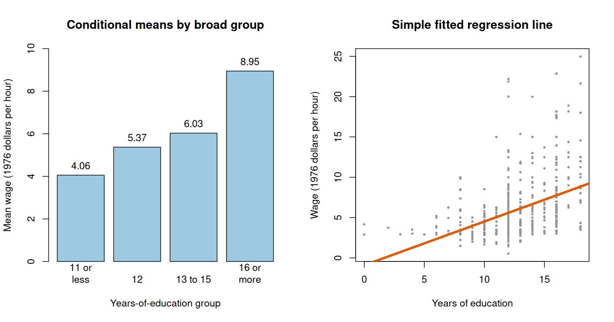

# Class 17: Conditional Distributions, Expectations, and Simple Regression

**Date:** Monday, November 30, 2026  
**Status:** Complete first version  
**Last updated:** August 30, 2026

[← Class 16](../16-inference-for-means-and-proportions/) · [Course syllabus](../../ECO202-Fall2026-Syllabus.pdf) · [Practice 17](practice/) · [Class 18 →](../18-multiple-regression-causal-interpretation-and-project-workshop/)

**Class-folder workflow:** Use this guide for preparation, class, and review; run adjacent files when directed; then complete [ungraded practice](practice/) before studying the [worked solutions](practice/solutions/).

<!-- Source lineage: Econ202-UlrichMueller/LectureNotes.tex, conditional distributions, conditional expectation, its properties, law of iterated expectations, regression function, mean-plus-noise representation, population regression coefficients, prediction/statistical/causal interpretations, and slope inference; Spring 2026 PS10; selected private historical assessments used only for scope calibration; Moore, McCabe, and Craig, Chapters 2 and 10. The empirical demonstration uses the documented wage1 CSV distributed with the course. The joint table, grouped-wage presentation, audits, checks, prompts, and prose are newly authored. -->

## Central question

How does averaging within subpopulations lead from conditional distributions to a simple regression line—and what can that line legitimately mean?

## Learning goals

By the end of class, you should be able to:

1. construct a conditional distribution from a joint probability table;
2. calculate and interpret conditional expectations as subpopulation means;
3. use the law of iterated expectations to recover an overall mean;
4. distinguish the conditional-mean function from its best linear approximation and from a fitted sample line;
5. interpret the mean-plus-noise decomposition $Y=\mathbb E[Y\mid X]+\varepsilon$;
6. calculate and interpret simple-regression coefficients and basic slope inference; and
7. separate predictive, conditional-mean, and causal interpretations.

<a id="lecture-map"></a>

## In-class route

| Stop | Live focus | Mode |
|---|---|---|
| **C17.1** | [Conditional distributions from a joint table](#c17-stop-1) | Board work 1 + probability check |
| **C17.2** | [Conditional means and iterated expectations](#c17-stop-2) | Board work 2 + recombination |
| **C17.3** | [The regression function and mean-plus-noise](#c17-stop-3) | Definition + Checkpoint 1 |
| **C17.4** | [Conditional wage means by education group](#c17-stop-4) | Data demonstration + interpretation |
| **C17.5** | [Population line and fitted sample line](#c17-stop-5) | Board work 3 + Class 4 connection |
| **C17.6** | [Inference for the education slope](#c17-stop-6) | Robust-SE audit + interval |
| **C17.7** | [Prediction, comparison, or causality?](#c17-stop-7) | AI interaction + project transfer |

## How to use this guide

**Prepare:** Review Class 9 conditional probability, Class 10 expectation and covariance, the Class 4 descriptive least-squares line, and Class 15 estimate-plus-or-minus-standard-error inference.

**In class:** Keep three objects separate: the full conditional distribution of $Y$ given $X=x$, its conditional mean $\mathbb E[Y\mid X=x]$, and a line used to approximate those means. State whether each line is a population target or a fitted sample result.

**Review:** Reconstruct the joint-table conditional means and their weighted overall mean. Then reproduce the wage slope, its units, interval, and three possible interpretations without crossing silently into causality.

**Practice:** Complete the short questions in Section 8, then use [Practice 17](practice/) for a 40–55 minute ungraded self-study route with complete worked solutions. Conditional-distribution calculations, iterated expectations, simple-regression interpretation, essential coefficient calculations, uncertainty, and causal limits are common core; memorized software syntax is not.

**Prerequisites:** Classes 4, 9–10, and 13–16.

## Full guide map

1. [Conditional distributions from a joint table](#1-conditional-distributions-from-a-joint-table)
2. [Conditional means and iterated expectations](#2-conditional-means-and-iterated-expectations)
3. [The regression function and mean-plus-noise](#3-the-regression-function-and-mean-plus-noise)
4. [Conditional wage means by education group](#4-conditional-wage-means-by-education-group)
5. [Population line and fitted sample line](#5-population-line-and-fitted-sample-line)
6. [Inference for the education slope](#6-inference-for-the-education-slope)
7. [Prediction, comparison, or causality?](#7-prediction-comparison-or-causality)
8. [Practice and answer checks](#8-practice-and-answer-checks)
9. [Common core, optional paths, and recap](#9-common-core-optional-paths-and-recap)

<a id="c17-stop-1"></a>

## 1. Conditional distributions from a joint table

Select one column of a joint distribution, divide by its margin, and verify that the resulting conditional probabilities sum to one.

Consider a fictional population in which $X$ records an education group and $Y$ records annual earnings in tens of thousands of dollars. The table gives joint probabilities.

| $Y\backslash X$ | Basic | Intermediate | Advanced | $\mathbb P(Y=y)$ |
|---:|---:|---:|---:|---:|
| 4 | 0.12 | 0.08 | 0.02 | 0.22 |
| 10 | 0.08 | 0.25 | 0.10 | 0.43 |
| 16 | 0.00 | 0.15 | 0.20 | 0.35 |
| $\mathbb P(X=x)$ | 0.20 | 0.48 | 0.32 | 1.00 |

For discrete variables and $\mathbb P(X=x)>0$,

$$
\mathbb P(Y=y\mid X=x)
=\frac{\mathbb P(Y=y,X=x)}{\mathbb P(X=x)}.
$$

> [!IMPORTANT]
> **Board work 1 — Condition on the intermediate group**
>
> Divide the three joint probabilities in the intermediate column by $0.48$:
>
> $$
> \mathbb P(Y=4\mid X=\text{intermediate})=0.08/0.48=1/6,
> $$
>
> $$
> \mathbb P(Y=10\mid X=\text{intermediate})=0.25/0.48=25/48,
> $$
>
> $$
> \mathbb P(Y=16\mid X=\text{intermediate})=0.15/0.48=5/16.
> $$
>
> The three conditional probabilities sum to one. Conditioning changes the reference population: the denominator is the intermediate-group margin, not the whole population.

A conditional distribution retains more than its mean. Education groups could differ in center, spread, skewness, or tail risk even if a later regression summarizes only one aspect.

[↑ In-class route](#lecture-map) · [Next →](#c17-stop-2)

<a id="c17-stop-2"></a>

## 2. Conditional means and iterated expectations

Calculate each subpopulation mean, then recover the overall mean by weighting with the group probabilities rather than averaging groups equally.

For discrete $Y$,

$$
\mathbb E[Y\mid X=x]
=\sum_y y\mathbb P(Y=y\mid X=x).
$$

The conditional expectations from the joint table are

$$
\mathbb E[Y\mid X=\text{basic}]=6.4,
$$

$$
\mathbb E[Y\mid X=\text{intermediate}]=10.875,
$$

$$
\mathbb E[Y\mid X=\text{advanced}]=13.375.
$$

These are subpopulation means, not individual predictions guaranteed to occur.

> [!IMPORTANT]
> **Board work 2 — Law of iterated expectations**
>
> Weight conditional means by group prevalence:
>
> $$
> \mathbb E\bigl[\mathbb E[Y\mid X]\bigr]
> =0.20(6.4)+0.48(10.875)+0.32(13.375)
> =10.78.
> $$
>
> The same answer follows from the marginal distribution of $Y$:
>
> $$
> \mathbb E[Y]=0.22(4)+0.43(10)+0.35(16)=10.78.
> $$

This identity,

$$
\mathbb E[Y]=\mathbb E\bigl[\mathbb E[Y\mid X]\bigr],
$$

is the **law of iterated expectations**. It says that the overall mean is the prevalence-weighted mean of the subpopulation means. It does not say that conditioning is causal.

> [!NOTE]
> **Return to the Class 5 selection decomposition.** Class 5 deliberately used finite-group averages because conditional expectation had not yet been introduced. With the notation now available, its population version can be written as
>
> $$
> \mathbb E[Y\mid D=1]-\mathbb E[Y\mid D=0]
> =\mathbb E[Y(1)-Y(0)\mid D=1]
> +\left\lbrack\mathbb E[Y(0)\mid D=1]-\mathbb E[Y(0)\mid D=0]\right\rbrack.
> $$
>
> The first term is the average treatment effect among treated units; the bracketed term compares the two groups' untreated potential outcomes. The notation compresses the same logic developed numerically in Class 5 and does not make either unobserved component identifiable from an observational comparison.

[← Previous](#c17-stop-1) · [↑ In-class route](#lecture-map) · [Next →](#c17-stop-3)

<a id="c17-stop-3"></a>

## 3. The regression function and mean-plus-noise

Treat the collection of conditional means as a population function, then separate systematic conditional means from individual deviations.

The **regression function** is

$$
f(x)=\mathbb E[Y\mid X=x].
$$

It can be nonlinear, discontinuous, or defined only on the observed support of $X$. Define

$$
\varepsilon=Y-f(X).
$$

Then

$$
Y=f(X)+\varepsilon,
\qquad
\mathbb E[\varepsilon\mid X]=0.
$$

The conditional mean-zero property holds by construction when $f(X)=\mathbb E[Y\mid X]$. It does not require Normal errors, constant conditional variance, random assignment, or a causal model. The conditional distribution of $Y$ can remain wide even when $f(x)$ is known.

### Checkpoint 1

If $\mathbb E[Y\mid X=2]=10$ and an observed unit with $X=2$ has $Y=14$, what is its realized $\varepsilon$? Does the value 4 contradict $\mathbb E[\varepsilon\mid X=2]=0$? What repeated-subpopulation calculation would check the condition?

[← Previous](#c17-stop-2) · [↑ In-class route](#lecture-map) · [Next →](#c17-stop-4)

<a id="c17-stop-4"></a>

## 4. Conditional wage means by education group

Estimate conditional means in broad education groups, recombine them, and compare their shape with a straight-line summary.

The historical [`wage1` data](data/README.md) contain 526 worker records from a 1976 Current Population Survey extract. Hourly wage is measured in 1976 dollars and education in years. The grouped sample means are:

| Education group | Records | Mean hourly wage |
|---|---:|---:|
| 11 years or less | 116 | 4.0567 |
| 12 years | 198 | 5.3714 |
| 13–15 years | 113 | 6.0300 |
| 16 years or more | 99 | 8.9480 |

These are empirical conditional means under a coarse grouping. Weighting them by $116/526$, $198/526$, $113/526$, and $99/526$ recovers the overall sample mean wage of approximately $5.8961$.

The script [`class-17-conditional-expectation-and-regression.R`](class-17-conditional-expectation-and-regression.R) reproduces the group means, fitted line, robust standard error, and figure. Open this class folder as the working folder, then run:

```sh
Rscript class-17-conditional-expectation-and-regression.R
```



The group means rise with education, but four grouped points cannot establish an exactly linear conditional-mean function for every education year. They also do not identify what the same worker's wage would have been under a different education level.

[← Previous](#c17-stop-3) · [↑ In-class route](#lecture-map) · [Next →](#c17-stop-5)

<a id="c17-stop-5"></a>

## 5. Population line and fitted sample line

Recover the population best linear approximation, connect it to Class 4's sample calculation, and preserve the difference between a line and the full conditional mean.

The population coefficients minimize mean squared prediction error:

$$
(\beta_0,\beta_1)
=\arg\min_{a,m}\mathbb E[(Y-a-mX)^2].
$$

For $\mathrm{Var}(X)>0$,

$$
\beta_1=\frac{\mathrm{Cov}(X,Y)}{\mathrm{Var}(X)},
\qquad
\beta_0=\mathbb E[Y]-\beta_1\mathbb E[X].
$$

If $f(x)=\mathbb E[Y\mid X=x]$ is linear, the population line equals that conditional-mean function. If $f$ is nonlinear, $(\beta_0,\beta_1)$ is still the best linear predictor under squared loss but does not reproduce every conditional mean.

> [!IMPORTANT]
> **Board work 3 — The fitted wage line**
>
> The sample coefficients minimize $\sum_i(y_i-b_0-b_1x_i)^2$ and can be calculated as
>
> $$
> b_1=\frac{\sum_i(x_i-\bar x)(y_i-\bar y)}{\sum_i(x_i-\bar x)^2},
> \qquad
> b_0=\bar y-b_1\bar x.
> $$
>
> For `wage1`,
>
> $$
> \widehat{\mathrm{wage}}
> =-0.9049+0.5414\mathrm{educ}.
> $$

The slope means that fitted hourly wage is 0.5414 1976 dollars higher for each additional year of education. It is a sample best-linear-prediction statement. The negative intercept is the line's fitted value at zero education. Education zero is observed for only two of the 526 records and lies at the boundary of the observed 0–18 year range, so the intercept is supported by very little local information and need not have a useful economic interpretation.

[← Previous](#c17-stop-4) · [↑ In-class route](#lecture-map) · [Next →](#c17-stop-6)

<a id="c17-stop-6"></a>

## 6. Inference for the education slope

Attach sampling uncertainty to the population best-linear-prediction slope, then state what a heteroskedasticity-robust standard error repairs and what it does not.

Treating the records as independent draws from a model population, the fitted slope is $b_1\approx0.5414$. An HC1 heteroskedasticity-robust estimated standard error is approximately

$$
\widehat{\mathrm{SE}}_{\mathrm{HC1}}(b_1)\approx0.06126
$$

1976 dollars per hour for each year of education. The large-sample standardized statistic for $H_0:\beta_1=0$ is

$$
Z\approx\frac{0.5414}{0.06126}=8.84,
$$

with a two-sided Normal-reference p-value below $0.0001$. Using the full-precision estimate and standard error, the approximate 95% interval is

$$
0.5413593\pm1.96(0.0612596)
=[0.4212904,0.6614281],
$$

reported as $[0.4213,0.6614]$.

The robust standard error allows conditional variance to change with education under the independent-observation large-sample model. It does not repair selection, measurement error, omitted variables, dependence, nonlinear interpretation, or causal identification. The interval concerns a population best-linear-prediction slope under the stated model, not every worker's return to another year of schooling.

### Checkpoint 2

An analyst reports only “the slope is highly significant.” What four additional items are needed to make the statement statistically and economically interpretable?

[← Previous](#c17-stop-5) · [↑ In-class route](#lecture-map) · [Next →](#c17-stop-7)

<a id="c17-stop-7"></a>

## 7. Prediction, comparison, or causality?

Write three distinct interpretations of the same slope, reject those unsupported by the design, and connect the audit to the individual empirical project.

1. **Best linear prediction:** Always available as a mathematical description of the chosen population distribution with finite second moments. The slope describes how the best linear predictor changes with $X$.
2. **Conditional-mean comparison:** Exact as a description of $\mathbb E[Y\mid X=x]$ only if the conditional-mean function is linear; otherwise the line is an average linear approximation.
3. **Causal effect:** Requires a manipulable treatment or intervention, well-defined potential outcomes, and a credible identification argument such as random assignment or defensible conditional independence. The observational wage regression does not supply that argument by itself.

First audit this statement without assistance:

> The regression proves that giving any worker one more year of education raises that worker's hourly wage by exactly 54 cents, and the tiny p-value removes omitted-variable and selection concerns.

**Complete non-AI route:** Identify the fitted object, units, target population, linearity requirement, standard-error assumptions, counterfactual causal claim, and missing design evidence. Then rewrite the statement separately for prediction, conditional-mean comparison, and causality.

> [!TIP]
> **AI interaction 1 — Audit the same regression claim**

```text
In the historical wage1 data, the simple fitted regression of hourly wage in
1976 dollars on years of education is wage_hat = -0.9049 + 0.5414 educ. The
HC1 standard error for the slope is 0.06126 and its approximate 95% interval
is [0.4213, 0.6614]. The data are observational.

Audit this claim: “The regression proves that giving any worker one more year
of education raises that worker's hourly wage by exactly 54 cents, and the tiny
p-value removes omitted-variable and selection concerns.”

Give separate best-linear-prediction, conditional-mean, and causal
interpretations. State the linearity, sampling, standard-error, and causal
identification assumptions for each. Preserve the 1976 units and historical
scope. Do not invent random assignment or omitted controls.
```

**Project transfer:** Write the project's proposed outcome, predictor, population, and regression target. Label the intended interpretation as descriptive, predictive, or causal, and state the evidence required for that label. If the design supports only description, retain that honest target.

[← Previous](#c17-stop-6) · [↑ In-class route](#lecture-map)

## 8. Practice and answer checks

### Practice A — Condition and average

Suppose $\mathbb P(X=0)=0.6$, $\mathbb E[Y\mid X=0]=4$, $\mathbb P(X=1)=0.4$, and $\mathbb E[Y\mid X=1]=9$. Calculate $\mathbb E[Y]$ and explain why an unweighted average of 4 and 9 is generally wrong.

<details>
<summary>Check after attempting Practice A</summary>

$\mathbb E[Y]=0.6(4)+0.4(9)=6$. The subpopulations have different prevalence, so they must not receive equal weight.

</details>

### Practice B — Mean plus noise

For a unit with $X=x$, suppose $f(x)=12$ and $Y=9$. Calculate the realized error. What average of errors should equal zero within the subpopulation with $X=x$?

<details>
<summary>Check after attempting Practice B</summary>

$\varepsilon=Y-f(x)=9-12=-3$. The conditional or subpopulation mean of $Y-f(x)$ across units with $X=x$ should be zero.

</details>

### Practice C — Slope units and interval

An outcome is measured in percentage points and $X$ in thousands of dollars. A slope estimate is $-0.8$ with standard error $0.3$. Construct an approximate 95% interval and interpret the slope units without making a causal claim.

<details>
<summary>Check after attempting Practice C</summary>

The interval is $-0.8\pm1.96(0.3)=[-1.388,-0.212]$ percentage points per thousand dollars. The fitted outcome is 0.8 percentage points lower per additional thousand dollars of $X$ in the best linear sample relationship.

</details>

## 9. Common core, optional paths, and recap

### Common core

You should be able to do the following without AI or software:

- obtain a conditional distribution from a joint table and verify it sums to one;
- calculate conditional means and recombine them using the law of iterated expectations;
- interpret $\mathbb E[Y\mid X=x]$ as a subpopulation mean and $Y=f(X)+\varepsilon$ with conditional mean-zero noise;
- distinguish a conditional-mean function, population best linear approximation, and fitted sample line;
- calculate or interpret a simple-regression slope, robust standard error, interval, and units; and
- separate predictive, conditional-mean, and causal claims and name the assumptions each requires.

### Optional paths

- **Theory:** Prove that $\mathbb E[g(X)\varepsilon]=0$ when $\mathbb E[\varepsilon\mid X]=0$.
- **Approximation:** Derive why the population regression line is the best linear approximation to a nonlinear conditional mean.
- **Computation:** Plot education-year-specific means or compare ordinary and HC1 standard errors.
- **Design:** Study clustering, measurement error, or instrumental variables as reasons simple slope inference may not answer a causal question.
- **Functional form:** Compare the line with bins, transformations, or smooth conditional-mean estimates.

### Durable recap

1. Conditioning changes the reference population and produces a full distribution, not only a mean.
2. The overall mean is the prevalence-weighted mean of conditional means.
3. The regression function collects conditional means; a simple regression line may only approximate it.
4. A fitted slope needs units, a target population, a standard error, and design assumptions.
5. Statistical significance cannot turn an observational best-linear-prediction slope into an individual causal effect.

## Notation

| Symbol | Meaning |
|---|---|
| $\mathbb P(Y=y\mid X=x)$ | Conditional probability within the subpopulation ($X=x$) |
| $f(x)=\mathbb E[Y\mid X=x]$ | Conditional-mean or regression function |
| $\varepsilon=Y-f(X)$ | Deviation from the conditional mean |
| $\beta_0,\beta_1$ | Population best-linear-prediction coefficients |
| $b_0,b_1$ | Fitted sample intercept and slope |
| $\widehat{\mathrm{SE}}_{\mathrm{HC1}}(b_1)$ | HC1 heteroskedasticity-robust estimated standard error |

## References and continuity

- Official textbook: Moore, McCabe, and Craig, 10th ed., Chapters 2 and 10.
- Complementary references: *Introduction to Modern Statistics*, regression chapters; Huntington-Klein, *The Effect*.
- Data source: Jeffrey M. Wooldridge's `wage1` data, distributed with the GPL-3 `wooldridge` R package; see the [class-local provenance note](data/README.md).
- Continuity with prior ECO 202: conditional distributions and expectations, iterated expectations, the regression function, mean-plus-noise representation, population regression coefficients, prediction/statistical/causal distinctions, and slope inference are retained. The redesign explicitly reconnects these ideas to Class 4's descriptive line and uses a recurring empirical dataset with robust standard-error and causal-language audits.

[← Class 16](../16-inference-for-means-and-proportions/) · [↑ In-class route](#lecture-map) · [Practice 17](practice/) · [Class 18 →](../18-multiple-regression-causal-interpretation-and-project-workshop/)
