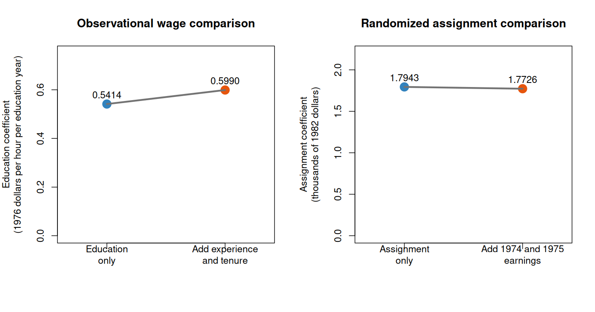

# Class 18: Multiple Regression and Causal Interpretation

**Date:** Wednesday, December 2, 2026  
**Status:** Complete first version  
**Last updated:** September 24, 2026

[← Class 17](../17-conditional-distributions-expectations-and-simple-regression/) · [Practice 18](practice/) · [Course syllabus](../../ECO202-Fall2026-Syllabus.pdf) · **Next meeting:** In-Class Exam 4

**Class-folder workflow:** Use this guide for preparation, class, and review; run adjacent files when directed; then complete [ungraded practice](practice/) before studying the [worked solutions](practice/solutions/).

<!-- Source lineage: Econ202-UlrichMueller/LectureNotes.tex, multiple-regression population coefficients, holding variables fixed, least squares, coefficient inference, regression interpretations, confounding, potential outcomes, and randomized experiments; Spring 2026 PS10; selected private historical assessments used only for scope calibration; Moore, McCabe, and Craig, Chapters 10--11. The empirical demonstrations use the documented wage1 and jtrain2 CSVs distributed with the course. The paired specifications, regression audits, checks, prompts, and prose are newly authored. Multiple regression is deliberately a conceptual preview; simple regression receives the course's substantive treatment in Class 17. -->

## Central question

What changes when a regression compares units while holding included variables fixed, and what additional evidence is needed for a causal interpretation?

## Learning goals

By the end of class, you should be able to:

1. connect a multiple conditional mean to the simple-regression ideas from Class 17;
2. interpret one multiple-regression coefficient while naming the variables held fixed;
3. compare a simple and an adjusted coefficient without declaring one automatically better or causal;
4. distinguish pre-treatment controls, possible confounders, post-treatment variables, and unsupported mechanical controls;
5. connect randomized assignment to a causal intention-to-treat comparison; and
6. audit a regression claim using the data, design, coefficient meaning, and limitations.

<a id="lecture-map"></a>

## In-class route

| Stop | Live focus | Mode |
|---|---|---|
| **C18.1** | [From one predictor to several](#c18-stop-1) | Class 17 retrieval + Checkpoint 1 |
| **C18.2** | [What “holding fixed” does—and does not—mean](#c18-stop-2) | Coefficient interpretation + control audit |
| **C18.3** | [Two empirical specification comparisons](#c18-stop-3) | Data demonstration + Checkpoint 2 |
| **C18.4** | [Audit the regression claim](#c18-stop-4) | Independent audit + AI interaction 1 + course synthesis |

## How to use this guide

**Prepare:** Review the Class 17 distinction among prediction, conditional comparison, and causality, and the Class 7 distinction between assignment and treatment receipt.

**In class:** Treat the regression examples as comparisons of specifications. State the statistical comparison and the design evidence before evaluating an AI critique.

**Review:** Explain both empirical coefficient comparisons in words, including units, variables held fixed, design, and limitations. Reconstruct the claim audit using the class examples.

**Practice:** Complete the short questions in Section 5, then use [Practice 18](practice/) for a 35–50 minute ungraded core and a separate 30–40 minute cumulative Exam 4 checkpoint. Multiple-regression interpretation is a conceptual bridge to the next econometrics class; matrix algebra and manual multiple-regression computation are not common-core ECO 202 exam targets.

**Prerequisites:** Classes 5, 7, and 13–17.

## Full guide map

1. [From one predictor to several](#c18-stop-1)
2. [What “holding fixed” does—and does not—mean](#c18-stop-2)
3. [Two empirical specification comparisons](#c18-stop-3)
4. [Audit the regression claim](#c18-stop-4)
5. [Practice and answer checks](#5-practice-and-answer-checks)
6. [Common core, optional paths, and recap](#6-common-core-optional-paths-and-recap)

<a id="c18-stop-1"></a>

## 1. From one predictor to several

Reconstruct the simple-regression target, then add predictors while preserving the distinction between a conditional-mean function, a best linear approximation, and a fitted sample equation.

Class 17 considered the population regression function

$$
f(x)=\mathbb E[Y\mid X=x]
$$

and a simple linear approximation with an intercept,

$$
Y=\beta_0+\beta_1X+\varepsilon.
$$

With several predictors, the conditional-mean function becomes

$$
f(x_1,\ldots,x_p)=\mathbb E[Y\mid X_1=x_1,\ldots,X_p=x_p].
$$

A multiple linear conditional-mean model writes

$$
\mathbb E[Y\mid X_1,\ldots,X_p]=\beta_0+\beta_1X_1+\cdots+\beta_pX_p.
$$

If the conditional mean is not exactly linear, least squares can still define the population linear predictor that minimizes mean squared prediction error. The fitted sample coefficients $b_0,b_1,\ldots,b_p$ are estimates of population targets under a stated sampling and modeling framework. Neither more predictors nor a better fit makes the line a causal model.

### Checkpoint 1

An analyst models hourly wage using years of education, years of labor-market experience, and years with the current employer. Identify the outcome and three predictors. Which coefficient compares modeled mean wages for observations differing by one year of education while experience and tenure are held fixed?

> [!NOTE]
> **Course-depth boundary.** In ECO 202, you should interpret an adjusted coefficient, compare specifications, and audit the variables and claim. The matrix formulas and algebra of multiple-regression estimation belong in the next econometrics course.

[↑ In-class route](#lecture-map) · [Next →](#c18-stop-2)

<a id="c18-stop-2"></a>

## 2. What “holding fixed” does—and does not—mean

Translate one coefficient into a conditional comparison, then decide whether each included variable clarifies the target, addresses a design concern, or creates a new problem.

In the linear specification

$$
\mathbb E[Y\mid X_1,\ldots,X_p]=\beta_0+\beta_1X_1+\cdots+\beta_pX_p,
$$

$\beta_j$ is the modeled difference in the conditional mean of $Y$ associated with a one-unit difference in $X_j$ while the other included predictors are held at the same values. A complete interpretation names:

- the outcome and its units;
- the focal predictor and its units;
- every predictor held fixed;
- the population and support over which the comparison is meaningful; and
- whether the statement is predictive, descriptive, conditional, or causal.

“Holding fixed” describes a statistical comparison in the fitted model. It does not mean that the researcher intervened, that unmeasured variables were held fixed, or that comparable observations exist at every requested combination.

### A control-variable audit

| Candidate variable | Timing or role | Question before inclusion |
|---|---|---|
| Pre-treatment common cause | Measured before the focal exposure; may affect both exposure and outcome | Does the design require adjustment, and is overlap adequate? |
| Precision predictor in a randomized experiment | Measured before assignment; predicts the outcome | Is it prespecified and included without changing the treatment target? |
| Post-treatment consequence | Can be affected by the focal exposure or assignment | Would conditioning block part of the effect or change the estimand? |
| Collider or selected-on variable | Influenced by two other variables | Could conditioning create an association that was absent before selection? |
| Mechanically chosen variable | Added because it raises the fit measure ($R^2$) or changes significance | What substantive or design argument justifies it? |

Adding a variable is not automatically a correction. A causal adjustment set follows from a defensible design and causal story; predictive variables can be useful for prediction without supporting a causal interpretation.

[← Previous](#c18-stop-1) · [↑ In-class route](#lecture-map) · [Next →](#c18-stop-3)

<a id="c18-stop-3"></a>

## 3. Two empirical specification comparisons

Compare simple and adjusted coefficients in one observational dataset and one randomized experiment, then explain why the two design contexts require different interpretations.

The script [`class-18-regression-and-project-workshop.R`](class-18-regression-and-project-workshop.R) uses the recurring [`wage1` and `jtrain2` data](data/README.md). Open this class folder as the working folder, then run:

```sh
Rscript class-18-regression-and-project-workshop.R
```

### Observational wage comparison

The simple fitted wage equation gives an education coefficient of $0.5414$ dollars per hour for each additional year of education. Adding years of experience and tenure changes the fitted education coefficient to $0.5990$.

| Wage specification | Education coefficient | Statistical comparison |
|---|---:|---|
| Wage on education | 0.5414 | Difference in fitted wage per education year |
| Wage on education, experience, and tenure | 0.5990 | Difference in fitted wage per education year, holding recorded experience and tenure fixed |

The change is evidence that these specifications answer different conditional-comparison questions in this sample. It does not show that $0.5990$ is the causal return to education. The data are observational; ability, family background, occupation, selection, measurement, functional form, and other omitted features can still matter. Adding controls cannot manufacture the missing counterfactual comparison.

### Randomized job-training comparison

The `jtrain2` data record randomized assignment to job training or control. The outcome `re78` is 1978 real earnings in thousands of 1982 dollars. The simple assignment coefficient is $1.7943$ thousand dollars. Adding 1974 and 1975 pre-assignment earnings changes it to $1.7726$ thousand dollars.

| Earnings specification | Assignment coefficient | Statistical comparison |
|---|---:|---|
| 1978 earnings on assignment | 1.7943 | Job-training-group mean minus control-group mean |
| 1978 earnings on assignment and pre-assignment earnings | 1.7726 | Assignment coefficient holding 1974 and 1975 earnings fixed |

Random assignment—not the presence of controls—is the source of the internal causal argument for assignment. Prespecified pre-treatment covariates can sometimes improve precision or absorb chance imbalance without changing the intention-to-treat target. By contrast, controlling for months of training received would condition on a post-assignment variable and change the question.



### Checkpoint 2

For each comparison, write one statistically accurate sentence and one causal sentence that would require additional justification. Name the required justification rather than using “controls were included” as the reason.

> [!WARNING]
> A coefficient's movement after adding variables is not, by itself, a measure of omitted-variable bias. The simple and adjusted coefficients can have different targets, and neither is automatically the correct causal effect.

[← Previous](#c18-stop-2) · [↑ In-class route](#lecture-map) · [Next →](#c18-stop-4)

<a id="c18-stop-4"></a>

## 4. Audit the regression claim

Use the two class examples to distinguish a verified coefficient from a justified causal conclusion. First assess this claim without assistance:

> Adding experience and tenure makes the education coefficient causal. Adding 1974 and 1975 pre-assignment earnings makes the training coefficient causal for the same reason.

For each example, name the outcome and coefficient units, identify the variables held fixed, state how the observations and treatment assignment arose, and identify the first unsupported step. Use the coefficient table and the data documentation to check your answer.

The wage data remain observational after controls are added. In the training study, random assignment supports the intention-to-treat interpretation; adding pretreatment covariates may change precision but does not create the randomized design. Neither adjustment nor a small p-value makes the sample representative of a different population.

> [!TIP]
> **AI interaction 1 — Audit the same regression comparison.** Complete the independent audit above first, then evaluate the assistant’s critique against the class examples.

```text
In historical observational wage data, the education coefficient is
0.5414 dollars per hour per year of education in a simple regression
and 0.5990 after experience and tenure are included.

In a randomized job-training study, compare a regression on assignment
alone with one that also includes pretreatment 1974 and 1975 earnings.

Audit this claim: “Adding controls makes the education coefficient causal.
It makes the training coefficient causal for the same reason.”

Name the statistical targets and variables held fixed. Explain what
supports a causal interpretation in each setting and what remains
unresolved. Do not invent assignment, sampling, or measurement facts.
```

A complete non-AI route is to check the same claim against the Class 7 design principles and the two empirical comparisons above. Accept a criticism only after verifying its premise; fluent wording does not supply identification evidence.

The recurring statistical chain is question → data and design → target → estimator → uncertainty → interpretation and limitations. Explain how each class example fits that chain, and which link prevents an automatic causal or population-wide claim.

[← Previous](#c18-stop-3) · [↑ In-class route](#lecture-map)

## 5. Practice and answer checks

For a complete self-study route, continue to [Practice 18](practice/) and open its [worked solutions](practice/solutions/) only after a genuine attempt.

### Practice A — Interpret a partial coefficient

A fitted equation predicts monthly spending in dollars from monthly income in thousands of dollars and household size. The income coefficient is 18. State a complete conditional interpretation and one causal claim that the coefficient alone does not justify.

<details>
<summary>Check after attempting Practice A</summary>

Holding included household size fixed, the fitted monthly spending is 18 dollars higher for a one-thousand-dollar difference in monthly income over the sample's supported comparisons. The coefficient alone does not establish that intervening to increase a household's income by 1,000 dollars would increase its spending by 18 dollars.

</details>

### Practice B — Decide what a coefficient change means

A simple slope is 2.4 and becomes 1.8 after a pre-treatment predictor is added. Which statements are justified: the coefficient changed; the adjusted estimate is necessarily unbiased; the omitted-variable bias equals 0.6; the two models make different conditional comparisons?

<details>
<summary>Check after attempting Practice B</summary>

The coefficient changed and the two models make different conditional comparisons. The numerical change alone does not establish that the adjusted estimate is unbiased or that omitted-variable bias equals 0.6.

</details>

### Practice C — Regression claim audit

Choose one interpretation of the wage or training coefficients above. Identify its claim type, estimand, exact evidence, strongest required assumption, independent check, and most important limitation. Which element would force you to revise the sentence first?

<details>
<summary>Check after attempting Practice C</summary>

There is no universal numerical answer. A defensible response must connect the same sentence to a coherent target, evidence, and assumptions. Any missing target, unsupported causal step, unavailable evidence, failed verification, or data-permission problem requires revision before stylistic polishing.

</details>

## 6. Common core, optional paths, and recap

### Common core

You should be able to do the following without AI or software:

- interpret a multiple-regression coefficient while naming the variables held fixed, units, population, and support;
- explain why an adjusted coefficient is not automatically causal or preferable to a simple coefficient;
- distinguish plausible pre-treatment adjustment from post-treatment or mechanically selected controls;
- connect randomized assignment—not regression adjustment—to a causal intention-to-treat argument;
- align an empirical question, observational unit, population, estimand, design, method, evidence, interpretation, and limitation; and
- state how important computations and claims can be independently verified.

Matrix formulas, manual multiple-regression computation, and multiple-regression inference algebra are previews for the next econometrics course rather than ECO 202 common-core exam targets.

### Optional paths

- **Theory:** Derive multiple least-squares coefficients and the Frisch–Waugh–Lovell theorem.
- **Inference:** Study heteroskedasticity-robust, cluster-robust, and design-based uncertainty for adjusted estimates.
- **Causal design:** Use causal diagrams to compare confounders, mediators, and colliders.
- **Prediction:** Compare out-of-sample prediction rather than selecting a model by in-sample fit.
- **Reproducibility:** Rerun the class analysis from the documented inputs and check the reported coefficients.

### Durable recap

1. Multiple regression changes the conditional comparison by holding included predictors fixed.
2. A control needs a substantive or design justification; more controls do not automatically mean less bias.
3. Random assignment, not the adjusted coefficient itself, supports the job-training causal argument.
4. An empirical analysis should expose the complete chain from question and data to evidence, uncertainty, interpretation, and limitation.
5. AI can expand criticism and computational support, but responsibility and verification remain with the student.

## Notation

| Symbol | Meaning |
|---|---|
| $f(x_1,\ldots,x_p)$ | Conditional-mean function given several predictors |
| $\beta_0,\ldots,\beta_p$ | Population multiple-linear-regression coefficients or best-linear-prediction targets |
| $b_0,\ldots,b_p$ | Fitted sample coefficients |
| $X_j$ | Focal predictor associated with coefficient ($\beta_j$) |
| $X_{-j}$ | Other included predictors held fixed |
| ITT | Intention-to-treat effect of assignment |

## References and continuity

- Official textbook: Moore, McCabe, and Craig, 10th ed., Chapters 10–11.
- Complementary references: *Introduction to Modern Statistics*, regression chapters; Angrist and Pischke, *Mastering 'Metrics*; Huntington-Klein, *The Effect*; Wickham, Çetinkaya-Rundel, and Grolemund, *R for Data Science*.
- Data sources: Jeffrey M. Wooldridge's `wage1` and `jtrain2` data, distributed with the GPL-3 `wooldridge` R package; see the [class-local provenance note](data/README.md).
- Continuity with prior ECO 202: multiple conditional means, holding variables fixed, least-squares targets, coefficient interpretation, controls, confounding, and causal qualifications are retained. Multiple-regression algebra is deliberately deferred; the class preserves the conceptual foundation needed for the next econometrics course, with statistical reasoning grounded in the two class examples.

[← Class 17](../17-conditional-distributions-expectations-and-simple-regression/) · [Practice 18](practice/) · [↑ In-class route](#lecture-map) · **Next meeting:** In-Class Exam 4
